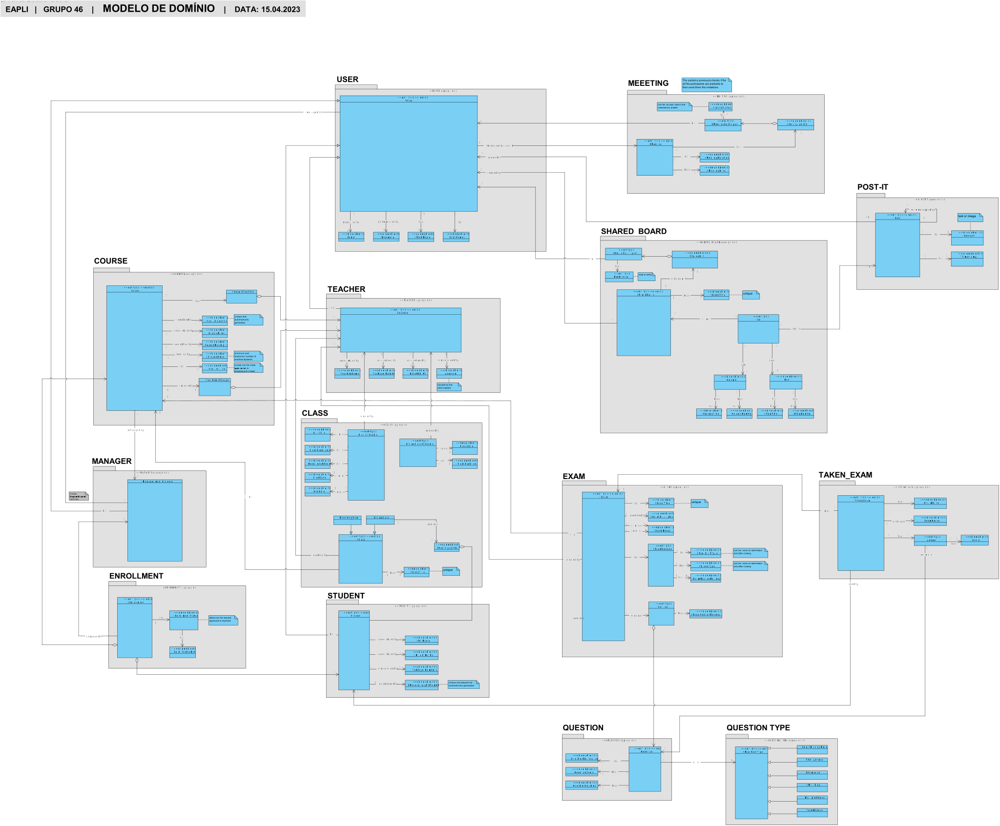

# OO Analysis #

The construction process of the domain model is based on the client specifications, especially the nouns (for _concepts_) and verbs (for _relations_) used.

## Rationale to identify domain conceptual classes ##
To identify domain conceptual classes, start by making a list of candidate conceptual classes inspired by the list of categories suggested in the book "Applying UML and Patterns: An Introduction to Object-Oriented Analysis and Design and Iterative Development".

### _Conceptual Class Category List_ ###

**Business Transactions**

* N/A

---

**Transaction Line Items**

* N/A

---

**Product/Service related to a Transaction or Transaction Line Item**

* Course
* Exam
* Grade

---

**Transaction Records**

* Dashboard
* Exam
* Meeting

---  

**Roles of People or Organizations**

* Teacher
* Student
* Manager

---

**Places**

* Remote Platform

---

**Noteworthy Events**

* Enrollment
* Schedule Class
* Take Exam

---

**Physical Objects**

* N/A

---

**Descriptions of Things**

* Course Description
* Exam Description

---

**Catalogs**

* N/A

---

**Containers**

* N/A

---

**Elements of Containers**

* N/A

---

**Organizations**

* Learning Systems (Company)

---

**Other External/Collaborating Systems**

* N/A

---

**Records of finance, work, contracts, legal matters**

* N/A

---

**Financial Instruments**

* N/A

---

**Documents mentioned/used to perform some work/**

* N/A
---

### **Rationale to identify associations between conceptual classes**

An association is a relationship between instances of objects that indicates a relevant connection and that is worth of remembering, or it is derivable from the List of Common Associations:

+ **_A_** is physically or logically part of **_B_**
+ **_A_** is physically or logically contained in/on **_B_**
+ **_A_** is a description for **_B_**
+ **_A_** known/logged/recorded/reported/captured in **_B_**
+ **_A_** uses or manages or owns **_B_**
+ **_A_** is related with a transaction (item) of **_B_**
+ etc.

| Concept (A) 		 |  Association   	  |     Concept (B) |
|----------------|:-----------------:|----------------:|
| Cell           |     contains      |          PostIt |
| Cell           |       is on       |     SharedBoard |
| Course         |        has        |           State |
| Course         |        has        |            Exam |
| Course         |        has        |         Edition |
| Course         |        has        |           Class |
| Course         |        has        |   CourseTeacher |
| Course         |    directed by    | TeacherInCharge |
| Exam           |        has        |        Question |
| Exam           |    created by     |         Teacher |
| Exam           |     contains      |         Section |
| Exam           |        has        |     ExameHeader |
| Section        |     contains      |        Question |
| ExtraClass     |       is of       |           Class |
| Class          |    teached by     |         Teacher |
| Class          |       is of       |          Course |
| Grade          |    recorded in    |       Dashboard |
| Manager        |      creates      |          Course |
| Manager        |    open/closes    |          Course |
| Manager        |       sets        |   CourseTeacher |
| Manager        |      manages      |            User |
| Manager        |       is a        |            User |
| Manager        |   opens/closes    |      Enrollment |
| Manager        |  aproves/rejects  |      Enrollment |
| Manager        |       loads       |      Enrollment |
| Enrollment     |       has a       |         Student |
| Enrollment     |       has a       |          Course |
| Question       |       is of       |    QuestionType |
| Student        |     enroll in     |          Course |
| Student        |       takes       |            Exam |
| Student        |  participates in  |           Class |
| Student        |        has        |           Grade |
| Student        |      creates      |           Board |
| Student        |       is a        |            User |
| Student        |       lists       |            Exam |
| Student        |       lists       |       ExamGrade |
| Student        |     requests      |      Enrollment |
| Teacher        |      creates      |   ClassSchedule |
| Teacher        |      updates      |   ClassSchedule |
| Teacher        |       lists       |       ExamGrade |
| Teacher        |       lists       |            Exam |
| Teacher        |      creates      |            Exam |
| User           |  schedules/owns   |         Meeting |
| User           |      cancels      |         Meeting |
| User           |   creates/owns    |     SharedBoard |
| User           |       views       |     SharedBoard |
| User           |      shares       |     SharedBoard |
| User           |      creates      |          PostIt |
| User           |      changes      |          PostIt |
| User           |  owner archives   |    BoardHistory |
| User           |       lists       |          Course |
| User           |       lists       |          Course |
| PostIt         | undo last changes |          PostIt |

## Domain Model

