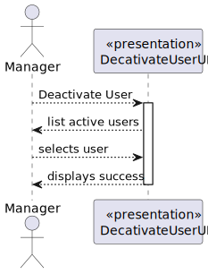

# US 1001.2.1 - As a Manager, I want to deactivate a User

## 1. Context

*This is the first time this functionality is being developed. It is included in Sprint B of the project eCourse*

## 2. Requirements

**US 1001** As Manager, I want to be able to register, disable/enable, and list users of the system

- US 1001.2 - Enable/Disable User<BR> <BR>
  Dependencies with:
    - 1001.1 - Register a new User
    - 1001.3 - List the system Users

### 2.1 Customer Specifications and Clarifications ###

**From the specifications Document:**

This User story is related to the Functional Requirement FRU01 - Management of Users - Create, disable/enable, and list users of the system (Teachers and Students, as well as Managers). **It should be only available to managers of the system.**

Managers (they can be also named as Administrators) manage all the users of the system as well as courses and students enrollment. 
All users should be identified in the system by their email 
Each user should also provide its full name and short name 
In order to be authenticated by the system the users must also provide a password.


**From the client clarifications:**
> **Question_1** (Tuesday, 14 de March de 2023 às 15:50) --> Looking at the users, they are to be given a short name and a full name.  --> Each **Clinical Analysis Laboratory** is characterized by the following **attributes**: Laboratory ID; Name; Address; Phone Number; TIN number. The **Chemical Laboratory** is characterized by the following attributes: Name; Address; Phone Number; TIN number. Many Labs company has only one **chemical lab**. Each Receptionist and each Medical Lab Technician can work in any Clinical Analysis Laboratory of the Many Labs network.
>
> **Answer_1** --> Usually my suggestion for this type of doubts is to search for the most common approach to solve the issue. I would say that it is part of the analysis of the problem. After that, you should take a decision and justify that decision. Having said that, as a client, I should say that my interpretation of short name is like a given name..
>
> **Question_2** (Thursday, 16 de March de 2023 às 20:40) -->  Do the system has to support an option to create new user roles that are not specified at the system specification documents or the system will always have just the three user roles described? The same question can be applied to the question types (e.g., Multiple Choice and Short Answer). Should the system support the creation of new question types?
>
> **Answer_2** --> Regarding user roles, the solution should support the ones necessary to cover all the actual functional requirements. Regarding question types, only the referenced in the specification are required..
>
> **Question_3** (Tuesday, 21 de March de 2023 às 13:47) -->  should the user be multi-role? For example, can a system user be a teacher and a student or a manager at the same time?
>
> **Answer_3** --> I see no need for that. For me, each user as only one specific role in the system.
>
> **Question_4** (Sunday, 26 de March de 2023 às 19:19) --> Does the Manager have the same attributes as Students and Teachers? (tay payer number, name)Is the name of each actor either the full name or the short name?
>
> **Answer_4** --> A manager should have only the attributes as described in section 5.1.1. Also in section 5.1.1: "All users should be identified in the system by their email.". It is also stated that "Each user should also provide its full name and short name". As mentioned before, the short name is like a given name, the short name someone chooses to be called. Therefore, all users should have a name (full name) and a short name. When later, the document refers that students and teachers should have names, please consider both full name and shot name (since both are users).
>
> **Question_5** (Monday, 3 de April de 2023 às 13:16) --> Is it necessary to track changes that a manager has made? For example, it is necessary to know which manager created which course?
>
> **Answer_5** --> I think that what you suggest is a good practice. However, I think there is no explicitly requirement for that, for the role of manager. There are other roles and requirements that need that (for instance, users and boards or users and meetings).
> 
> **Question_6** (Thursday, 20 de April de 2023 às 15:38) --> Um manager pode conter dados como "Birth Date" e "Tax Payer Number", assim como o Teacher e o Student?
>
> **Answer_6** --> Para o que se pretende actualmente essa informação não é relevante/útil para os managers. Mas, como cliente, não me parece que seja grave se puder ser registada também para esses utilizadores.


### 2.3. Acceptance Criteria ###
N.A.

### 2.4. Dependencies ###

- 1001.1 - Register a new User
- 1001.3 - List the system Users


## 3. Analysis

### 3.1 Relevant Domain Model Excerpt


### 3.2 System Sequence Diagram (SSD)



## 4. Design

### 4.1. Realization (Sequence Diagram - SD)


### 4.2. Class Diagram (CD)


### 4.3. Applied Patterns

- ENTITY as root of AGGREGATE
- VALUE OBJECT caractherizes OBJECTS
- SERVICE
- FACTORY
- REPOSITORY
- SINGLE RESPONSABILITY


### 4.4. Tests

**Test 1:** *Verifies that it is not possible to create an instance of the Example class with null values.*

```
    @Test
    public void ensureUserStatusIsDectivatedAfterDeactivation() throws Exception {
        final Set<Role> roles = new HashSet<>();
        roles.add(ADMIN);

        SystemUser user1 = userBuilder.with(EMAIL, PASSWORD, FULL_NAME, SHORT_NAME).withRoles(roles).build();

        user1.deactivate(CurrentTimeCalendars.now());

        final boolean expected = user1.isActive();
        assertFalse(expected);
    }
````

## 5. Implementation


## 6. Integration/Demonstration
*NA*

## 7. Observations
*NA*
