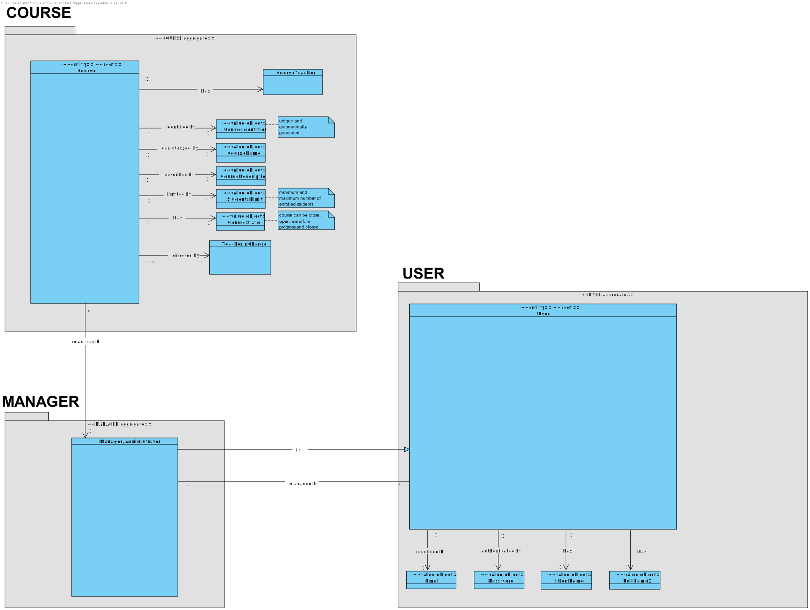
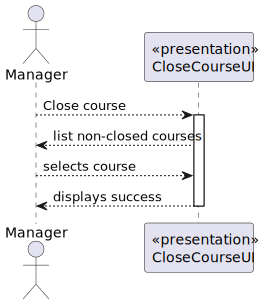
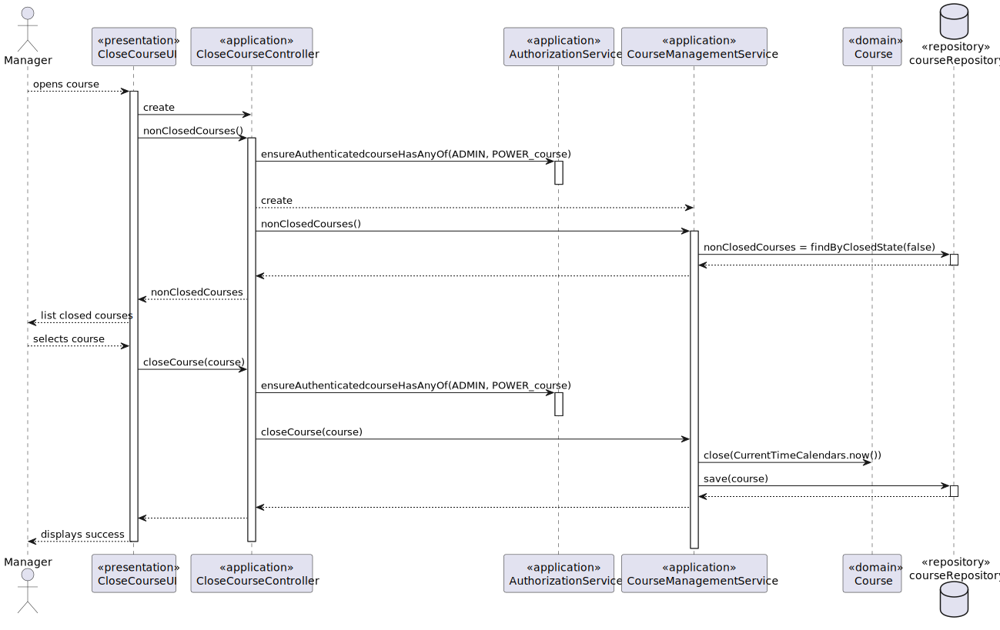
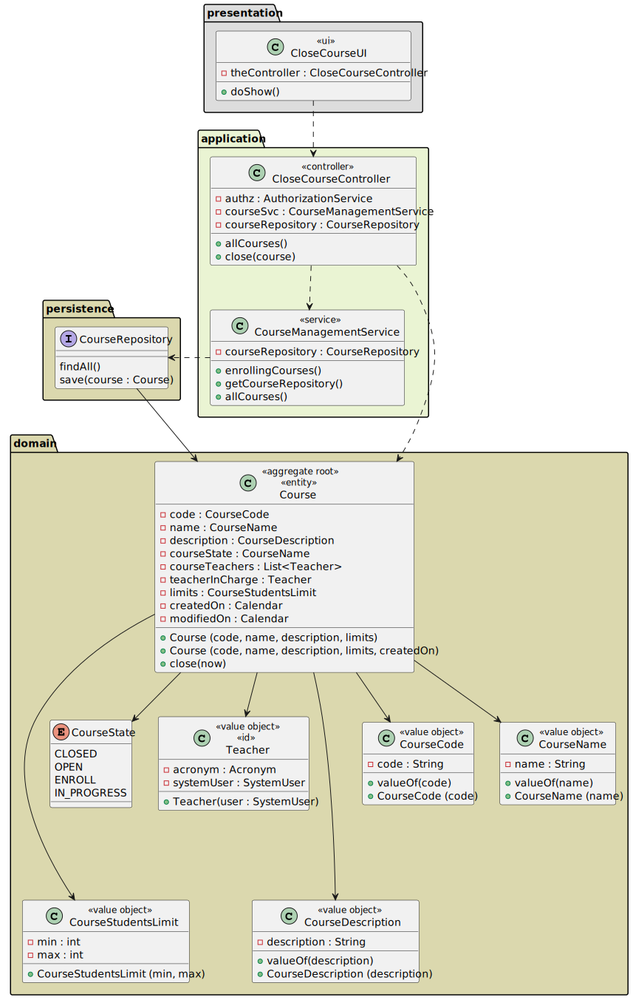
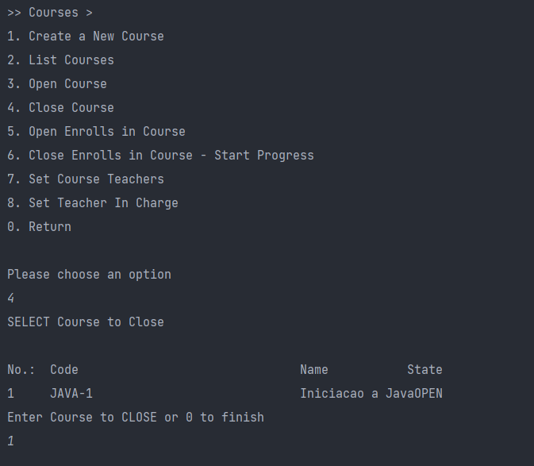

# US 1004.2 - As a Manager, I want to close a course

## 1. Context

*This is the first time this functionality is being developed. It is included in Sprint B of the project eCourse*

## 2. Requirements

**US 1004** As Manager, I want to be able to open and close courses

- US 1004 - Open/Close Course<BR> <BR>
  Dependencies with:
    - 1002 - Create Course
    - 1003 - Open/Close Enrollments

### 2.1 Customer Specifications and Clarifications ###

**From the specifications Document:**

This User story is related to the Functional Requirement FRC03 - Open/Close Course. **It should be only available to managers of the system.**

Managers (they can be also named as Administrators) manage all the users of the system as well as courses and students enrollment.
A course is characterized by its title and a unique code inputed by the administrator, e.g.,
"JAVA-1".
The usual workflow related to the course can be illustrated as follows:
event create (-> state close) -> event open (->state open) -> event open enrollments (-> state
enroll) -> event close enrollments (-> state in progress) -> event close (-> state closed)


**From the client clarifications:**
> **Question_1** (Tuesday, 14 de March de 2023 às 15:51) --> **Project course** Yes, I think the specification has some contradictory or confusing statements regarding courses.
I should say that maybe the ideia is that a course:
"- has unique code inputed by the administrator, e.g., "JAVA-1, that is used to identify it
"- it has a name (name and title may refer to the same property of courses, and I would say that there is no need for it to be unique)
>

> **Answer_1** --> - Yes, I think the specification has some contradictory or confusing statements regarding courses.
I should say that maybe the ideia is that a course:
"- has unique code inputed by the administrator, e.g., "JAVA-1, that is used to identify it
"- it has a name (name and title may refer to the same property of courses, and I would say that there is no need for it to be unique)
>

> **Question_2** (Friday, 17 de March de 2023 às 15:13) --> **Number of Students in a Course** - As it is said in the project description, "Courses may have a minimum and a maximum number of enrolled students. This may limit the possibility of opening (i.e. starting) courses that do not satisfy the limits.", that being showed we want to know if it is optional to have limits on the course?
If its mandatory to have the limits, who can establish limits of students  to the course?, what are the acceptable limits of students in a course? And what are the conditions for a course to have limits?
>

> **Answer_2** --> Managers should be able to specify the limits. In my opinion the system should notify the manager if a course is out of the enrolment limits (before this course is changed to "in progress"). But, in the end, it is up to the manager to follow/enforce or not, the limits.
>

> **Question_3** (Friday, 17 de March de 2023 às 18:38) -->  **Students in different courses** Can one student be enrolled in different courses?
>

> **Answer_3** --> Yes. I see no reason not to (section 5.1.3: "Students enroll in courses.").
>

> **Question_4** (Monday, 20 de March de 2023 às 20:57) --> **Course Edition specification** regarding the edition of a course to be taken, are there any attributes to specify it? (such as year and/or semester, for example)(practical example: ESOFT 2023 2nd semester)
>

> **Answer_4** --> "A course is simply a course". There is no hierarchy or containment relation with other concept, such as program or semester. From the specification: "Different editions of a course are to be considered different courses (e.g., Intro-Math-Sem01, Intro-Math-Sem02)".
>

> **Question_5** (Tuesday, 21 de March de 2023 às 20:56) --> **Re: Course Edition specification** I still have a doubt, if the course name and edition are the same but the unique code is different, is it to be considered a different course or is it the same as the one already in the system?
>

> **Answer_5** --> A course has a "unique code inputed by the administrator, e.g., 'JAVA-1'.". It is this unique code that identifies the course. According to the specification there are no specific constraints regarding the title of the course.
>

> **Question_6** (Friday, 24 de March de 2023 às 17:39) --> **Course e class** Poderia esclarecer o que é um Course e o que é uma Class?
>

> **Answer_6** --> Um "course" é um curso. Mas será um curso de "curta duração", não confundir com um curso "de ensino superior", como uma licenciatura ou mestrado. Em inglês iríamos identificar isso como sendo um "program", que é constituído por vários "courses". Num curso de ensino superior, o mais similar a "course" seria uma unidade curricular ou disciplina. Uma "class" é uma aula (relativa a um "course").
>

> **Question_7** (Saturday, 25 de March de 2023 às 09:55) --> Listing users and other doubts
I have some doubts about some requirements:
"1) Is it necessary to know who created a specific exam?
"2) Is it necessary to list exams that a specific teacher created?
"3) Is it necessary to list exams that were taken by a specific student?
"4) Is it necessary to know who created a specific user?
"5) Is it necessary to know the manager that set a teacher to a specific course?
"6) Is it necessary to know the manager that enrolled a student?
>

> **Answer_7** --> Regarding your questions, my generic answer is that you only have to implement the requirements that are specified in the document.
"1) Is it necessary to know who created a specific exam?"
I do not think there is any requirement that explicitly requires that. However, I can not answer if the technical solution of the problem may require that.
"2) Is it necessary to list exams that a specific teacher created?"
Once again, I do not see any requirement that specifies that. However, there is one very similar: FRE03-List Course Exams.
"3) Is it necessary to list exams that were taken by a specific student?"
FRE03 - List Grades should display the grades of a students. This regards previous exames taken by the student.
"4) Is it necessary to know who created a specific user?
"5) Is it necessary to know the manager that set a teacher to a specific course?
"6) Is it necessary to know the manager that enrolled a student?"
There is no requirement specific to all these questions. However, I do not know if the system must support "something" related to these questions. I think this is something related to the design of the solution, that you and your team must decide when designing the solution in order to meet the existing requirements.
>

> **Question_8** (Friday, 31 de March de 2023 às 15:41) --> **Course creation** When the Manager creates a Course, should there already be an assigned group of Teachers and Students associated with the created Course or should they be added later?
>

> **Answer_8** --> There are specific requirements for all these functionalities and they may take place after the course creation. For instance, FRC04, refers to setting the teachers of the course and FRC06 refers to the bulk enrolment of students. They both can take place after the creation of the course.
However, I think there is no "problem" if the system supports that the manager do all these settings just "after" creating the course.
>

> **Question_9** (Tuesday, 18 de April de 2023 às 14:06) --> **G1006: List courses** Relative to this US, "As User, I want to list all the courses that are available to me" what should we list according to the User role?
Student: Courses that Student is enrolled
Teacher: Courses that Teacher teaches
Manager: All Courses
Are these assumptions right?
>

> **Answer_9** --> Regarding Teachers and Managers I agree with you. Regarding students I think it is best to list all the courses in which the student is enrolled or may be enrolled (the enrolments are opened). If not, how would a student know the courses in which he/she can enrol?
>
### 2.3. Acceptance Criteria ###
N.A.

### 2.4. Dependencies ###

- 1004.1 - Open Course
- 1003 - Open/Close Enrollments in Courses
- 1002 - Create Course


## 3. Analysis

### 3.1 Relevant Domain Model Excerpt


### 3.2 System Sequence Diagram (SSD)



## 4. Design

### 4.1. Realization (Sequence Diagram - SD)


### 4.2. Class Diagram (CD)



### 4.3. Applied Patterns

- ENTITY as root of AGGREGATE
- VALUE OBJECT caractherizes OBJECTS
- BUILDER
- SERVICE
- FACTORY
- REPOSITORY
- SINGLE RESPONSABILITY


### 4.4. Tests

**Test 1:** *Verifies that it is not possible to create an instance of the Example class with null values.*

```

    @Test
    public void ensureCourseIsClosedAfterCloseCommand() {
        Course teste = new Course(CODE, NAME, DESCRIPTION, STUDENTS_MIN, STUDENTS_MAX, CurrentTimeCalendars.now());
        teste.open(CurrentTimeCalendars.now());
        teste.close(CurrentTimeCalendars.now());
        assertEquals(CourseState.CLOSED, teste.courseState());
    }
  
````

## 5. Implementation




## 6. Integration/Demonstration
*NA*

## 7. Observations
*NA*
