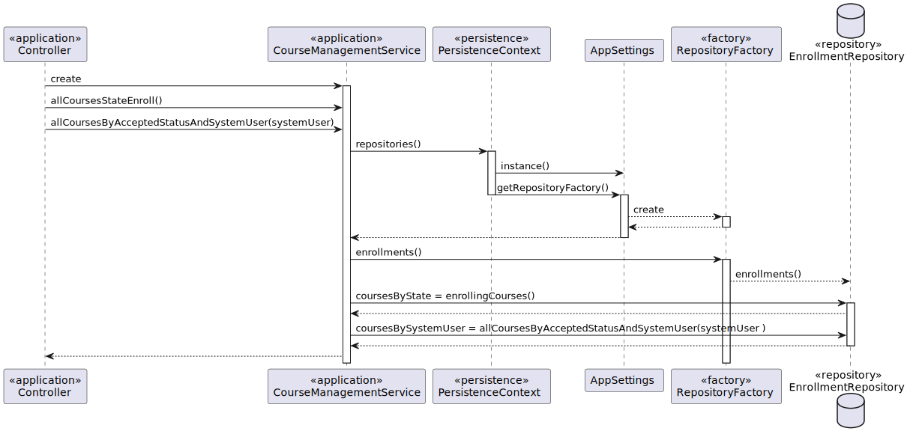

# US 1006 - As User, I want to list all the courses that are available to me

## 1. Context

*This is the first time this functionality is being developed. It is included in Sprint B of the project eCourse*

## 2. Requirements

**US 1006** As User, I want to list all the courses that are available to me

- 1008.1. List all courses available. 

### 2.1 Customer Specifications and Clarifications ###

**From the specifications Document:**

This User story is related to the Functional Requirement FRC05 - List Courses All users are able to execute this functionality. 

**From the client clarifications:**

> **Question_1** - (Tuesday, 18 de April de 2023 às 14:06)- G1006: List courses
Relative to this US, "As User, I want to list all the courses that are available to me" what should we list according to the User role?
Student: Courses that Student is enrolled
Teacher: Courses that Teacher teaches
Manager: All Courses
Are these assumptions right?
>
> **Answer_1** - Regarding Teachers and Managers I agree with you.
Regarding students I think it is best to list all the courses in which the student is enrolled or may be enrolled (the enrolments are opened). If not, how would a student know the courses in which he/she can enrol?

### 2.3. Acceptance Criteria ###

### 2.4. Dependencies ###
* US1001 - As Manager, I want to be able to register, disable/enable, and list users of the system (Teachers and Students, as well as Managers).
Users will schedule a meeting.
* US1002 -  As Manager, I want to create courses.
* US1003 - As Manager, I want to open/close enrollments in courses, because a student only can enroll in a course if the course is in open enrollment state.

## 3. Analysis

### 3.1 Relevant Domain Model Excerpt

### 3.2 System Sequence Diagram (SSD)

## 4. Design

### 4.1. Realization (Sequence Diagram - SD)

### 4.2. Class Diagram (CD)

### 4.3. Applied Patterns
- ENTITY as root of AGGREGATE
- VALUE OBJECT caractherizes OBJECTS
- BUILDER
- SERVICE
- FACTORY
- REPOSITORY

### 4.4. Tests

## 5. Implementation
* Manager

* Teacher

* Student

## 6. Integration/Demonstration

*In this section the team should describe the efforts realized in order to integrate this functionality with the other parts/components of the system*

*It is also important to explain any scripts or instructions required to execute an demonstrate this functionality*

## 7. Observations

*This section should be used to include any content that does not fit any of the previous sections.*

*The team should present here, for instance, a critical prespective on the developed work including the analysis of alternative solutioons or related works*

*The team should include in this section statements/references regarding third party works that were used in the development this work.*