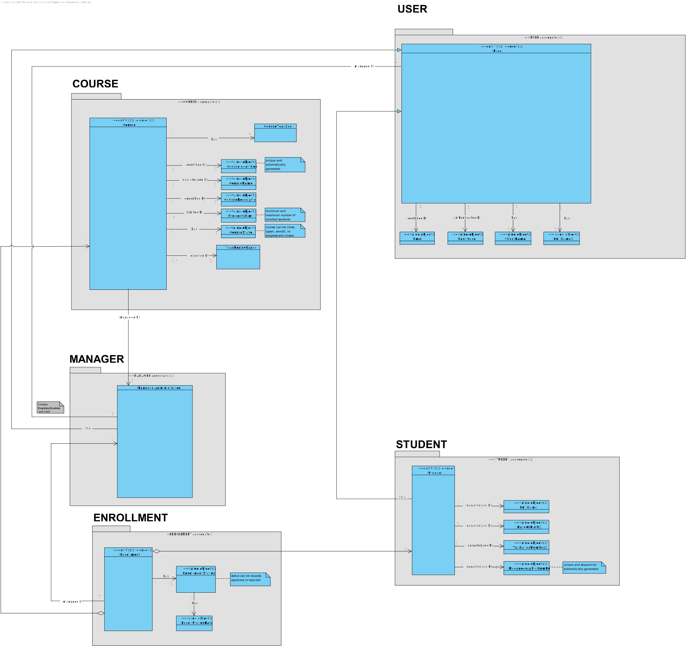

# US 1007 - As Manager, I want to enroll students in bulk by importing their data using a csv file

## 1. Context

*This is the first time this functionality is being developed. It is included in Sprint B of the project eCourse*

## 2. Requirements

### 2.1 User Story Description

**US 1007** As Manager, I want to enroll students in bulk by importing their data using a csv file.

To develop this user story, the following flow was considered:
- Read the CSV file, quering all the students mechanographic number and respective course to be enrolled and accepted
- For each of the students, if the Course is in enroll state, a new enrollment in accepted state is registered

### 2.2 Customer Specifications and Clarifications ###

**From the specifications Document:**

>This User story is related to the Functional Requirement FRC06 - Bulk Enroll Students in Course This can be made by importing a csv file with students. Only managers are able to execute this functionality. (Section 3.1.2).

>Manager importing requests, the state must be directly ACCEPTED
"A course is characterized by its title and a unique code.
The usual workflow related to the course can be illustrated as follows:
event create (-> state close) -> event open (-> state open) -> event open enrollments (-> state enroll) -> event close enrollments (-> state in progress) -> event close (-> state closed)". (Section 5.2.1).

>"Managers manage all the users of the system as well ... students enrollment". (Section 5.1.1).

**From the client clarifications:**

> *Question_1* (Friday, 17 March 2023 at 18:38h) --> Can one student be enrolled in different courses?
>
> *Answer_1* --> Yes. I see no reason not to (section 5.1.3: "Students enroll in courses.").
>
> *Question_2* (Monday, 20 March 2023 at 21:20h) -->  In the document you provided it says "A course may be open or closed." but I saw a post of yours where you mentioned "(before this course is changed to "in progress")".
So does that mean it can be open (to enroll), closed(after it ends) and in progress(decurring, closed for enrollment)?
>
> *Answer_2* --> Yes, a course may have several states. Section "5.2.1 Course" exemplifies the usual cycle of a course.
>
> *Question_3* (Tuesday, 18 de April de 2023 às 18:07) -->  Will we have a csv file example for the students data?
>
> *Answer_3* --> No, the client did not prepare any csv example. CSV is a standard file format. You should support the bulk enrolment of students in a course by have their identification in a csv file.
>
### 2.3. Acceptance Criteria ###

From the specifications document and client clarifications, the following acceptance criteria were identified:
 * The request can only be made if the course is in enroll state.
 * Incorrect MechanographicNumber/CourseCode from document should print an error and continue other lines import

### 2.4. Dependencies ###

* **US1003** - As Manager, I want to open/close enrollments in courses. (A student only requests enroll in a course in open enroll state).
* **US1008** - As Student, I want to request my enrollment in a course.

## 3. Analysis

### 3.1 Relevant Domain Model Excerpt



### 3.2 System Sequence Diagram (SSD)


## 4. Design

### 4.1. Realization (Sequence Diagram - SD)


### 4.2. Class Diagram (CD)


### 4.3. Applied Patterns

* ENTITY as root of AGGREGATE
* VALUE OBJECT caractherizes OBJECTS
* SERVICE
* REPOSITORY
* SINGLE RESPONSABILITY

### 4.4. Tests

**Test 1:** *Verifies that it is not possible to create an instance of the Enrollment class with null Student.*

```
@Test
public void ensureEnrollmentHasStudent() {
	assertThrows(IllegalArgumentException.class, () -> 
        new Enrollment(null, course, EnrrolmentStatus.REQUESTED, date));
}
````

**Test 2:** *Verifies that it is not possible to create an instance of the Enrollment class with null Course.*

```
@Test
public void ensureEnrollmentHasCourse() {
	assertThrows(IllegalArgumentException.class, () -> 
        new Enrollment(student, null, EnrollmentStatus.REQUESTED, date));
}
````

**Test 3:** *Verifies that it is not possible to create an instance of the Enrollment class with null Token.*

```
@Test
public void ensureEnrollmentHasToken() {
	final Enrollment e = new Enrollment(student, course, EnrollmentStatus.REQUESTED, date);
        assertNotNull(e.identity());
}
````

## 5. Implementation

*NA*

## 6. Integration/Demonstration

*NA*

## 7. Observations

*NA*