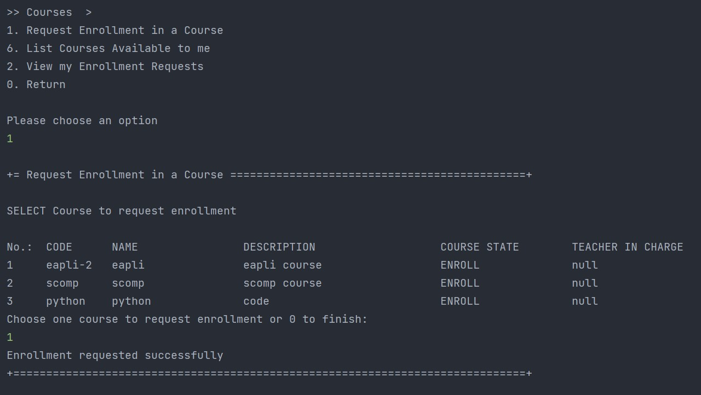

# US 1008 - As Student, I want to request my enrollment in a course

## 1. Context

*This is the first time this functionality is being developed. It is included in Sprint B of the project eCourse.*

## 2. Requirements

### 2.1 User Story Description

**US 1008** As Student, I want to request my enrollment in a course.

To develop this user story, the following flow were considered:
- List all courses available for enrollment (courses in enroll state). 
- The student chooses one course to request enrollment.
- The system registers the request.
- The enrollment request is saved in requested state.

### 2.2 Customer Specifications and Clarifications ###

**From the specifications Document:**

>This User story is related to the Functional Requirement FRC07 - Request Enrollment in a Course. The student requests to be enrolled in a course. (Section 3.1.2).

>"Students enroll in courses." Student must be authenticated to request enrollment in a course. (Section 5.1.3).

>The student can request enrollment in a course if the course is in open enrollment state. 
"A course is characterized by its title and a unique code.
The usual workflow related to the course can be illustrated as follows:
event create (-> state close) -> event open (-> state open) -> event open enrollments (-> state enroll) -> event close enrollments (-> state in progress) -> event close (-> state closed)". (Section 5.2.1).

>"Managers manage all the users of the system as well ... students enrollment". (Section 5.1.1).

**From the client clarifications:**

> *Question_1* (Friday, 17 March 2023 at 18:38h) --> Can one student be enrolled in different courses?
>
> *Answer_1* --> Yes. I see no reason not to (section 5.1.3: "Students enroll in courses.").
>
> *Question_2* (Tuesday, 18 April 2023 at 14:06h) -->  Relative to this US, "As User, I want to list all the courses that are available to me" what should we list according to the User role? 
>
> *Answer_2* --> Regarding students I think it is best to list all the courses in which the student is enrolled or may be enrolled (the enrolments are opened). If not, how would a student know the courses in which he/she can enrol?
>
> *Question_3* (Monday, 20 March 2023 at 21:20h) -->  In the document you provided it says "A course may be open or closed." but I saw a post of yours where you mentioned "(before this course is changed to "in progress")".
So does that mean it can be open (to enroll), closed(after it ends) and in progress(decurring, closed for enrollment)?
>
> *Answer_3* --> Yes, a course may have several states. Section "5.2.1 Course" exemplifies the usual cycle of a course.
>

### 2.3. Acceptance Criteria ###

From the specifications document and client clarifications, the following acceptance criteria were identified:
 * A student can request enrollments in different courses.
 * The request can only be made if the course is in enroll state.

### 2.4. Dependencies ###

* **US1003** - As Manager, I want to open/close enrollments in courses. (A student only requests enroll in a course in open enroll state).
* **US1006** - As User, I want to list all the courses that are available to me. (For students will be listed all courses in which student is enrolled or courses with enrollement open).

## 3. Analysis

### 3.1 Relevant Domain Model Excerpt


### 3.2 System Sequence Diagram (SSD)


## 4. Design

### 4.1. Realization (Sequence Diagram - SD)


### 4.2. Class Diagram (CD)


### 4.3. Applied Patterns

* ENTITY as root of AGGREGATE
* VALUE OBJECT caractherizes OBJECTS
* SERVICE
* REPOSITORY
* SINGLE RESPONSABILITY

### 4.4. Tests

**Test 1:** *Verifies that it is not possible to create an instance of the Enrollment class with null Student.*

```
@Test
public void ensureEnrollmentHasStudent() {
	assertThrows(IllegalArgumentException.class, () -> 
        new Enrollment(null, course, EnrrolmentStatus.REQUESTED, date));
}
````

**Test 2:** *Verifies that it is not possible to create an instance of the Enrollment class with null Course.*

```
@Test
public void ensureEnrollmentHasCourse() {
	assertThrows(IllegalArgumentException.class, () -> 
        new Enrollment(student, null, EnrollmentStatus.REQUESTED, date));
}
````

**Test 3:** *Verifies that it is not possible to create an instance of the Enrollment class with null Token.*

```
@Test
public void ensureEnrollmentHasToken() {
	final Enrollment e = new Enrollment(student, course, EnrollmentStatus.REQUESTED, date);
        assertNotNull(e.identity());
}
````

## 5. Implementation

```
@UseCaseController
public class RequestEnrollmentController {

    private final AuthorizationService authz = AuthzRegistry.authorizationService();
    private final CourseManagementService courseSvc = AuthzRegistry.courseService();

    private final EnrollmentManagementService enrollmentSvc = AuthzRegistry.enrollmentService();

    public Iterable<Course> enrollCourses() {
        authz.ensureAuthenticatedUserHasAnyOf(EcourseRoles.STUDENT);
        return courseSvc.enrollingCourses();
    }

    public Enrollment addNewEnrollment(Course course, final Calendar createdOn) {
        authz.ensureAuthenticatedUserHasAnyOf(EcourseRoles.STUDENT);
        final SystemUser student = authz.session().get().authenticatedUser();
        return enrollmentSvc.registerNewEnrollment(student, course, EnrollmentStatus.REQUESTED, createdOn);
    }

    public Enrollment addNewEnrollment(Course course) {
        //authz.ensureAuthenticatedUserHasAnyOf(EcourseRoles.STUDENT);
        return addNewEnrollment(course, CurrentTimeCalendars.now());
    }
}
````

### Demonstration of the implemented functionality



## 6. Integration/Demonstration

NA

## 7. Observations
It wa added an option to list enrollment requests in the menu of the student. Here the student can see the list of all requests made.