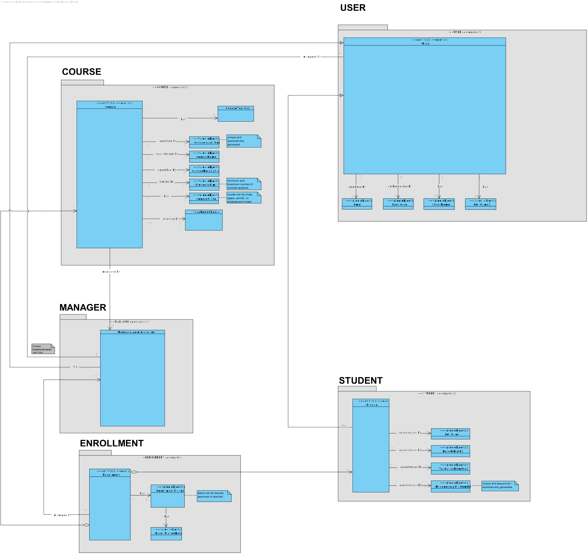
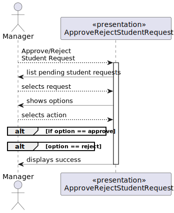
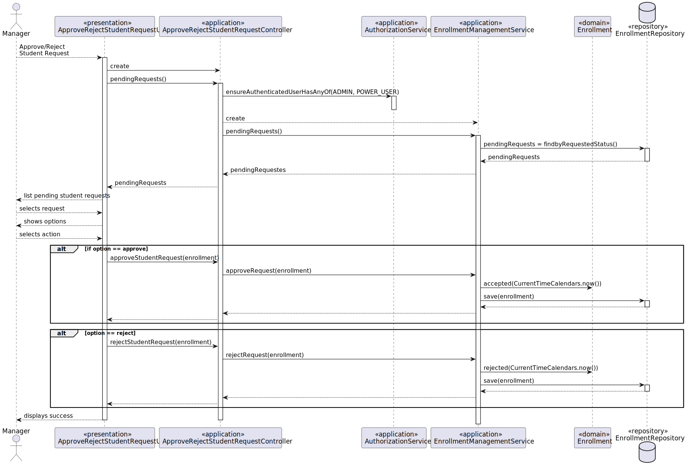
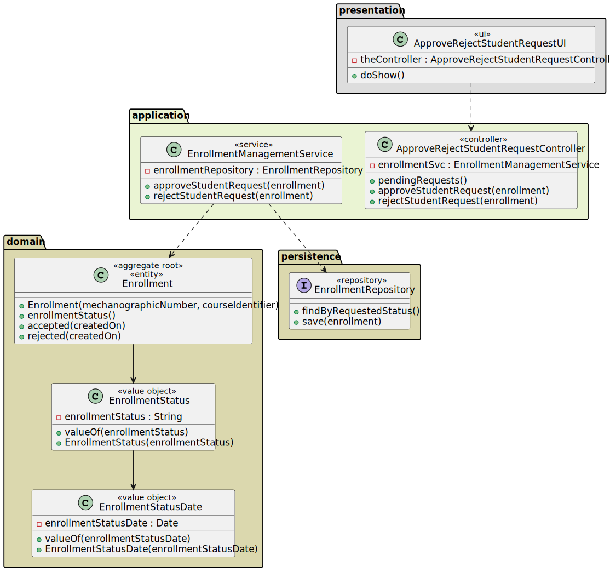
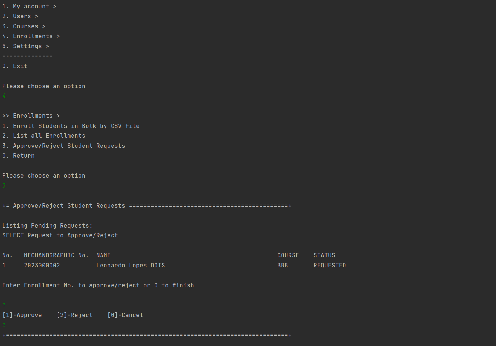

# US 1009 - As Manager, I want to approve or reject students applications to courses

## 1. Context

*This is the first time this functionality is being developed. It is included in Sprint B of the project eCourse*

## 2. Requirements

**US 1009** As Manager, I want to approve or reject students applications to courses

- US 1009 - Approve/Reject Enrollments<BR> <BR>
  Dependencies with:
  - 1003 - As Manager, I want to open and close enrollements in courses
  - 1008 - As Student, I want to request my enrollment in a course

### 2.1 Customer Specifications and Clarifications ###

**From the specifications Document:**

>This User story is related to the Functional Requirement FRC08 - Approve/Reject Enlistment in Course A manager approves or rejects a students’ application to a course.

>Managers (they can be also named as Administrators) manage all the users of the system as well as courses and students enrollment. 


**From the client clarifications:**
> *Question_1* (Friday, 17 March 2023 at 18:38h) --> Can one student be enrolled in different courses?
>
> *Answer_1* --> Yes. I see no reason not to (section 5.1.3: "Students enroll in courses.").
>
> *Question_2* (Monday, 20 March 2023 at 21:20h) -->  In the document you provided it says "A course may be open or closed." but I saw a post of yours where you mentioned "(before this course is changed to "in progress")".
So does that mean it can be open (to enroll), closed(after it ends) and in progress(decurring, closed for enrollment)?
>
> *Answer_2* --> Yes, a course may have several states. Section "5.2.1 Course" exemplifies the usual cycle of a course.
>


### 2.3. Acceptance Criteria ###
N.A.

### 2.4. Dependencies ###

- 1003 - Open/Close Enrollments In Course
- 1008 - Request Enrollment in a Course


## 3. Analysis

### 3.1 Relevant Domain Model Excerpt


### 3.2 System Sequence Diagram (SSD)



## 4. Design

### 4.1. Realization (Sequence Diagram - SD)


### 4.2. Class Diagram (CD)



### 4.3. Applied Patterns

- ENTITY as root of AGGREGATE
- VALUE OBJECT caractherizes OBJECTS
- SERVICE
- FACTORY
- REPOSITORY
- SINGLE RESPONSABILITY


### 4.4. Tests

**Test 1:** *Verifies that it is not possible to create an instance of the Enrollment class with null Student.*

```
@Test
public void ensureEnrollmentHasStudent() {
	assertThrows(IllegalArgumentException.class, () -> 
        new Enrollment(null, course, EnrrolmentStatus.REQUESTED, date));
}
````

**Test 2:** *Verifies that it is not possible to create an instance of the Enrollment class with null Course.*

```
@Test
public void ensureEnrollmentHasCourse() {
	assertThrows(IllegalArgumentException.class, () -> 
        new Enrollment(student, null, EnrollmentStatus.REQUESTED, date));
}
````

**Test 3:** *Verifies that it is not possible to create an instance of the Enrollment class with null Token.*

```
@Test
public void ensureEnrollmentHasToken() {
	final Enrollment e = new Enrollment(student, course, EnrollmentStatus.REQUESTED, date);
        assertNotNull(e.identity());
}
````

## 5. Implementation

```
@UseCaseController
public class ApproveRejectStudentRequestController {

    private final AuthorizationService authz = AuthzRegistry.authorizationService();
    private final EnrollmentManagementService enrollSvc = AuthzRegistry.enrollmentService();

    public Iterable<Enrollment> pendingRequests() {
        authz.ensureAuthenticatedUserHasAnyOf(EcourseRoles.POWER_USER, EcourseRoles.ADMIN);
        return enrollSvc.pendingRequests();
    }

    public Enrollment approveStudentRequest(final Enrollment enrollment) {
        authz.ensureAuthenticatedUserHasAnyOf(EcourseRoles.POWER_USER, EcourseRoles.ADMIN);
        return enrollSvc.approveRequest(enrollment);
    }

    public Enrollment rejectStudentRequest(final Enrollment enrollment) {
        authz.ensureAuthenticatedUserHasAnyOf(EcourseRoles.POWER_USER, EcourseRoles.ADMIN);
        return enrollSvc.rejectRequest(enrollment);
    }
}
```

## 6. Integration/Demonstration


## 7. Observations
*NA*
