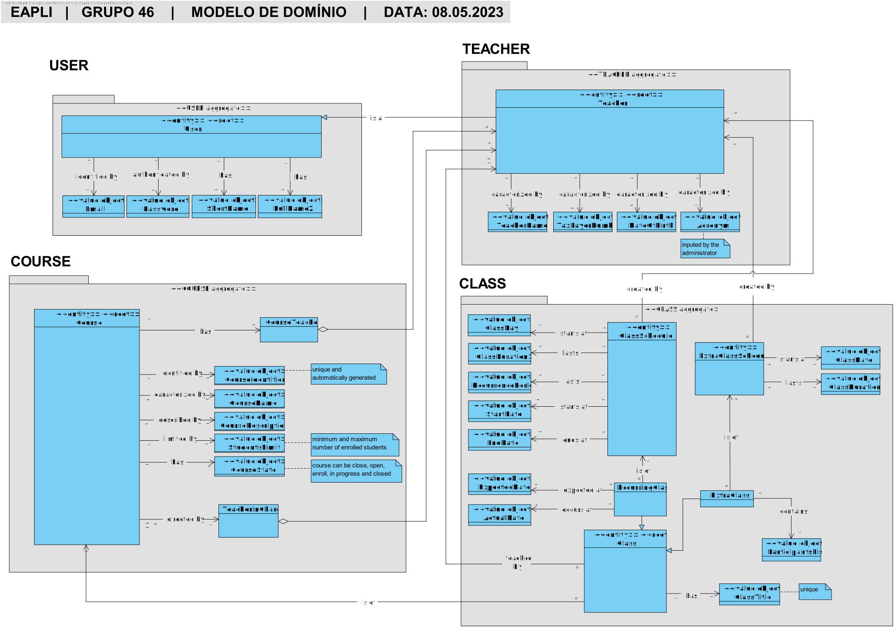
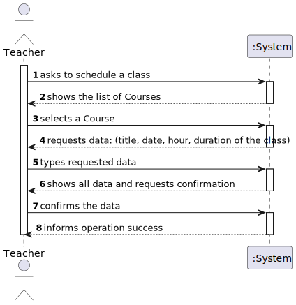
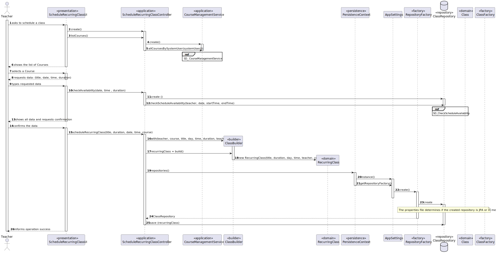
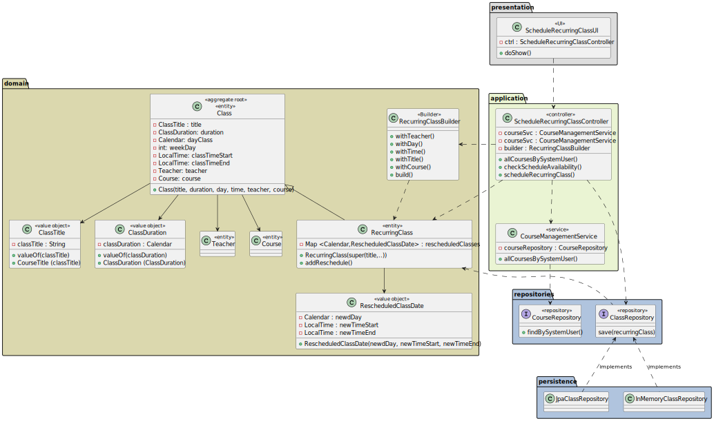

# US 1010 - Schedule a class

## 1. Context

*This is the first time this functionality is being developed. It is included in Sprint B of the project eCourse*

## 2. Requirements


### 2.1. User Story Description

As **Teacher**, I want to **schedule a class**


### 2.2. Customer Specifications and Clarifications


**From the specifications document:**
>"**FRC09 - Schedule of Class** A teacher schedule a class (always a recurring class, happens every week). **System must check if the Teacher is available for the class period" (p.6)**

>"Students of the course participate in all classes of the course." (p.13)

>"Teachers are responsible for **scheduling classes for their courses**. A class is always **a recurring
> weekly event**. A class must have a **unique title**, a **date** and a **duration**. It should be **impossible** to
> schedule classes that are coincident with other classes of the same course. The **system should also warn** if one of the participants in the class (either a teacher or a student) has other classes
> at the same time." (p.13-14)

>"Classes and meetings are events that happen in some time and **have a duration**. They also **have
participants**. However, **there is no concept of location** related to classes and meetings. They do
not take place in a specific location and **"nothing" happens at the time of the event**" _(??? O que quer dizer este nothing happens? Nem sequer há um sumario da aula ou registo de estudantes presentes? Porque é que para o cliente foi relevante especificar isto? ???)_ (p.14)


**From the client clarifications:**

> **Question:** Poderia esclarecer o que é um Course e o que é uma Class?
>
> **Answer:** Um "course" é um curso. [...]  Num curso de ensino superior, o mais similar a "course" seria uma unidade curricular ou disciplina.
>             <br> **Uma "class" é uma aula (relativa a um "course").**

> **Question:** Boa tarde nos estamos a ter uma duvida sobre qual e a diferença entre meetings e classes
>
> **Answer:** [...] as aulas são regulares e têm participantes pré-definidos. [...]

> **Question:** Should we allow the users to choose until what date they want to schedule the weekly classes or should the weakly classes be scheduled until the end of the semester and if so what is the duration of the semester ?
>
> **Answer:** **Only teachers should be able to schedule classes.**
>             <br> I think there is no requirement that refers to the course duration or the concept of term or semester. Therefore, if you do not consider the course to have a pre-established ending date, **then you also should not consider the end of the recurrence (in fact, it will happen when the manager closes the course).**
>             <br>If you consider that a course must have an ending date, then also consider the end of the recurrence of the classes to the same date.
>             <br><br>However, since "nothing" happens at the time of the classes, the option you take will have limited implications, I think, only at the validation of availability of participants.

> **Question:** Regarding weekly classes recurrence, should be considered as a recurrence class if it happens more than one day per week? For example, the same class can occur on mondays and wednesdays?
>
> **Answer:** A class should be considered only one class ("aula"). This **one class is always a recurring class**. If a course has **more than one class each week**, then **each class will be a recurring class**.

> **Question:** We have a question about a class scheduling. When a teacher wants to schedule a class, do they introduce start date/time and end date/time, or start date/time and duration of the class? And in general, how often will the client want to consult the duration of the classes?
>
> **Answer:** For the class the teacher should entre the **start date/time and duration** (see Section 5.1.2).
>             <br>The duration of the class is important when scheduling "events" (such a classes and meetings) because the system must comply with some scheduling rules, for instance, to **avoid scheduling classes that are coincident** with other classes of the same course (see Section 5.1.2).

> **Question:** Nestas duas US (US1010 e US1011), pretende que seja mostrada a lista de Class/ExtraClass que já estão agendadas para que o professor saiba onde pode agendar?
>
> **Answer:** Em termos de requisitos é importante que o sistema garanta as regras que estão descritas em 5.1.2 relativo a aulas e aulas extra. Em termos de user interface para cada um desses casos de uso não existem requisitos específicos.
<br><br>Nesse aspeto de "user experience" devem seguir boas práticas. Mas isso já faz parte do desenho da solução. "O cliente não percebe muito disso :-)"


### 1.3. Acceptance Criteria ###

* **AC1:** It should be impossible to schedule classes that are coincident with other classes of the same course.
* **AC2:** System must check if the Teacher is available for the class period


### 1.4. Dependencies ###

* There is a dependency to **US1001 - As Manager, I want to be able to register, disable/enable, and list users of the system** since at least one **Teacher** must exist in order to **schedule a class**.
  <br>
* _**US1002** - As Manager, I want to create courses_
  <br>
* _**US1004** - As Manager, I want to open and close courses_


## 3. Analysis


### 3.1 Relevant Domain Model Excerpt



### 3.2 System Sequence Diagram (SSD)




## 4. Design


### 4.1. Realization (Sequence Diagram - SD)



### 4.2. Class Diagram (CD)



### 4.3. Applied Patterns

### 4.4. Tests

```java
@Test
public void ensureHasTeacher(){
        System.out.println("Class has teacher");
        valid_date.set(YEAR1, MONTH, DAY);
        assertThrows(IllegalArgumentException.class, () -> classBuilder.withDuration(DURATION).withTitle(TITLE).withDay(valid_date).withTeacher(null).withTime(TIME).withCourse(course).build());
        }
@Test
public void ensureHasDuration(){
        System.out.println("Class has duration");
        valid_date.set(YEAR1, MONTH, DAY);
        assertThrows(IllegalArgumentException.class, () -> classBuilder.withDuration(-1).withTitle(TITLE).withDay(valid_date).withTeacher(teacher1).withTime(TIME).withCourse(course).build());
        }
@Test
public void ensureHasDate(){
        System.out.println("Class has valid date");
        assertThrows(NullPointerException.class, () -> classBuilder.withDuration(DURATION).withTitle(TITLE).withDay(null).withTeacher(teacher1).withTime(TIME).withCourse(course).build());
        }
```


## 5. Implementation

*In this section the team should present, if necessary, some evidencies that the implementation is according to the design. It should also describe and explain other important artifacts necessary to fully understand the implementation like, for instance, configuration files.*

*It is also a best practice to include a listing (with a brief summary) of the major commits regarding this requirement.*

### **RegisterVaccinationCenterUI:**


## 6. Integration/Demonstration

*In this section the team should describe the efforts realized in order to integrate this functionality with the other parts/components of the system*

*It is also important to explain any scripts or instructions required to execute an demonstrate this functionality*

## 7. Observations

*This section should be used to include any content that does not fit any of the previous sections.*

*The team should present here, for instance, a critical prespective on the developed work including the analysis of alternative solutioons or related works*

*The team should include in this section statements/references regarding third party works that were used in the development this work.*