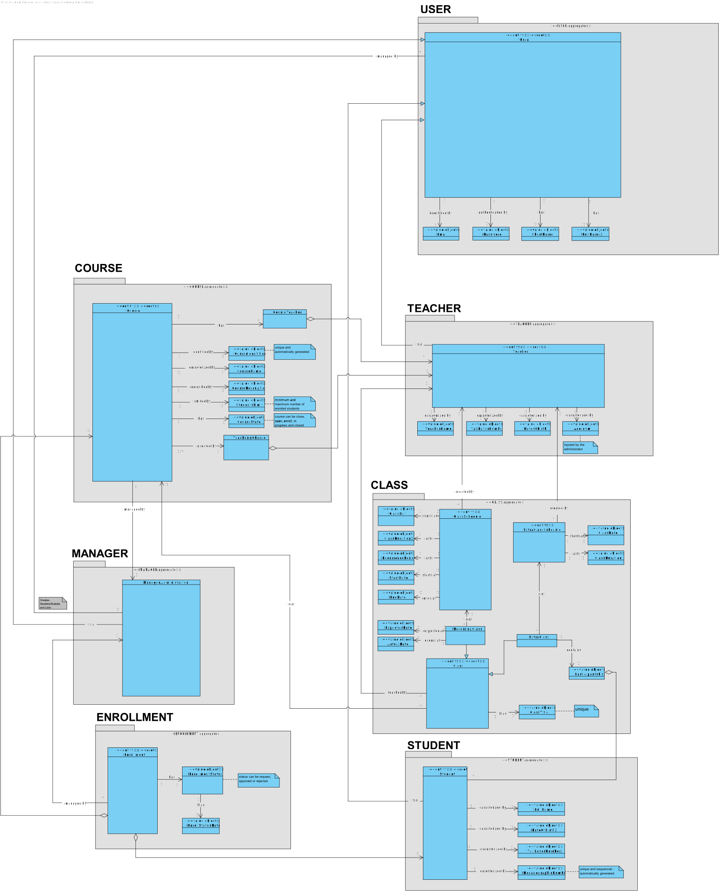
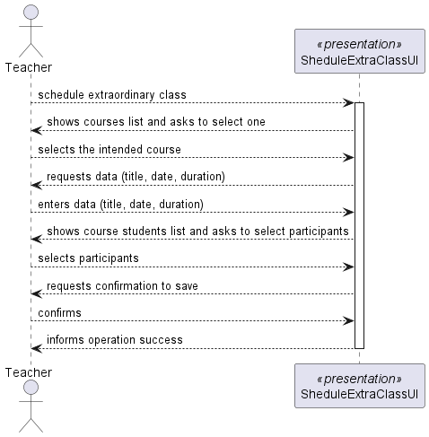
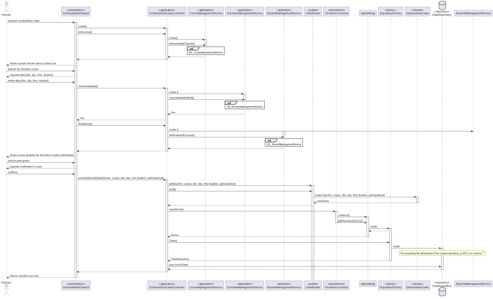
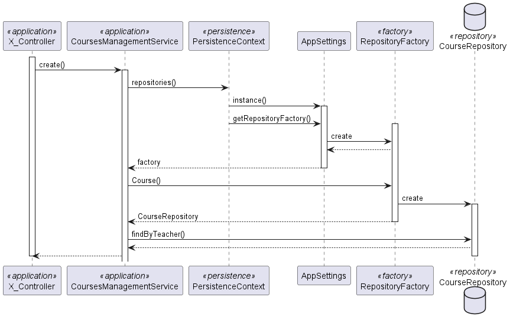
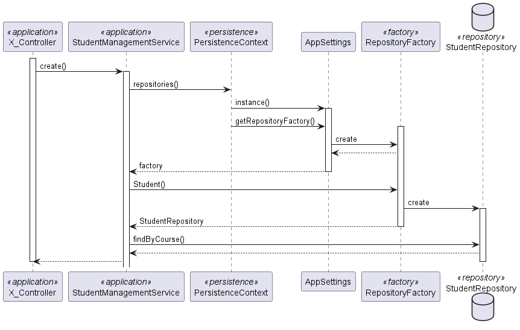
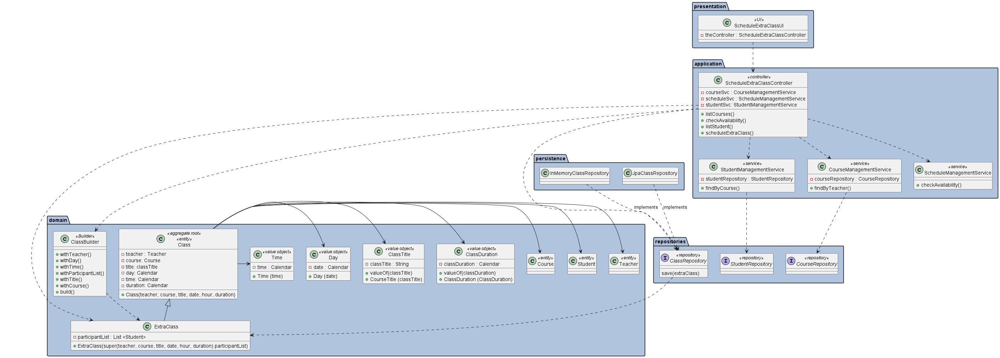

# US 1011 - As Teacher, I want to schedule an extraordinary class

## 1. Context

*This is the first time this functionality is being developed. It is included in Sprint B of the project eCourse*

## 2. Requirements

### 2.1. User Story Description
**US 1011** As Teacher, I want to schedule an extraordinary class

### 2.1 Customer Specifications and Clarifications ###

**From the specifications Document:**

This US is related to the Functional Requirement **FRC10** - Schedule of Extra Class A teacher schedule an extraordinary class. 
An extra class is a one occurrence only and it has a specific group of participants (a subset of the class students).

Additionally, according to the project description:
* *Classes and meetings are events that happen in some time and have a duration. They also have
participants. However, there is no concept of location related to classes and meetings. 
They do not take place in a specific location and "nothing" happens at the time of the event.*
*  *A class must have a unique title, a date and a duration*
* *It should be impossible to schedule classes that are coincident with other classes of the same course. The system should 
also warn if one of the participants in the class (either a teacher or a student) has other classes at the same time.*

  

**From the client clarifications:**

*From the client clarifications:*
> ***Question_1*** (Thursday, 20 de April de 2023 às 11:40) --> [US1010 e US1011- Schedule Class and ExtraClass] - Nestas duas US, pretende que seja mostrada a lista de Class/ExtraClass que já estão agendadas para que o professor saiba onde pode agendar?
>
> *Answer_1* --> Em termos de requisitos é importante que o sistema garanta as regras que estão descritas em 5.1.2 relativo a aulas e aulas extra. Em termos de user interface para cada um desses casos de uso não existem requisitos específicos.
Nesse aspeto de "user experience" devem seguir boas práticas. Mas isso já faz parte do desenho da solução. "O cliente não percebe muito disso :-)"

>
> ***Question_2*** (Thursday, 20 de April de 2023 às 13:46) -->  [Class duration and time] - From what time to what time can a class be scheduled (eg: can the course have a class at 3AM?).
And what’s the minimum and maximum duration for a class? i supose we can’t have 43m classes?
>
> *Answer_2* --> (AGUARDA RESPOSTA)

> ***Question_3*** (Saturday, 15 de April de 2023 às 10:38) -->[Class duration]  We have a question about a class scheduling. When a teacher wants to schedule a class, do they introduce start date/time and end date/time, or start date/time and duration of the class? And in general, how often will the client want to consult the duration of the classes?
>
> *Answer_3* --> For the class the teacher should entre the start date/time and duration (see Section 5.1.2).
The duration of the class is important when scheduling "events" (such a classes and meetings) because the system must comply with some scheduling rules, for instance, to avoid scheduling classes that are coincident with other classes of the same course (see Section 5.1.2).

>
> *Question_4* (Saturday, 22 de April de 2023 às 17:58) --> [US1011 - As Teacher, I want to schedule an extraordinary class] - Good afternoon, I've a question regarding the schedule of an extraordinary class. Does an extraordinary class need to have a course associated?
>
> *Answer_4* --> (AGUARDA RESPOSTA)

>
> *Question_5* ( Saturday, 25 de March de 2023 às 16:10) --> [Meetings and classes] I have a question about the meetings and classes. With the description of the functionalities/requirements of classes and meetings, wouldn't they be the same? Since both are online, in my point of view, it would make sense if a student could accept/reject a class as well, for example, and the same could be applied for the remaining requirements with the exception of creating classes.
But of course, I might be missing something that totally nullifies this point of view.
>
> *Answer_5* --> There is no requirement that "says" the student can accept or reject a class.
Only meetings have the possibility that participants may accept or reject the meeting. This does not apply to classes.

### 2.3. Acceptance Criteria ###

**A.C.1-** An extraordinary class has one occurrence only.

**A.C.2-** It has a specific group of participants (a subset of the class students).

**A.C.3-** A class must have a unique title, a date and a duration.

**A.C.4-** It should be impossible to schedule classes that are coincident with other classes of the same course. The system should
also warn if one of the participants in the class (either a teacher or a student) has other classes at the same time.

### 2.4. Dependencies ###
* [US1001] - As Manager, I want to be able to register, disable/enable, and list users of the system (Teachers and Students, as well as Managers). 
Since the teacher has to be registered and enable to schedule an extraordinary class, the same way that participants in an extraordinary class are only students registered and enable.

* [US1002] - As Manager, I want to create courses and [US1004] - As Manager, I want to open and close courses, because it's only possible to schedule extraordinary classes of open courses

* [US1003] - As Manager, I want to open/close enrollments in courses, since extraordinary class participants are only students enrolled in that course.
 

## 3. Analysis

### 3.1 Relevant Domain Model Excerpt

### 3.2 System Sequence Diagram (SSD)

## 4. Design

### 4.1. Realization (Sequence Diagram - SD)
* SD General

* SD CourseManagementService
  

* SD StudentManagementService
  

### 4.2. Class Diagram (CD)

### 4.3. Applied Patterns

* ENTITY as root of AGGREGATE
* VALUE OBJECT caractherizes OBJECTS
* SERVICE
* FACTORY
* REPOSITORY
* SINGLE RESPONSABILITY
* BUILDER

### 4.4. Tests

**Test 1:** *Verifies that it is not possible to create an instance of ExtraClass with a null teacher.*

    @Test
    public void ensureHasTeacher(){
        System.out.println("Class has teacher");
        valid_date.set(YEAR1, MONTH, DAY);
        students.add(student);
        assertThrows(IllegalArgumentException.class, () -> classBuilder.withDuration(DURATION).withTitle(TITLE).withDay(valid_date).withParticipants(students).withTeacher(null).withTime(TIME).withCourse(course).build());
    }

**Test 2:** *Verifies that it is not possible to create an instance of ExtraClass with a negative duration.*

    @Test
    public void ensureHasDuration(){
        System.out.println("Class has duration");
        valid_date.set(YEAR1, MONTH, DAY);
        students.add(student);
        assertThrows(IllegalArgumentException.class, () -> classBuilder.withDuration(-1).withTitle(TITLE).withDay(valid_date).withParticipants(students).withTeacher(teacher1).withTime(TIME).withCourse(course).build());
    }

**Test 3:** *Verifies that it is not possible to create an instance of ExtraClass with a null date.*

    @Test
    public void ensureHasDate(){
        System.out.println("Class has valid date");
        students.add(student);
        assertThrows(NullPointerException.class, () -> classBuilder.withDuration(DURATION).withTitle(TITLE).withDay(null).withParticipants(students).withTeacher(teacher1).withTime(TIME).withCourse(course).build());
    }

**Test 4:** *Verifies that it is not possible to create an instance of ExtraClass with a date in the paste.*

    @Test
    public void ensureDateIsInFuture(){
        System.out.println("Class date is in future");
        valid_date.set(YEAR, MONTH, DAY);
        students.add(student);
        assertThrows(IllegalArgumentException.class, () -> classBuilder.withDuration(DURATION).withTitle(TITLE).withDay(valid_date).withParticipants(students).withTeacher(teacher1).withTime(TIME).withCourse(course).build());
    }

**Test 5:** *Verifies that it is not possible to create an instance of ExtraClass with a null course.*

    @Test
    public void ensureHasCourse(){
        System.out.println("Class has course");
        valid_date.set(YEAR1, MONTH, DAY);
        students.add(student);
        assertThrows(IllegalArgumentException.class, () -> classBuilder.withDuration(DURATION).withTitle(TITLE).withDay(valid_date).withParticipants(students).withTeacher(teacher1).withTime(TIME).withCourse(null).build());
    }

**Test 4:** *Verifies that it is not possible to create an instance of ExtraClass with a null title.*

    @Test
    public void ensureHasTitle(){
        System.out.println("Class has course");
        valid_date.set(YEAR1, MONTH, DAY);
        students.add(student);
        assertThrows(IllegalArgumentException.class, () -> classBuilder.withDuration(DURATION).withTitle("").withDay(valid_date).withParticipants(students).withTeacher(teacher1).withTime(TIME).withCourse(course).build());
    }

**Test 4:** *Verifies that it is  possible to create an instance of ExtraClass with valid atributes.*

    @Test
    public void ensureIsValid(){
        System.out.println("Class is valid");
        valid_date.set(YEAR1, MONTH, DAY);
        students.add(student);
        ExtraordinaryClass extra= classBuilder.withDuration(DURATION).withTitle(TITLE).withDay(valid_date).withParticipants(students).withTeacher(teacher1).withTime(TIME).withCourse(course).build();
        assertNotNull(extra);
    }

## 5. Implementation

*In this section the team should present, if necessary, some evidencies that the implementation is according to the design. It should also describe and explain other important artifacts necessary to fully understand the implementation like, for instance, configuration files.*

*It is also a best practice to include a listing (with a brief summary) of the major commits regarding this requirement.*

## 6. Integration/Demonstration

*In this section the team should describe the efforts realized in order to integrate this functionality with the other parts/components of the system*

*It is also important to explain any scripts or instructions required to execute an demonstrate this functionality*

## 7. Observations

*This section should be used to include any content that does not fit any of the previous sections.*

*The team should present here, for instance, a critical prespective on the developed work including the analysis of alternative solutioons or related works*

*The team should include in this section statements/references regarding third party works that were used in the development this work.*