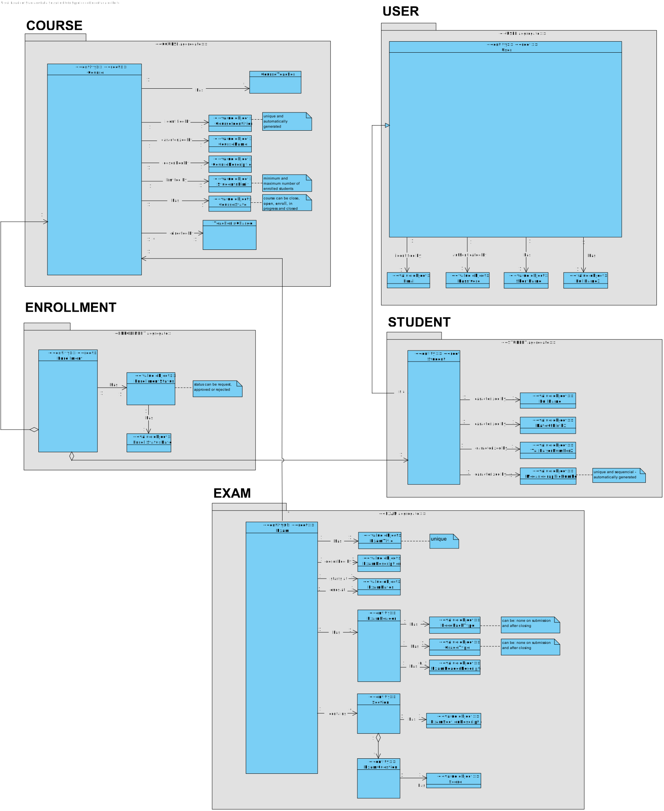
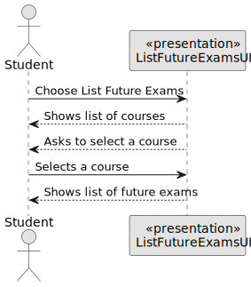
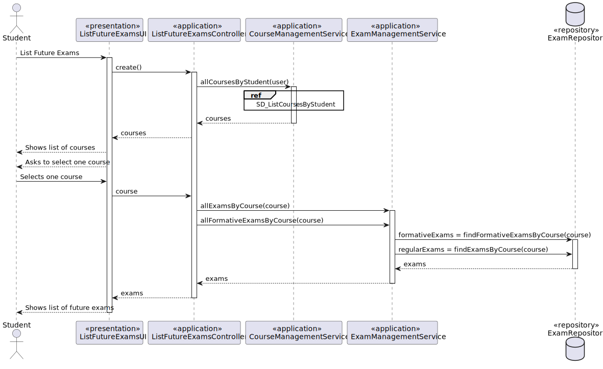
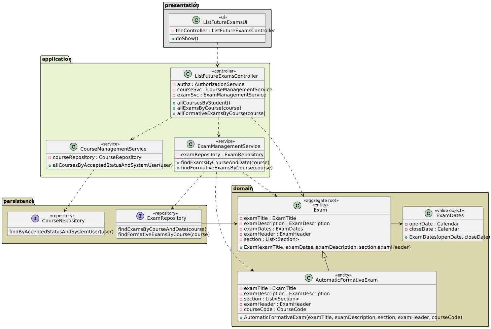
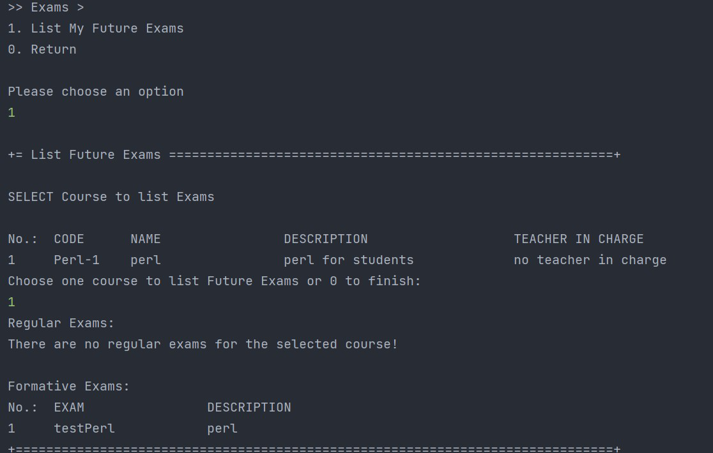

# US 2002 - As Student, I want to view a list of my future exams

## 1. Context

*This is the first time this functionality is being developed. It is included in Sprint B of the project eCourse.*

## 2. Requirements

### 2.1 User Story Description

**US 2002** As Student, I want to view a list of my future exams.

To develop this user story, the following flow were considered:
- check the courses in which the student is enrolled.
- shows list of courses and asks student to select one course to view the exams
- list all regular exams available (with open date after actual date) and all automatic formative exams.
- the list should contain exam title, description, open date, close date (these two in regular exams).

### 2.2 Customer Specifications and Clarifications ###

**From the specifications Document:**

This User Story is related to the Functional Requirement **FRC02** - List Exams. The system displays to a student his/her future exams. (Section 3.1.3).

"Teachers can create exams. An exam is related to a specific course. It has a unique title and a small description. Exams have also an open and a close date." (Section 5.1.2)
"The open date is the time when students can start to take the exam. The close date is the deadline for students to submit the exam."

"Students enroll in courses. They take exams." (Section 5.1.3)

**From the client clarifications:**

> *Question_1* (Thursday, 30 March 2023 at 09:54h) --> Is an exam available for all students of a certain course, or do the students of the course need to sign up to take an exam previously.
>
> *Answer_1* --> I think there is no "sign up" for exams. After the exam is created it should be available to all the students of that course, and all the students can/should take that exam.

> *Question_2* () --> Ao criar um exame, este pode ser marcado para mais do que um dia?
> 
> *Answer_2* --> Relativamente a esta questão o que está na especificação é: "Exams have also an open and a close date. The open date is the time when students can start to take the exam. The close date is the deadline for students to submit the exam.". Portanto, eu diria que tem um "tempo" de abertura e um tempo de "fecho". O tempo de abertura tem de ser antes do tempo de fecho. Nada de especifico é dito sobre a duração do exame ou outro tipo de restrição, pelo que se devem aceitar exames que estão "abertos" por períodos que ultrapassam um dia.

### 2.3. Acceptance Criteria ###
N.A.

### 2.4. Dependencies ###

* **US 1006** - As User, I want to list all the courses that are available to me.

## 3. Analysis

### 3.1 Relevant Domain Model Excerpt



### 3.2 System Sequence Diagram (SSD)



## 4. Design

### 4.1. Realization (Sequence Diagram - SD)



### 4.2. Class Diagram (CD)



### 4.3. Applied Patterns

* SERVICE
* FACTORY
* REPOSITORY
* SINGLE RESPONSABILITY

### 4.4. Tests

NA (no domain tests in this user story)

## 5. Implementation

```
public class ListFutureExamsController {

    private final AuthorizationService authz = AuthzRegistry.authorizationService();
    private final CourseManagementService courseSvc = AuthzRegistry.courseService();
    private final ExamManagementService examSvc = AuthzRegistry.examService();

    public Iterable<Course>allCoursesbyStudent(){
        authz.ensureAuthenticatedUserHasAnyOf(EcourseRoles.STUDENT);
        return courseSvc.allCoursesByAcceptedStatusAndSystemUser(authz.session().get().authenticatedUser());
    }

    public Iterable<Exam>allExamsByCourse(CourseCode code){
        authz.ensureAuthenticatedUserHasAnyOf(EcourseRoles.STUDENT);
        return examSvc.findExamsByCourseAndDate(code);
    }

    public Iterable<AutomaticFormativeExam> allFormativeExamsByCourse(CourseCode code) {
        authz.ensureAuthenticatedUserHasAnyOf(EcourseRoles.STUDENT);
        return examSvc.findFormativeExamsByCourse(code);
    }

}

````

## 6. Integration/Demonstration

### Demonstration of the implemented functionality


## 7. Observations
In the beginning of the development of this user story it was planed to show a list with all exams without asking the course but 
for sake of simplicity another approach was taken. 