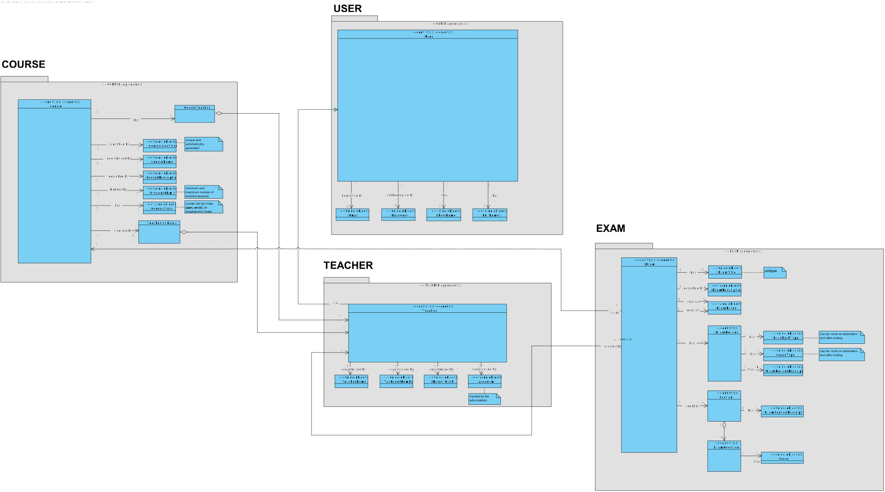
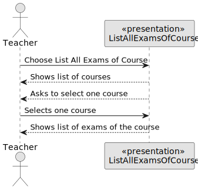
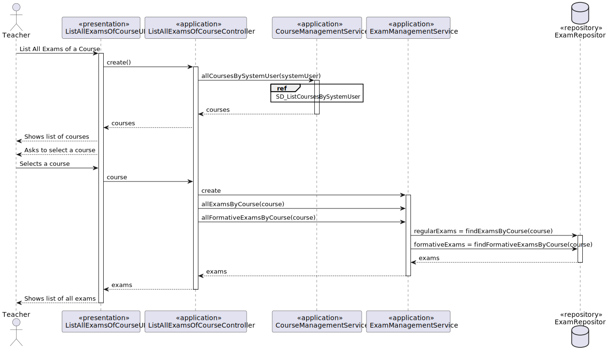
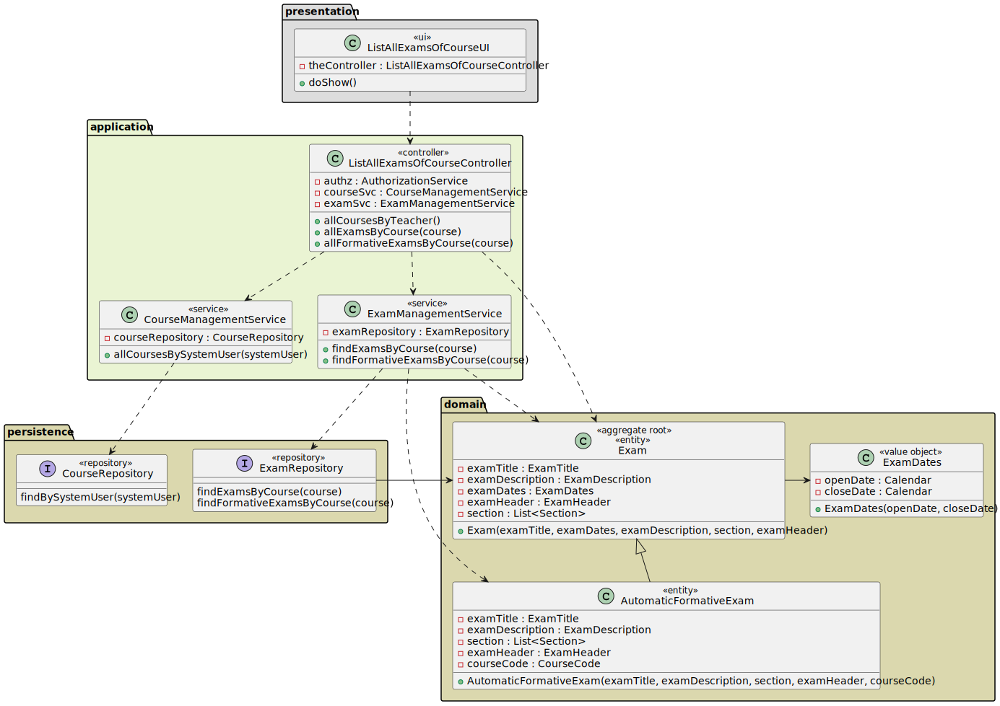
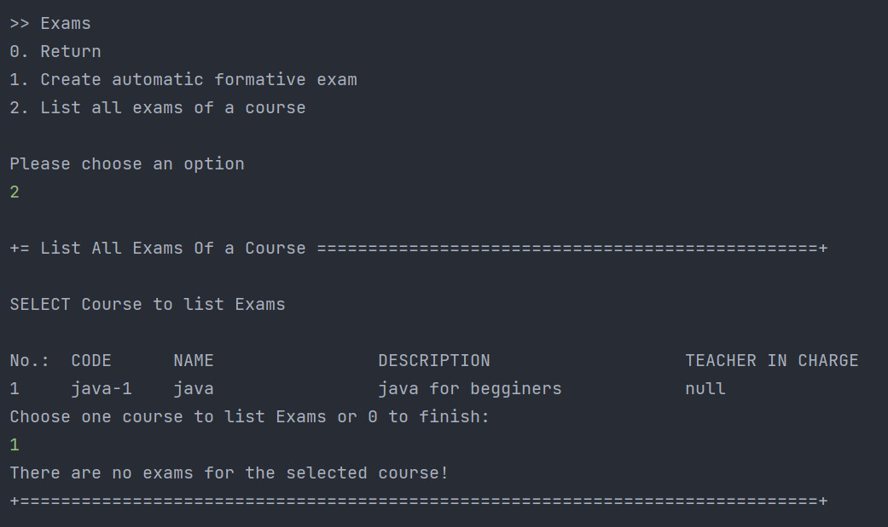

# US 2003 - As Teacher, I want to view a list of all exams in a course

## 1. Context

*This is the first time this functionality is being developed. It is included in Sprint B of the project eCourse.*

## 2. Requirements

### 2.1 User Story Description

**US 2003** As Teacher, I want to view a list of all exams in a course

To develop this user story, the following flow were considered:
- verify courses in which the teacher teaches  
- shows list of courses and asks teacher to select one course to view the exams
- display a list of all exams of the course

### 2.2 Customer Specifications and Clarifications ###

**From the specifications Document:**

This User Story is related to the Functional Requirement **FRC03** - List Course Exams. The system displays to a teacher of a course all the exams of the course. (Section 3.1.3).

"Teachers can create exams. An exam is related to a specific course. It has a unique title and a small description. Exams have also an open and a close date." (Section 5.1.2)
"The open date is the time when students can start to take the exam. The close date is the deadline for students to submit the exam."

**From the client clarifications:**
NA


### 2.3. Acceptance Criteria ###
N.A.

### 2.4. Dependencies ###

* **US 1006** - As User, I want to list all the courses that are available to me.

## 3. Analysis

### 3.1 Relevant Domain Model Excerpt



### 3.2 System Sequence Diagram (SSD)



## 4. Design

### 4.1. Realization (Sequence Diagram - SD)



### 4.2. Class Diagram (CD)



### 4.3. Applied Patterns

* SERVICE
* FACTORY
* REPOSITORY
* SINGLE RESPONSABILITY

### 4.4. Tests

NA (no domain tests in this user story)

## 5. Implementation

```
public class ListAllExamsOfCourseController {

    private final AuthorizationService authz = AuthzRegistry.authorizationService();
    private final CourseManagementService courseSvc = AuthzRegistry.courseService();
    private final ExamManagementService examSvc = AuthzRegistry.examService();


    public Iterable<Course> allCoursesByTeacher() {
        authz.ensureAuthenticatedUserHasAnyOf(EcourseRoles.TEACHER);
        return courseSvc.allCoursesBySystemUser(authz.session().get().authenticatedUser());
    }


    public Iterable<Exam> allExamsByCourse(CourseCode code) {
        return examSvc.findExamsByCourse(code);
    }
}

````

## 6. Integration/Demonstration

### Demonstration of the implemented functionality


## 7. Observations
Due to the existence of two types of exams (regular and automatic formative) it is showed two lists: one of regular
exams and other of automatic formative exams.