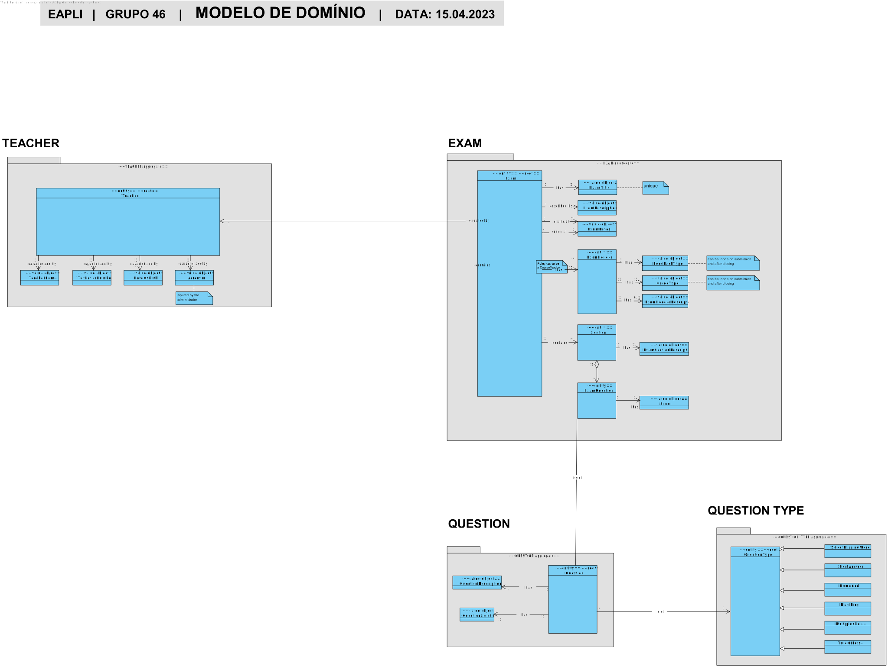
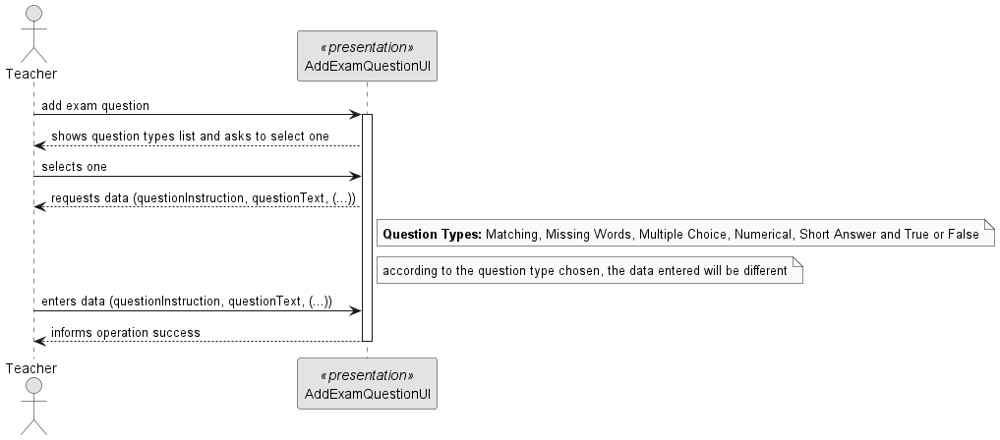
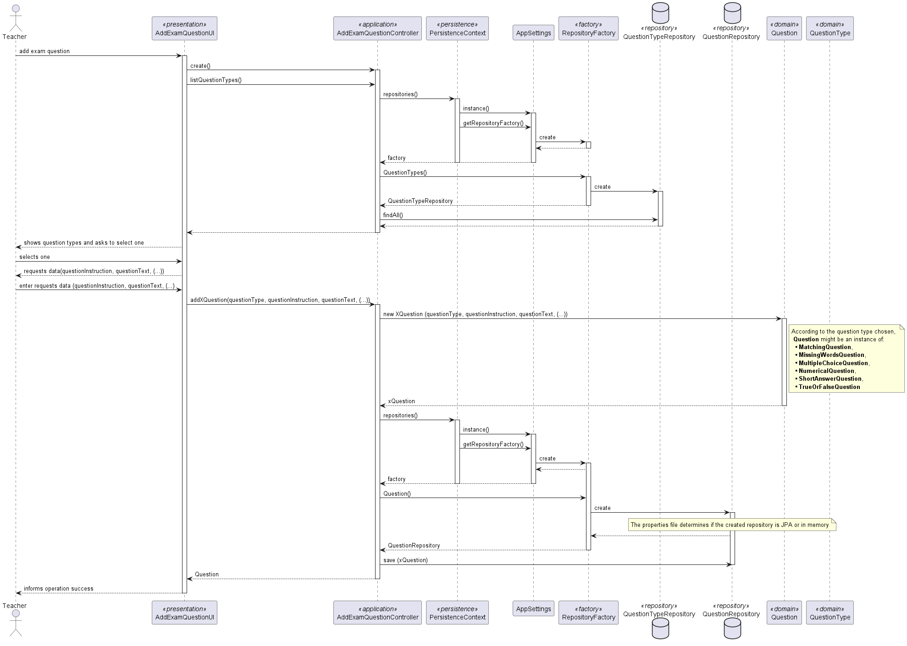
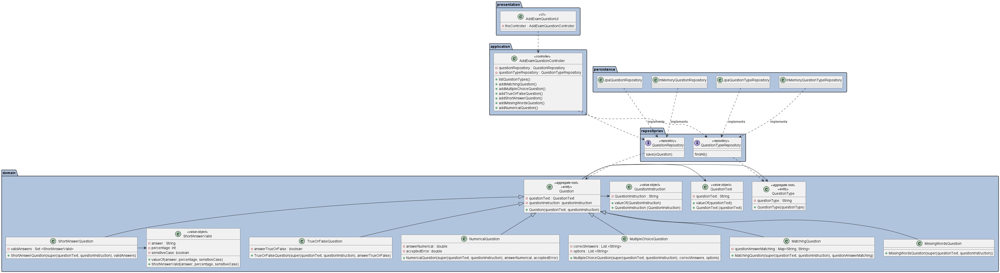
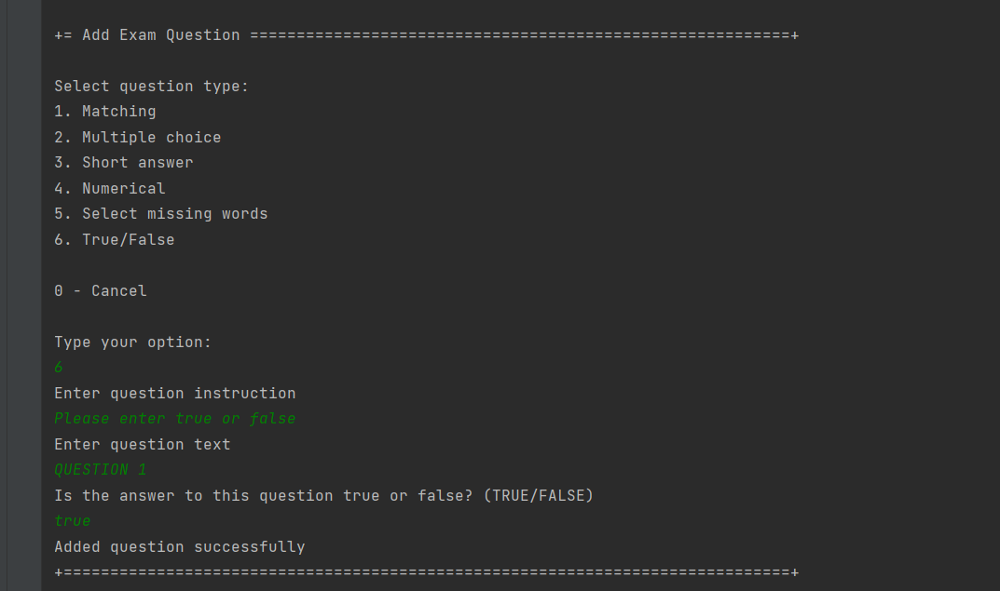

# US 2007 - [2007] As Teacher I want to add/update exam questions to a repository of exam questions to be used in automatic formative exams

## 1. Context

*This is the first time this functionality is being developed. It is included in Sprint B of the project eCourse*

## 2. Requirements

### 2.1. User Story Description
**US 2007** - As Teacher I want to add/update exam questions to a repository of exam questions to be used in automatic formative exams

### 2.1 Customer Specifications and Clarifications ###

**From the specifications Document:**

This US is related to the functional requirements:
* **FRE01 Create Exam:** A Teacher creates a new exam. This includes the specification
  of the exam (i.e., its structure, in accordance with a grammar for exams that is used to
  validate the specification of the exam)

* **NFR09 Exam Language:**  The support for exams (its design, feedback and grading)
  must follow specific technical requirements, specified in LPROG. The ANTLR tool should
  be used (https://www.antlr.org/).

Additionally: 

_For the moment the goal is to support online exams that can be automatically graded.
The system must provide a language to support the specification and "execution" of exams.
The language must support the design of the exam layout and its questions as well as
solutions, feedback and grading. The system must also support the automatic production
of feedback and grading for the answers given by students when they take the exam.
Usually this is done at the end of the exam. Therefore, you must analyze the problem and
design a solution that supports the two goals: validate the structure of the exam; evaluate the
answers of each exam (giving feedback and calculating the grade)._

**Question Types**

The solution should be based on the following type of questions that are inspired on the Moodle
platform. You should support, as much as possible, the features that are supported in Moodle,
as described in the following items.

• **Matching** - A list of sub-questions is provided, along with a list of answers. The respondent must "match" the correct answers with each question.

– https://docs.moodle.org/401/en/Matching_question_type.

• **Multiple Choice** - With the Multiple Choice question type you can create single-answer
and multiple-answer questions and weight individual answers.

– https://docs.moodle.org/401/en/Multiple_Choice_question_type.

• **Short Answer** - In response to a question, the respondent types a word or phrase. There
may be several possible correct answers, with dierent grades. Answers may or may not
be sensitive to case.

– https://docs.moodle.org/401/en/Short-Answer_question_type.

• **Numerical** - From the student perspective, a numerical question looks just like a shortanswer question. The dierence is that numerical answers are allowed to have an accepted error. This allows a continuous range of answers to be set.

– https://docs.moodle.org/401/en/Numerical_question_type.

• **Select Missing Words** - Students select a missing word or phrase from a dropdown
menu. Items may be grouped and used more than once.

– https://docs.moodle.org/401/en/Select_missing_words_question_type.

• **True/False** - In response to a question, the respondent selects from two options: True
or False.

– https://docs.moodle.org/401/en/True/False_question_type.

**From the client clarifications:**

There are no questions about this US

### 2.3. Acceptance Criteria ###

**AC1:** The teacher can specify the type of question (Matching, Multiple Choice, Short Answer, Numerical, Select Missing Words, True/False).

**AC2:** The question should have a title or description.

**AC3:**  The system should utilize the ANTLR tool for the design, feedback, and grading of exams.
The system should follow the technical specifications provided in LPROG.

**AC4:** The system should provide similar features and functionality for the supported question types as described in the Moodle documentation.

**AC5 - Matching Question Acceptance Criteria:**

    - The question should have a list of answers.
    - The teacher can specify the correct matching of answers to sub-questions.

**AC6 - Multiple Choice Question Acceptance Criteria:**

    - The question should have a list of options.
    -The teacher can specify the correct answer(s) among the options.

**AC7 - Short Answer Question Acceptance Criteria:**

    - The teacher can specify the correct answer(s) as a word or phrase.
    - The teacher can optionally specify multiple correct answers with different grades.
    -The teacher can specify whether the answers are case-sensitive or not.

**AC8 - Numerical Question Acceptance Criteria:**

    - The teacher can specify the correct answer(s) as a numerical value.
    - The teacher can specify an accepted error range for the numerical answers.

**AC9- Select Missing Words Question Acceptance Criteria:**

    - The question should have a paragraph or sentence with missing words or phrases.
    - The teacher can provide options for each missing word or phrase.
    - The teacher can specify the correct options for each missing word.

**AC10 - True/False Question Acceptance Criteria:**

    -The teacher can specify whether the correct answer is True or False.

### 2.4. Dependencies ###
* [US1001] - As Manager, I want to be able to register, disable/enable, and list users of the system (Teachers and Students, as well as Managers).
  Since the teacher has to be registered and enable to add a question to question repository.

## 3. Analysis

### 3.1 Relevant Domain Model Excerpt

### 3.2. System Sequence Diagram (SSD)

## 4. Design

### 4.1. Realization (Sequence Diagram - SD)

### 4.2. Class Diagram (CD)

### 4.3. Applied Patterns

* ENTITY as root of AGGREGATE
* VALUE OBJECT caractherizes OBJECTS
* FACTORY
* REPOSITORY
* SINGLE RESPONSABILITY

### 4.4. Tests

**Test 1:** *Verifies that it is not possible to create an instance of MatchingQuestion without instruction.*

    @Test
    public void ensureHasInstruction(){
        System.out.println("Question has title");
        questionAnswer.put("Question1", "Answer1");
        assertThrows(IllegalArgumentException.class, () -> new MatchingQuestion(new QuestionType(ECourseQuestionTypeStrings.MATCHING_QUESTION),null, QuestionText.valueOf("Question"),questionAnswer));
    }

**Test 2:** *Verifies that it is not possible to create an instance of MatchingQuestion without text.*
   
     @Test
    public void ensureHasText(){
        System.out.println("Question has text");
        questionAnswer.put("Question1", "Answer1");
        assertThrows(IllegalArgumentException.class, () -> new MatchingQuestion(new QuestionType(ECourseQuestionTypeStrings.MATCHING_QUESTION),QuestionInstruction.valueOf("instruction"), null ,questionAnswer));
    }

**Test 3:** *Verifies that it is not possible to create an instance of MatchingQuestion without subquestions and answers.*

    @Test
    public void ensureHasSubQuestionsAndAnswers(){
        System.out.println("Question has subquestion(s) and answer(s)");
        assertThrows(IllegalArgumentException.class, () -> new MatchingQuestion(new QuestionType(ECourseQuestionTypeStrings.MATCHING_QUESTION),QuestionInstruction.valueOf("instruction"), QuestionText.valueOf("Question") ,null));
    }

**Test 4:** *Verifies that it is possible to create an instance of MatchingQuestion with valid atributes.*
    
    @Test
    public void ensureIsValid(){
        System.out.println("Question has subquestion(s) and answer(s)");
        questionAnswer.put("Question1", "Answer1");
        MatchingQuestion  question= new MatchingQuestion(new QuestionType(ECourseQuestionTypeStrings.MATCHING_QUESTION),QuestionInstruction.valueOf("instruction"), QuestionText.valueOf("Question") ,questionAnswer);
        assertNotNull(question);
    }

**Test 5:** *Verifies that it is not possible to create an instance of MultipleChoiceQuestion withouth options*

    @Test
    public void ensureHasOptions(){
    System.out.println("Question has options");
    assertThrows(IllegalArgumentException.class, () -> new MultipleChoiceQuestion(new QuestionType(ECourseQuestionTypeStrings.MATCHING_QUESTION),QuestionInstruction.valueOf("instruction"), QuestionText.valueOf("Question"),options, answer));
    }

**Test 6:** *Verifies that it is not possible to create an instance of MultipleChoiceQuestion withouth answers*

      @Test
      public void ensureHasAnswers(){
      System.out.println("Question has answers");
      options=new ArrayList<>();
      options.add("option A");
      options.add("option B");
      assertThrows(IllegalArgumentException.class, () -> new MultipleChoiceQuestion(new QuestionType(ECourseQuestionTypeStrings.MATCHING_QUESTION),QuestionInstruction.valueOf("instruction"), QuestionText.valueOf("Question"),options, answer));
      }

**Test 7:** *Verifies that it is  possible to create an instance of MultipleChoiceQuestion with valid atributes*

    @Test
    public void ensureIsValid(){
        System.out.println("Question has text");
        options=new ArrayList<>();
        answer=new ArrayList<>();
        options.add("option A");
        options.add("option B");
        answer.add("option A");
        MultipleChoiceQuestion  question= new MultipleChoiceQuestion(new QuestionType(ECourseQuestionTypeStrings.MATCHING_QUESTION),QuestionInstruction.valueOf("instruction"), QuestionText.valueOf("Question") ,options, answer);
        assertNotNull(question);
    }

**Test 8:** *Verifies that it is  possible to create an instance of NumericalQuestion with valid atributes*

    @Test
    public void ensureIsValid(){
    System.out.println("Question is valid");
    NumericalQuestion  question= new NumericalQuestion(new QuestionType(ECourseQuestionTypeStrings.MATCHING_QUESTION),QuestionInstruction.valueOf("instruction"), QuestionText.valueOf("Question"), 100, 20);
    assertNotNull(question);
    }

**Test 9:** *Verifies that it is not possible to create an instance of ShortAnswerQuestion with negative percentage*

    @Test
    public void ensurePercentageIsNonNegative(){
        System.out.println("Question has valid percentage");
        assertThrows(IllegalArgumentException.class, () -> new ShortAnswerValid(true,"answer", -1));
    }

**Test 10:** *Verifies that it is not possible to create an instance of ShortAnswerQuestion with percentage greater than 100*
    
      @Test
        public void ensurePercentageIsLessThan100(){
            System.out.println("Question has valid percentage");
            assertThrows(IllegalArgumentException.class, () -> new ShortAnswerValid(true,"answer", 101));
        }

**Test 11:** *Verifies that it is  possible to create an instance of ShortAnswerQuestion with valid atributes*

        @Test
        public void ensureIsValid(){
            System.out.println("Question is valid");
            validAnswers.add(new ShortAnswerValid(true,"answer", 100));
            ShortAnswerQuestion  question= new ShortAnswerQuestion(new QuestionType(ECourseQuestionTypeStrings.MATCHING_QUESTION),QuestionInstruction.valueOf("instruction"), QuestionText.valueOf("Question"), validAnswers);
            assertNotNull(question);
        }

## 5. Implementation

*In this section the team should present, if necessary, some evidencies that the implementation is according to the design. It should also describe and explain other important artifacts necessary to fully understand the implementation like, for instance, configuration files.*

*It is also a best practice to include a listing (with a brief summary) of the major commits regarding this requirement.*

## 6. Integration/Demonstration

## 7. Observations

*This section should be used to include any content that does not fit any of the previous sections.*

*The team should present here, for instance, a critical prespective on the developed work including the analysis of alternative solutioons or related works*

*The team should include in this section statements/references regarding third party works that were used in the development this work.*