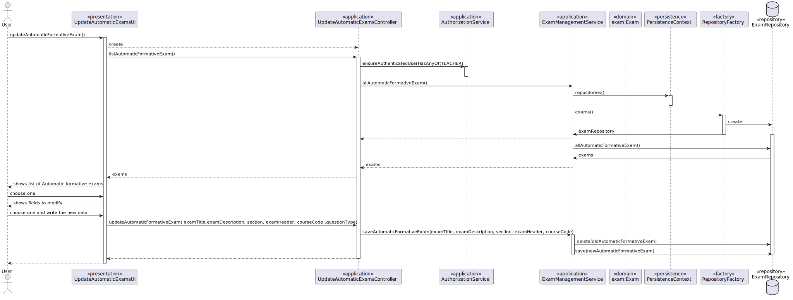

# US 2008 - As Teacher, I want to create/update automatic formative exams

## 1. Context

*This is the first time this functionality is being developed. It is included in Sprint B of the project eCourse*

## 2. Requirements
**US 2008** As Teacher, I want to create/update automatic formative exams
The specification of formative exams is similar to regular exams, but the user specifies the type of questions to be inserted in the sections instead of the specific questions. When generating the automatic formative exam, the system should randomly create the questions (without repetition on a given exam). Also, formative exams do not have open and close dates. Feedback and grades are only provided at the end of the exam.
The support for exams (its design, feedback and grading) must follow specific technical requirements, specified in LPROG.
The ANTLR tool should be used (https://www.antlr.org/).

### 2.1 Customer Specifications and Clarifications ###

**From the specifications Document:**

FRE01 - Create Exam A Teacher creates a new exam. This includes the specification of the exam(i.e, its structure, in accordance with a grammar for exams that is used to validate the specification of the exam)

**From the client clarifications:**
> **Question_1** (Tuesday, 21 de March de 2023 às 17:21) -->In regards to the exam, what do you mean by feedback and grading? Is it necessary to save the answers of the users showing and comparing them with the correct answer? Furthermore is it necessary to save the answer of the question?
> 
> **Answer_1** --> The ideia is to have feedback and grading similarly to what is available for tests in the moodle platform. How you may achieve this is not up to me to decide.
> 
> **Question_2** (Tuesday, 14 de March de 2023 às 15:52) -->   As for the exam, is the title written in the exam the same as its unique title to identify? They are both mentioned, but in different parts of the project.
> 
> **Answer_2** --> Page 14: "It has a unique title and a small description.". Therefore my answer should be that the title is unique. Maybe it could be used to identify the exam. It is also mentioned that the contents and structure of exams is to be based on the Moodle platform (particularly for the questions). As such, maybe a study of that platform is a good starting point for understanding how this feature of the eCourse project should/can "work".
> 
> **Question_3** (Saturday, 25 de March de 2023 às 16:10) -->  Meetings and classes:
I have a question about the meetings and classes.
With the description of the functionalities/requirements of classes and meetings, wouldn't they be the same? Since both are online, in my point of view, it would make sense if a student could accept/reject a class as well, for example, and the same could be applied for the remaining requirements with the exception of creating classes.
But of course, I might be missing something that totally nullifies this point of view.
>
> **Answer_3** --> There is no requirement that "says" the student can accept or reject a class.
Only meetings have the possibility that participants may accept or reject the meeting. This does not apply to classes.

### 2.3. Acceptance Criteria ###

### 2.4. Dependencies ###

* [US1001] - As Manager, I want to be able to register, disable/enable, and list users of the system (Teachers and Students, as well as Managers).
Users will schedule a meeting.

## 3. Analysis

### 3.1 Relevant Domain Model Excerpt

### 3.2 System Sequence Diagram (SSD)
* CREATE 
* 

* UPDATE

## 4. Design

### 4.1. Realization (Sequence Diagram - SD)
* CREATE

* UPDATE
* 

### 4.2. Class Diagram (CD)

### 4.3. Applied Patterns

- ENTITY as root of AGGREGATE
- VALUE OBJECT caractherizes OBJECTS
- SERVICE
- FACTORY
- REPOSITORY

### 4.4. Tests

## 5. Implementation
* CREATE EXAM

* UPDATE EXAM 

## 6. Integration/Demonstration

*In this section the team should describe the efforts realized in order to integrate this functionality with the other parts/components of the system*

*It is also important to explain any scripts or instructions required to execute an demonstrate this functionality*

## 7. Observations

*This section should be used to include any content that does not fit any of the previous sections.*

*The team should present here, for instance, a critical prespective on the developed work including the analysis of alternative solutioons or related works*

*The team should include in this section statements/references regarding third party works that were used in the development this work.*