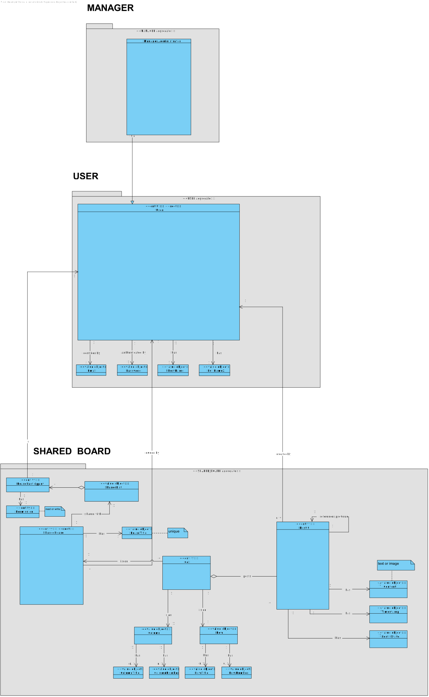
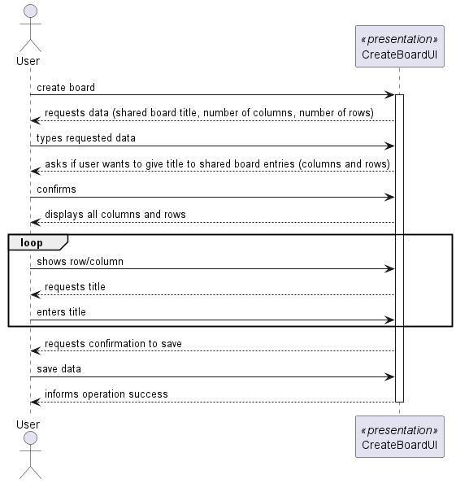
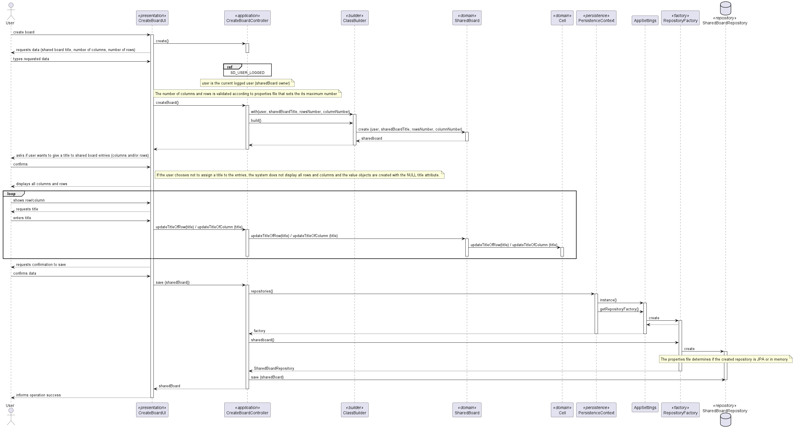
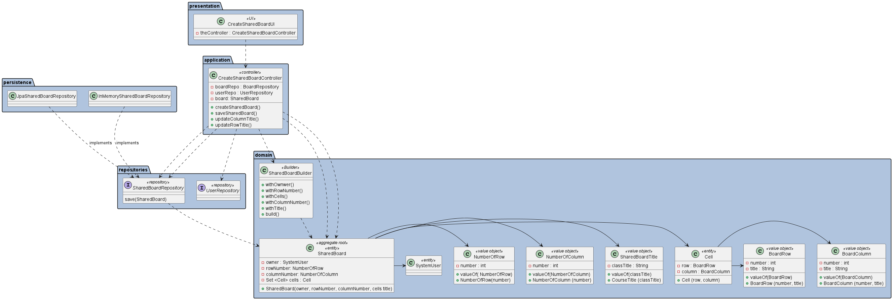

# US 3002 - As User, I want to create a board

## 1. Context

*This is the first time this functionality is being developed. It is included in Sprint B of the project eCourse*

## 2. Requirements

### 2.1. User Story Description
**US 3002** As User, I want to create a board

### 2.1 Customer Specifications and Clarifications ###

**From the specifications Document:**

This US is related to the Functional Requirement **FRB01- Create Board** - A user creates a board.

Additionally, according to the project description:
* *Shared Boards are one of the main used tools for teaching. From the old chalk
boards to the new connected digital boards, boards are one of the most successful teaching tool. 
The project aims to implement the concept of shared board, as a board that can be used to share and organize ideas and information. Figure 2.2 presents an illustration
  of a shared board used for managing projects.*

* *All users can create and use boards as well as meetings*

* *5.2.3 Shared Boards
  A shared board is a digital implementation of a post-it board. It has a unique
  title. It is divided into a certain number of columns and rows. Therefore it has a certain number
  of cells. For the moment it makes sense to define the maximum number of rows to 20 and of
  columns to 10. But this should be a setting in a property file. Columns and rows may have
  titles. They may also be identified by an integer number from 1 to the maximum number.
  The user that creates the board is its owner. The owner can share the board with other users.
  Users may have read or write access to the board.
  Users with write permission may post content to a cell in the board. The content can be a
  text or an image.*

  

**From the client clarifications:**

*From the client clarifications:*
> ***Question_1*** (Tuesday, 28 de March de 2023 às 22:01) --> [Shared board] - Relativamente ao uso da shared board: 1. uma célula pode ter mais do que um post it? 2. Se sim, é possível ter post-its de users diferentes na mesma célula? Se sim, até quantos?
>
> *Answer_1* --> 1. Neste momento (no âmbito deste projeto) isso não será necessário. A ser possível (uma célula com mais do que 1 post-it) isso iria dificultar algumas funcionalidades, como a que permite mudar um post-it.

>
> ***Question_2*** (Monday, 27 de March de 2023 às 23:23) -->  [Board] -  Can a user own more than one board?
>
> *Answer_2* --> Yes

> ***Question_3*** (Tuesday, 2 de May de 2023 às 23:08) -->[US3002 - As a user, I want to create a board]- Para a realização da US3002 basta fazer o necessário para a criação de uma board ou também temos que fazer os requisitos não funcionais?
>
> *Answer_3* --> (Aguarda resposta)

>
> **Question_4** (Saturday, 25 de March de 2023 às 16:48) --> [Board Line/Entry attributes] - As stated in the system specifications document, "Columns and rows may have titles. They may also be identified by an integer number from 1 to the maximum number", we wanted to clarify if it should be possible to have a column with no title and no identifier.
Also, can the identifier of a column/row change once it's assigned?
>
> *Answer_4* --> In order for user to post content into a cell they must identify the cell. Therefore, I think at least, ir should be possible to identify the cell by the number of its column and the number of its row. If the cells have titles, these titles can be used to identify the cells. However, it should always be possible to identify a cell by the column number and row number.
Regarding changing the title of the columns and rows after creating the board, there is nothing explicit about that. Therefore, I would accept the solution that does not support that possibility.

>

### 2.3. Acceptance Criteria ###

**A.C.1-** All users can create and use boards.

**A.C.2-** A shared board has a unique title.

**A.C.3-** It is divided into a certain number of columns and rows.

**A.C.4-** The number maximum of columns is 10 and the number maximum of rows is 20. 
It should be setting in a property file

**A.C.5-** Columns and rows may have titles. 

**A.C.6-** Columns and rows are identified by an integer from 1 to maximum

**A.C.7-** The user that creates the board is its owner

### 2.4. Dependencies ###
* [US1001] - As Manager, I want to be able to register, disable/enable, and list users of the system (Teachers and Students, as well as Managers). 
Since all users can create and use boards.

## 3. Analysis

### 3.1 Relevant Domain Model Excerpt

### 3.2 System Sequence Diagram (SSD)

## 4. Design

### 4.1. Realization (Sequence Diagram - SD)

### 4.2. Class Diagram (CD)

### 4.3. Applied Patterns

* ENTITY as root of AGGREGATE
* VALUE OBJECT caractherizes OBJECTS
* FACTORY
* REPOSITORY
* SINGLE RESPONSABILITY
* BUILDER
* 
### 4.4. Tests

**Test 1:** *Verifies that it is not possible to create an instance of Shared Board class without owner (system user).*

    @Test
    public void ensureSharedBoardHasOwner(){
        System.out.println("Shared Board owner can't be null");
        assertThrows(IllegalArgumentException.class, () -> boardBuilder.withOwner(null).withColumnNumber(COLUMN).withRowNumber(ROW).withTitle(TITLE).build());
    }

**Test 2:** *Verifies that it is not possible to create an instance of Shared Board class without title.*

    @Test
    public void ensureSharedBoardHasTitle(){
        System.out.println("Shared Board title can't be null");
        assertThrows(IllegalArgumentException.class, () -> boardBuilder.withOwner(user1).withColumnNumber(COLUMN).withRowNumber(ROW).withTitle("").build());
    }

**Test 3:** *Verifies that it is not possible to create an instance of Shared Board class with number of rows negative.*

    @Test
    public void ensureSharedBoardHasRows(){
        System.out.println("Shared Board has rows");
        assertThrows(IllegalArgumentException.class, () -> boardBuilder.withOwner(user1).withColumnNumber(COLUMN).withRowNumber(-1).withTitle(TITLE).build());
    }

**Test 4:** *Verifies that it is not possible to create an instance of Shared Board class with number of columns negative.*

    @Test
    public void ensureSharedBoardHasColumns(){
        System.out.println("Shared Board title has columns");
        assertThrows(IllegalArgumentException.class, () -> boardBuilder.withOwner(user1).withColumnNumber(-1).withRowNumber(ROW).withTitle(TITLE).build());
    }

**Test 5:** *Verifies that it is not possible to create an instance of Shared Board class.*

    @Test
    public void ensureSharedBoardIsValid(){
        System.out.println("Shared Board is valid");
        SharedBoard board =boardBuilder.withOwner(user1).withColumnNumber(COLUMN).withRowNumber(ROW).withTitle(TITLE).build();
        assertNotNull(board);
    }

**Test 6:** *Verifies that it is possible not to create an instance of Shared Board class with number of rows above limit.*

    @Test
    public void ensureNumberOfRowsMustBeLessOrEqualThanLimit(){
        System.out.println("Rows must be less or equal than limit");
        assertThrows(IllegalArgumentException.class, () -> new NumberOfRows(1000));
    }

**Test 7:** *Verifies that it is not possible to create an instance of Shared Board class with number of columns above limit.*

    @Test
    public void ensureNumberOfRowsMustBeLessOrEqualThanLimit(){
        System.out.println("Rows must be less or equal than limit");
        assertThrows(IllegalArgumentException.class, () -> new NumberOfRows(1000));
    }

## 5. Implementation

*In this section the team should present, if necessary, some evidencies that the implementation is according to the design. It should also describe and explain other important artifacts necessary to fully understand the implementation like, for instance, configuration files.*

*It is also a best practice to include a listing (with a brief summary) of the major commits regarding this requirement.*

## 6. Integration/Demonstration

*In this section the team should describe the efforts realized in order to integrate this functionality with the other parts/components of the system*

*It is also important to explain any scripts or instructions required to execute an demonstrate this functionality*

## 7. Observations

*This section should be used to include any content that does not fit any of the previous sections.*

*The team should present here, for instance, a critical prespective on the developed work including the analysis of alternative solutioons or related works*

*The team should include in this section statements/references regarding third party works that were used in the development this work.*