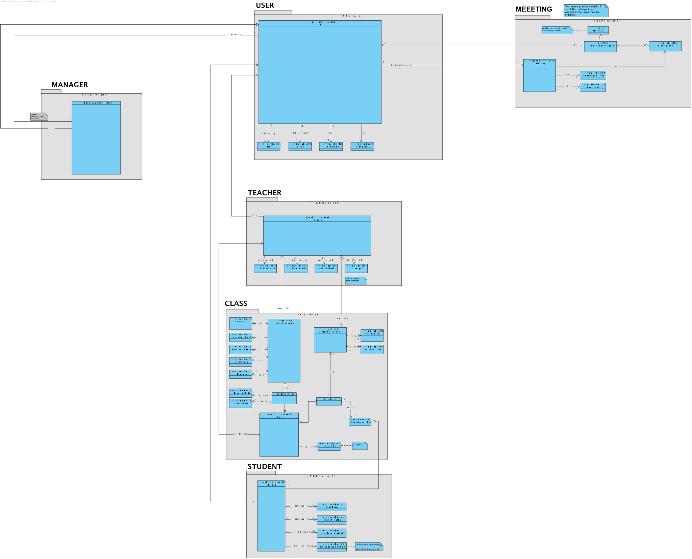
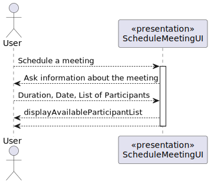
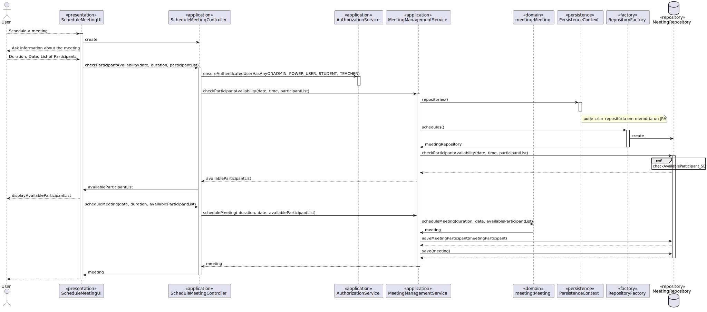
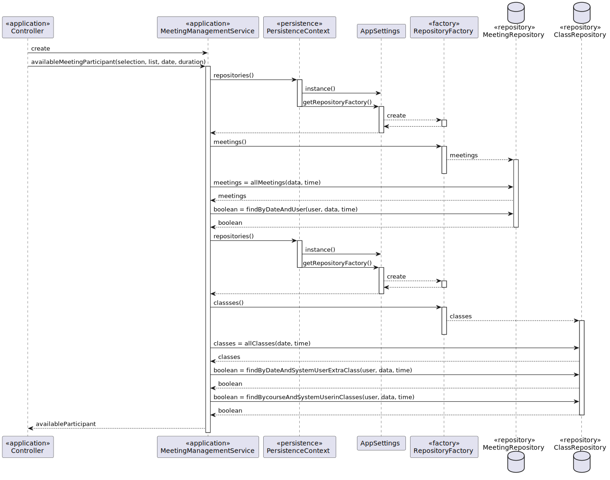
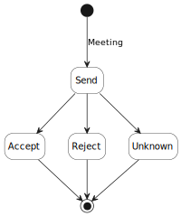
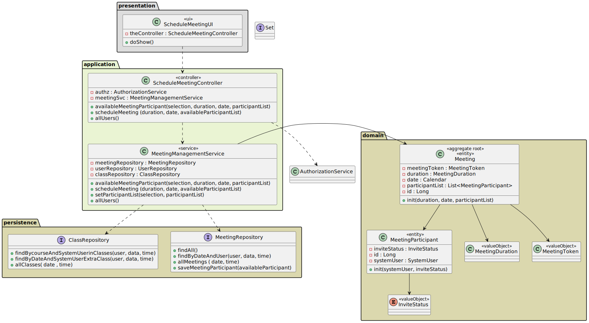
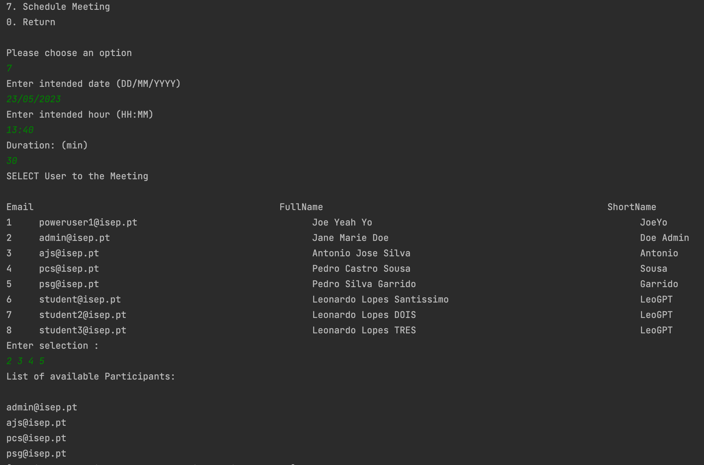

# US 4001 - As User, I want to schedule a meeting

## 1. Context

*This is the first time this functionality is being developed. It is included in Sprint B of the project eCourse*

## 2. Requirements
**US 4001** As User, I want to schedule a meeting.

- Schedule a meeting. 

- Check participants availability.
	
- Send invitation to participants.

### 2.1 Customer Specifications and Clarifications ###

**From the specifications Document:**

This User story is related to the Functional Requirement FRM01 - Schedule a Meeting: A user schedules a meeting. The system must check if
all participants are available and send invitations to participants.


**From the client clarifications:**
> **Question_1** (Tuesday, 21 de March de 2023 às 14:18) -->Boa tarde nos estamos a ter uma duvida sobre qual e a diferença entre meetings e classes.
> 
> **Answer_1** --> Os conceitos são bastante próximos mas existem diferenças. Por exemplo, as aulas são regulares e têm participantes pré-definidos. As reuniões são definidas por qualquer utilizador, têm o conceito de convite, podem-se especificar os participantes, etc. Ou seja, existem ainda diferenças significativas.
> 
> **Question_2** (Tuesday, 21 de March de 2023 às 16:06) -->  Overlapping meetings and classes. Can a meeting and class overlap? If so, should the system notify that there is an overlap and for which user(s)?
> 
> **Answer_2** --> Regarding classes:
FRC09 - Schedule of Class A teacher schedule a class (always a recurring class, happens every week). System must check if the Teacher is available for the class period.	
Regarding Meetings:
FRM01 - Schedule a Meeting A user schedules a meeting. The system must check if all participants are available and send invitations to participants.
In the case of Meetings they should not be created if the participants are not available (i.e., they may have classes or other meetings at the same time).
> 
> **Question_3** (Saturday, 25 de March de 2023 às 16:10) -->  Meetings and classes:
I have a question about the meetings and classes.
With the description of the functionalities/requirements of classes and meetings, wouldn't they be the same? Since both are online, in my point of view, it would make sense if a student could accept/reject a class as well, for example, and the same could be applied for the remaining requirements with the exception of creating classes.
But of course, I might be missing something that totally nullifies this point of view.
>
> **Answer_3** --> There is no requirement that "says" the student can accept or reject a class.
Only meetings have the possibility that participants may accept or reject the meeting. This does not apply to classes.

### 2.3. Acceptance Criteria ###

The system must check if all participants are available and send invitations to participants.

### 2.4. Dependencies ###
* [US1001] - As Manager, I want to be able to register, disable/enable, and list users of the system (Teachers and Students, as well as Managers).
Users will schedule a meeting.


## 3. Analysis

### 3.1 Relevant Domain Model Excerpt


### 3.2 System Sequence Diagram (SSD)



## 4. Design

### 4.1. Realization (Sequence Diagram - SD)






### 4.2. Class Diagram (CD)



### 4.3. Applied Patterns

- ENTITY as root of AGGREGATE
- VALUE OBJECT caractherizes OBJECTS
- BUILDER
- SERVICE
- FACTORY
- REPOSITORY


### 4.4. Tests

**Test 1:** *Verifies that it is not possible to create an instance of the Example class with null values.*

```
@Test
    public void ensureMeetingHasDate() {
        assertThrows(NullPointerException.class, () ->
                new Meeting(null,time, duration, meetingParticipant));
    }
    
@Test
    public void ensureMeetingHasInvalidDate() {
        invalid_date.set(2023,01,23);
        assertThrows(IllegalArgumentException.class, () ->
                new Meeting(invalid_date,time, duration, meetingParticipant));
    }
    
@Test
    public void ensureMeetingHasDuration() {
        valid_date.set(2023,06,23);
        assertThrows(NullPointerException.class, () ->
                new Meeting(valid_date,null, duration , meetingParticipant));
    }

@Test
    public void ensureMeetingHasToken() {
        valid_date.set(2023,06,23);
        final Meeting e = new Meeting(valid_date,time, duration,meetingParticipant);
        assertNotNull(e.identity());
    }
````

## 5. Implementation



## 6. Integration/Demonstration

*In this section the team should describe the efforts realized in order to integrate this functionality with the other parts/components of the system*

*It is also important to explain any scripts or instructions required to execute an demonstrate this functionality*

## 7. Observations

*This section should be used to include any content that does not fit any of the previous sections.*

*The team should present here, for instance, a critical prespective on the developed work including the analysis of alternative solutioons or related works*

*The team should include in this section statements/references regarding third party works that were used in the development this work.*