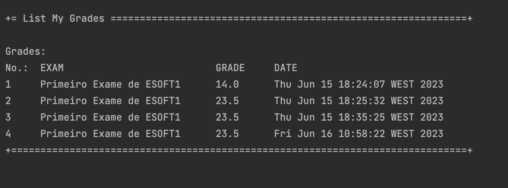

# US 2005 - As Student, I want to view a list of my grades

## 1. Context

*This is the first time this functionality is being developed. It is included in Sprint C of the project eCourse.*

## 2. Requirements

### 2.1 User Story Description

**US 2005** As Student, I want to view a list of my grades

### 2.2 Customer Specifications and Clarifications ###

**From the specifications Document:**

FRE05 - List Grades The system displays to a students his/her grades

**From the client clarifications:**

NA

### 2.3. Acceptance Criteria ###
NA

### 2.4. Dependencies ###

* **US2004** -As Student, I want to take an exam

## 3. Analysis

### 3.1 Relevant Domain Model Excerpt

### 3.2 System Sequence Diagram (SSD)

## 4. Design

### 4.1. Realization (Sequence Diagram - SD)

### 4.2. Class Diagram (CD)

### 4.3. Applied Patterns

* ENTITY as root of AGGREGATE
* VALUE OBJECT caractherizes OBJECTS
* SERVICE
* REPOSITORY
* SINGLE RESPONSABILITY

### 4.4. Tests

NA

## 5. Implementation

## 6. Integration/Demonstration

### Demonstration of the implemented functionality

## 7. Observations
NA