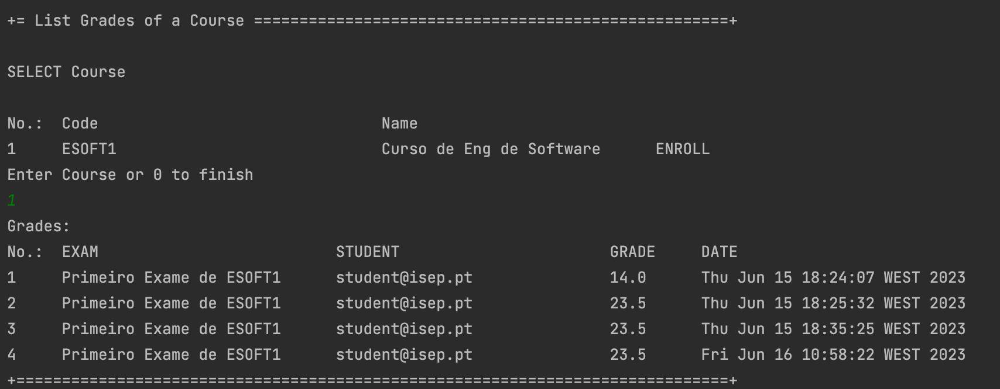

# US 2006 - As Teacher, I want to view a list of the grades of exams of my courses

## 1. Context

*This is the first time this functionality is being developed. It is included in Sprint C of the project eCourse.*

## 2. Requirements

### 2.1 User Story Description

**US 2006** As Teacher, I want to view a list of the grades of exams of my courses

### 2.2 Customer Specifications and Clarifications ###

**From the specifications Document:**

• FRE06 - List Course Grades The system displays the grades of a class (to a teacher of
that course)

**From the client clarifications:**

> *Question_1* (Tuesday, 6 de June de 2023 às 16:56) --> Relativamente a esta user story, o ficheiro excel providenciado refere o seguinte:
"As Teacher, I want to view a list of the grades of exams of my courses"
> Um professor deve conseguir ver as notas de um curso específico, de todos os seus cursos ao mesmo tempo, ou ambos?
>
> *Answer_1* --> Penso que seria interessante ter todas as possibilidades que mencionou. Como sugestão, talvez apresentar os cursos do professor e este poder indicar quais os cursos que quer ver ou "todos".

> *Question_2* (Thursday, 1 de June de 2023 às 16:28) --> As notas dos exames formativos tambem deveriam ser listadas? Ou apenas seriam listadas as notas dos exames "normais"
>
> *Answer_2* -->Os exames formativos são gerados automaticamente e, não existindo um registo das perguntas e respostas desses exames, não penso que faça sentido armazenar os resultados dessas notas.
> No entanto, o sistema deve apresentar para estes exames o feedback e a nota no final.

> *Question_3* (Monday, 3 de April de 2023 às 00:03) -->Regarding the referred functional requirement, it states "The system displays the grades of a class(...)".
> Is this a typo? Meaning that classes are not evaluated, but courses instead. If so, how are courses evaluated? Is it an average between all taken exams?
>
> *Answer_3* -->The grades in FRE05 and FRE06 are related to the exams of the course. There is no need to do any calculation. The system, should display the grades of each exam that the student did take (FRE05) or display the grades for every exam of the course and for every student (in the case of FRE06).

### 2.3. Acceptance Criteria ###
NA

### 2.4. Dependencies ###

* **US2004** -As Student, I want to take an exam

## 3. Analysis

### 3.1 Relevant Domain Model Excerpt

### 3.2 System Sequence Diagram (SSD)

## 4. Design

### 4.1. Realization (Sequence Diagram - SD)

### 4.2. Class Diagram (CD)

### 4.3. Applied Patterns

* ENTITY as root of AGGREGATE
* VALUE OBJECT caractherizes OBJECTS
* SERVICE
* REPOSITORY
* SINGLE RESPONSABILITY

### 4.4. Tests

NA

## 5. Implementation

## 6. Integration/Demonstration

### Demonstration of the implemented functionality

## 7. Observations
NA