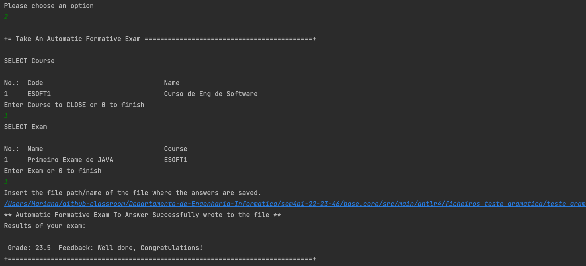

# US 2009 - As Student, I want to take an automatic formative exam

## 1. Context

*This is the first time this functionality is being developed. It is included in Sprint C of the project eCourse.*

## 2. Requirements

### 2.1 User Story Description

**US 2009** As Student, I want to take an automatic formative exam

### 2.2 Customer Specifications and Clarifications ###

**From the specifications Document:**

FRE04 - Take Exam A Student takes an exam and answer its questions. At the end of
the exam, the system should display the feedback and result (i.e., grade) of the exam. The
feedback and grade of the exam should be automatically calculated by a parser based on
the grammar defined for exams structure.

**From the client clarifications:**

> *Question_1* (Wednesday, 24 de May de 2023 às 22:45) --> A propósito das US's 2004 e 2009, de que forma é que os exames serão apresentados ao aluno para o mesmo os realizar? Será semelhante às boards, em que será criada uma página em Java Script?
>
> *Answer_1* --> Documento de especificação, página 11, Figura 4.1. É apresentada uma visão da arquitetura da solução.
> Apenas a aplicação "shared board app" implementa um servidor http para servir o "board viewer". Todas as outras funcionalidades da solução devem estar distribuídas pelas outras "apps", que devem ser java console applications. Ou seja, a "user interface" para a funcionalidade dos exames deve ser implementada como uma console application. A referencia aos "quiz" do moodle é apenas para ilustrar quais as funcionalidades pretendidas. Mas a sua implementação não necessita de ser realizada em HTML (ou seja, não é esperado que o façam).
> Pensava que isso estava claro no documento da especificação.


> *Question_2* (Wednesday, 31 de May de 2023 às 16:16) --> Our group has a following question: when a student finished taking exam, will he want at some point review the exam and see his answers? Do we need to save the exam with the answers of a certain student to be able to show it later (if needed), or should we just calculate the final grade and show feedback for each question (if applicable)?
> Another question is about types of feedback: on-submission means on submission of a question or the whole exam?
>
> 
> *Answer_2* -->  when a student finished taking exam, will he want at some point review the exam and see his answers?
> This is not required.
> Do we need to save the exam with the answers of a certain student to be able to show it later (if needed), or should we just calculate the final grade and show feedback for each question (if applicable)?
> Just calculate the final grade and show feedback for each question. Unless saving of the answers is required as a technical solution for some other aspect of your solution you do not need to save the answers.
> Another question is about types of feedback: on-submission means on submission of a question or the whole exam?
> On submission of the whole exam.
 
 
> *Question_3* (Wednesday, 24 de May de 2023 às 15:57) --> After discussing these questions with the OT teacher, we would like to know your opinion about the grades.
> First we would like to know if you wish that the grades are saved in the program database. Second we would like for you to clarify the expected flow of both feedback and grade types
>
> 
> *Answer_3* --> Regarding the first question, if you do not save the grades how do you implement the functionalities of FRE05 and FRE06?
> Regarding the second question, the ideia is to have something very similar to the Moodle platform. According to the specification "The system must also support the automatic production of feedback and grading for the answers given by students when they take the exam. Usually this is done at the end of the exam." So, the grade and the feedback should be provided only and the end of the exam. At the end of the exam, the system should display to the student the resulting grade of the exam as well as the grade and feedback for each question/answer.
> You may find a simple workflow on how to create moodle tests(quiz) in https://youtu.be/dCDPS7ufGuQ
> Regarding grades, each question will have points when the answer is correct. If you sum all the points form all the answers you will have the grade of the exam.
> Please consider only the question types that are presented in the specification document. For each question type you will find further details on the specifics of the grading logic.

> *Question_4* (Thursday, 30 de March de 2023 às 09:54) --> Is an exam available for all students of a certain course, or do the students of the course need to sign up to take an exam previously.
>
>
> *Answer_4* --> I think there is no "sign up" for exams. After the exam is created it should be available to all the students of that course, and all the students can/should take that exam.

> *Question_5* (Thursday, 1 de June de 2023 às 16:28) --> As notas dos exames formativos tambem deveriam ser listadas? Ou apenas seriam listadas as notas dos exames "normais"
>
>
> *Answer_5* --> Os exames formativos são gerados automaticamente e, não existindo um registo das perguntas e respostas desses exames, não penso que faça sentido armazenar os resultados dessas notas.
> No entanto, o sistema deve apresentar para estes exames o feedback e a nota no final.


### 2.3. Acceptance Criteria ###

To develop this user story, the following flow were considered:
A Student takes an automatic formative exam and answer its questions. Each time the system generates a new exam based on the database of questions and the specification of that exam.
At the end of the exam, the system should display the feedback and result (i.e., grade) of the exam.

### 2.4. Dependencies ###

* **US2007** -As Teacher I want to add/update exam questions to a repository of exam questions to be used in automatic formative exams
* **US2008** - As Teacher, I want to create/update automatic formative exams

## 3. Analysis

### 3.1 Relevant Domain Model Excerpt


### 3.2 System Sequence Diagram (SSD)


## 4. Design

### 4.1. Realization (Sequence Diagram - SD)


### 4.2. Class Diagram (CD)


### 4.3. Applied Patterns

* ENTITY as root of AGGREGATE
* VALUE OBJECT caractherizes OBJECTS
* SERVICE
* REPOSITORY
* SINGLE RESPONSABILITY

### 4.4. Tests

NA

## 5. Implementation

```

````


## 6. Integration/Demonstration

### Demonstration of the implemented functionality


## 7. Observations
NA