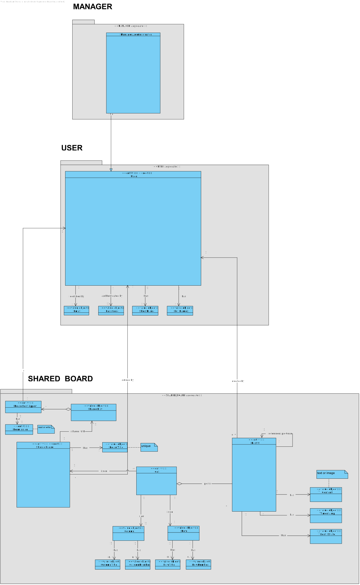
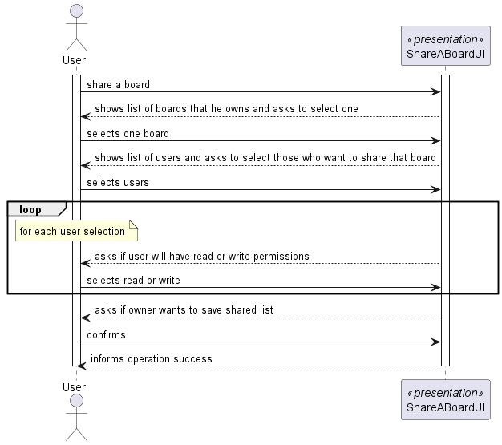
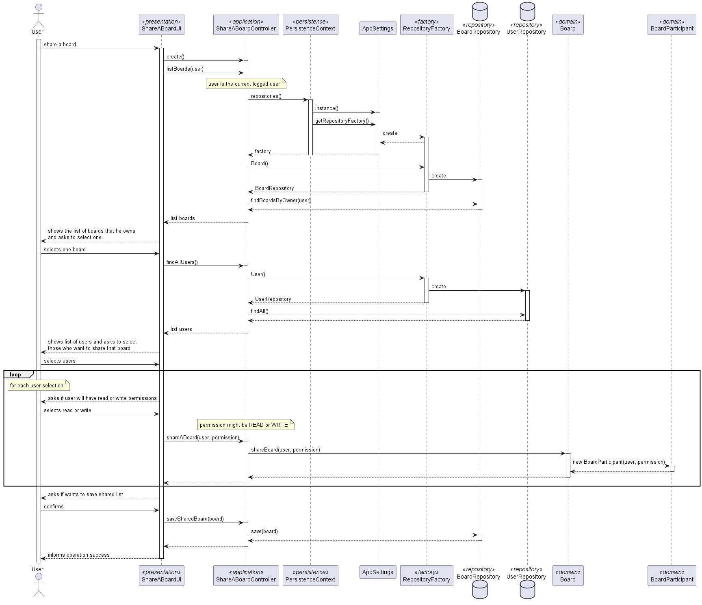
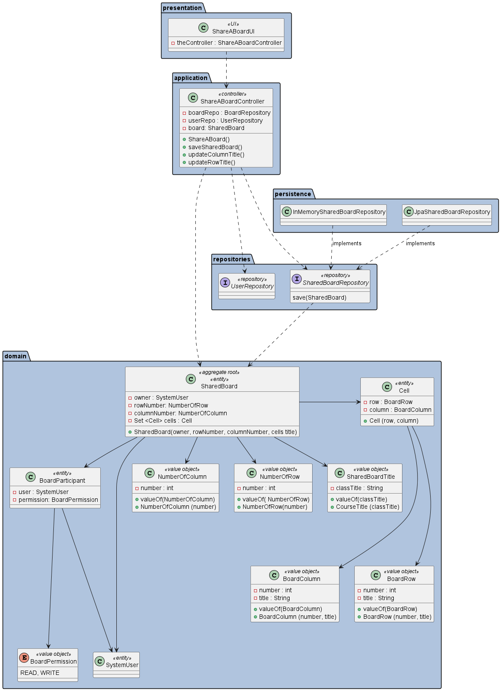
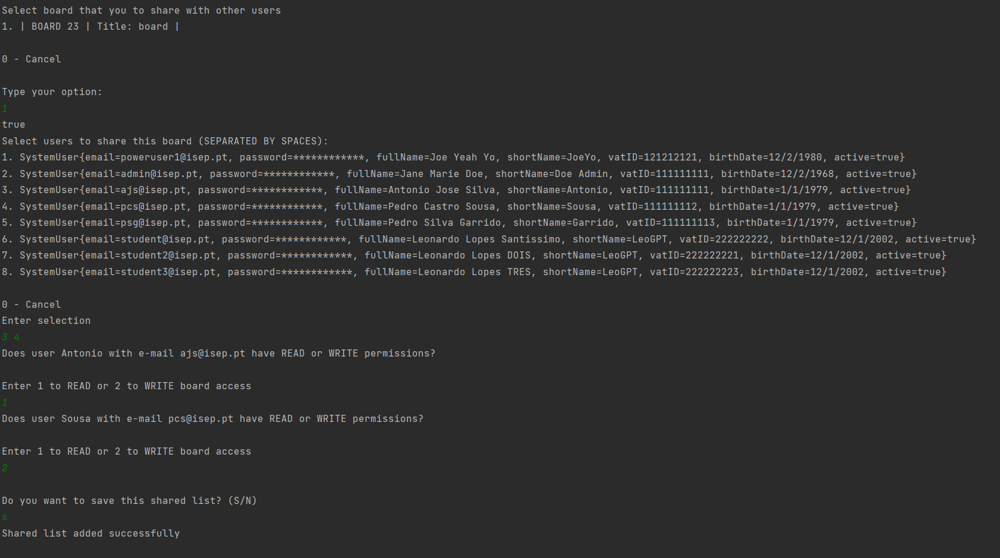

# US 3004 - As User, I want to share a board

## 1. Context

*This is the first time this functionality is being developed. It is included in Sprint C of the project eCourse*

## 2. Requirements

### 2.1. User Story Description

**US 3004-** As User, I want to share a board

### 2.1 Customer Specifications and Clarifications ###

**From the specifications Document:**

This US is related to the Functional Requirement:

**• FRB02 - Share Board -** A user shares a board it owns with other users

**• NFR13 - Design and Implement Shared Board Synchronization -** This functional
part of the system has very specific technical requirements, particularly some concerns
about synchronization problems. In fact, several clients will try to concurrently update
boards. As such, the solution design and implementation must be based on threads,
condition variables and mutexes. Specific requirements will be provided in SCOMP.

Additionally, according to the project description:
* *The user that creates the board is its owner. The owner can share the board with other users.
  Users may have read or write access to the board.
  Users with write permission may post content to a cell in the board. The content can be a
  text or an image. When the server commits a post it also should notify all clients with access
  to the board of the update*

*From the client clarifications:*
> ***Question_1*** (Wednesday, 24 de May de 2023 às 15:11) --> [US 3004/3005/3009] - As I read all the requirements within these User Stories, 
> I had a few questions:
-Who can see the board's updates?
--All users associated to a board are able to see the updates;
--All users with Write permissions in a board are able tto see its updates;
--Only the owner of a board is able to see its updates.
-As I'm sharing the board, I have to do which of these?
--give permissions to the users to Write on it immediately
--only share it with Read permissions and afterwards have the possibility to give the user write permissions
--only share it with Read permissions and lock those permissions as Read
-After sharing the board with someone, should it be considered an update to be listed on User Story 3005?

>
> *Answer_1* --> "The user that creates the board is its owner. The owner can share the board with other users. 
> Users may have read or write access to the board.". If a user shares the board with other users (either read or write) these users should be able 
> to see the updates (otherwise what are we sharing?). 
> Only users with write permissions are able to update the board. When a user shares a board he/she must specify the users and, 
> for each user, if the access is read or write. I think it makes sense to notify current users of a board when some update is done regarding access to the board.

### 2.3. Acceptance Criteria ###

**A.C.1-** Only the owner shares a board with other users  

**A.C.2-** Users may have read or write access to the board.

### 2.4. Dependencies ###
* [US1001] - As Manager, I want to be able to register, disable/enable, and list users of the system (Teachers and Students, as well as Managers). 
Since all users can be a board owner or have access to other boards (read or write).

* [US3002] - As User, I want to create a board. Since to share a board it needs to be created first.

## 3. Analysis

### 3.1 Relevant Domain Model Excerpt

### 3.2 System Sequence Diagram (SSD)

## 4. Design

### 4.1. Realization (Sequence Diagram - SD)

### 4.2. Class Diagram (CD)

### 4.3. Applied Patterns

* ENTITY as root of AGGREGATE
* VALUE OBJECT caractherizes OBJECTS
* FACTORY
* REPOSITORY
* SINGLE RESPONSABILITY

### 4.4. Tests

**Test 1:** *Verifies if shared list is updated*

     @Test
    public void ensureBoardIsShared(){
        SharedBoard board = boardBuilder.withOwner(user1).withColumnNumber(COLUMN).withRowNumber(ROW).withTitle(TITLE).build();
        board.shareABoard(user2, BoardPermission.READ);
        assertFalse(board.sharedlist().isEmpty());
    }

**Test 2:** *Verifies if it's possible to share a board with null permission*

    @Test
    public void ensureShareABoarPermissionIsNotNull(){
        SharedBoard board = boardBuilder.withOwner(user1).withColumnNumber(COLUMN).withRowNumber(ROW).withTitle(TITLE).build();
        assertThrows(IllegalArgumentException.class,()-> board.shareABoard(user2, null));
    }

**Test 3:** *Verifies if it's possible to share a board with null user*

    @Test
    public void ensureShareABoarUserIsNotNulll(){
        SharedBoard board = boardBuilder.withOwner(user1).withColumnNumber(COLUMN).withRowNumber(ROW).withTitle(TITLE).build();
        assertThrows(IllegalArgumentException.class,()-> board.shareABoard(null, BoardPermission.READ));
    }

## 5. Implementation

## 6. Integration/Demonstration

*In this section the team should describe the efforts realized in order to integrate this functionality with the other parts/components of the system*

*It is also important to explain any scripts or instructions required to execute an demonstrate this functionality*

## 7. Observations

*This section should be used to include any content that does not fit any of the previous sections.*

*The team should present here, for instance, a critical prespective on the developed work including the analysis of alternative solutioons or related works*

*The team should include in this section statements/references regarding third party works that were used in the development this work.*