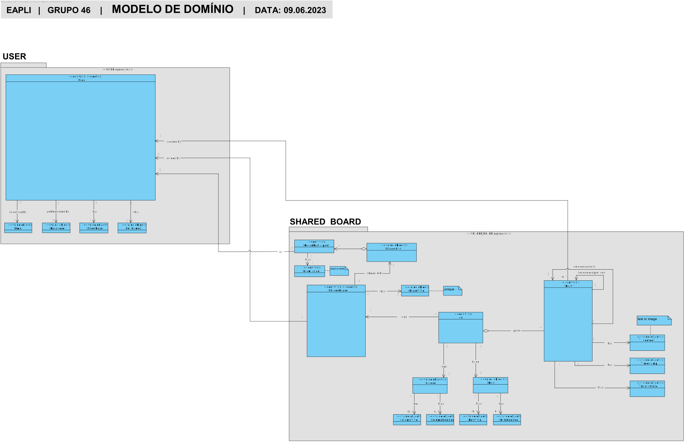

# US 3006 - As User, I want to create a post-it on a board

## 1. Context

*This is the first time this functionality is being developed. It is included in Sprint C of the project eCourse*

## 2. Requirements

**US 3006** As User, I want to create a post-it on a board

Dependencies with:
    - 3004 - Share a Board

### 2.1 Customer Specifications and Clarifications ###

**From the specifications Document:**

**• FRB04 - Create Post-it A user creates a post-it on a board**
It should be only available to users with Write Permission and each Post-It actions to its OWNER.

**• NFR13 - Design and Implement Shared Board Synchronization -** This functional
part of the system has very specific technical requirements, particularly some concerns
about synchronization problems. In fact, several clients will try to concurrently update
boards. As such, the solution design and implementation must be based on threads,
condition variables and mutexes. Specific requirements will be provided in SCOMP.


Additionally, according to the project description:
* *The user that creates the board is its owner. The owner can share the board with other users.
  Users may have read or write access to the board.
  Users with write permission may post content to a cell in the board. The content can be a
  text or an image. When the server commits a post it also should notify all clients with access
  to the board of the update*

**From the client clarifications:**

> **Question_1** (Wednesday, 31 de May de 2023 às 14:09) --> Nas especificações do sistema é dito o seguinte:
"Users with write permission may post content to a cell in the board. The content can be a text or an image."
Quando um User cria um post-it deve passar um link da imagem por exemplo:
"https://www.isep.ipp.pt/img/logo_20230106.png"
Ou devemos anexar uma imagem que está no nosso computador?

> **Answer_1** --> Para o cliente é um pouco indiferente o mecanismo que usam para fazer o "post" de imagens (assim como o(s) formato(s) suportado(s)).
Podem optar pela solução que for mais simples. Suponho que suportar o "upload" de imagens locais e suportar um formato comum, como png ou jpeg, seja suficiente.

> **Question_2** (Wednesday, 24 de May de 2023 às 15:11) --> As I read all the requirements within these User Stories, I had a few questions:
-Who can see the board's updates?
--All users associated to a board are able to see the updates;
--All users with Write permissions in a board are able tto see its updates;
--Only the owner of a board is able to see its updates.
-As I'm sharing the board, I have to do which of these?
--give permissions to the users to Write on it immediately
--only share it with Read permissions and afterwards have the possibility to give the user write permissions
--only share it with Read permissions and lock those permissions as Read
-After sharing the board with someone, should it be considered an update to be listed on User Story 3005?

> **Answer_2** --> "The user that creates the board is its owner. The owner can share the board with other users. Users may have read or write access to the board.". If a user shares the board with other users (either read or write) these users should be able to see the updates (otherwise what are we sharing?). Only users with write permissions are able to update the board.
When a user shares a board he/she must specify the users and, for each user, if the access is read or write. I think it makes sense to notify current users of a board when some update is done regarding access to the board.


### 2.3. Acceptance Criteria ###
- This functional part of the system has very specific technical requirements, particularly some concerns about synchronization problems.
  In fact, several clients will try to concurrently update boards.
  As such, the solution design and implementation must be based on threads, condition variables and mutexes. Specific requirements will be provided in SCOMP.
- Only users with Write Permissions or owners can create post-its

### 2.4. Dependencies ###
- 3004 - Share a Board


## 3. Analysis

### 3.1 Relevant Domain Model Excerpt


### 3.2 System Sequence Diagram (SSD)


## 4. Design

### 4.1. Realization (Sequence Diagram - SD)


### 4.2. Class Diagram (CD)


### 4.3. Applied Patterns

- ENTITY
- VALUE OBJECT caractherizes OBJECTS
- SERVICE
- FACTORY
- REPOSITORY
- SINGLE RESPONSABILITY


### 4.4. Tests


```
        @Test(expected = IllegalArgumentException.class)
    public void ensureCreatePostItCantHaveContentNull() {
        final Set<Role> roles = new HashSet<>();
        roles.add(TEACHER);
        SystemUser user1 = userBuilder.with(EMAIL1, PASSWORD, FULL_NAME, SHORT_NAME, VAT_ID, DAY, MONTH, YEAR).withRoles(roles).build();
        Content content = new Content(null);
        new PostIt(user1, content);
    }
```
```
    @Test(expected = IllegalArgumentException.class)
    public void ensureCreatePostItCantHaveNullOwner() {
        Content content = new Content("conteudo");
        new PostIt((SystemUser) null, content);
    }

```
```
    @Test(expected = IllegalArgumentException.class)
    public void ensureCreatePostItCantHaveNullOwnerNeitherNullContent() {
        Content content = new Content(null);
        new PostIt((SystemUser) null, content);
    }
```
```
    @Test
    public void ensurePostItIsNotDeletedWhenCreated() {
        final Set<Role> roles = new HashSet<>();
        roles.add(TEACHER);
        SystemUser user1 = userBuilder.with(EMAIL1, PASSWORD, FULL_NAME, SHORT_NAME, VAT_ID, DAY, MONTH, YEAR).withRoles(roles).build();

        PostIt postIt = new PostIt(user1, new Content("conteudo"));

        assertFalse(postIt.isDeleted());
    }
```
```
   @Test
    public void ensurePostItNextIsNullWhenCreated() {
        final Set<Role> roles = new HashSet<>();
        roles.add(TEACHER);
        SystemUser user1 = userBuilder.with(EMAIL1, PASSWORD, FULL_NAME, SHORT_NAME, VAT_ID, DAY, MONTH, YEAR).withRoles(roles).build();

        PostIt postIt = new PostIt(user1, new Content("conteudo"));
        assertNull(postIt.getNext());
    }
```
    @Test
    public void ensurePostItParentIsNullWhenCreated() {
        final Set<Role> roles = new HashSet<>();
        roles.add(TEACHER);
        SystemUser user1 = userBuilder.with(EMAIL1, PASSWORD, FULL_NAME, SHORT_NAME, VAT_ID, DAY, MONTH, YEAR).withRoles(roles).build();

        PostIt postIt = new PostIt(user1, new Content("conteudo"));
        assertNull(postIt.parent());
    }


## 5. Implementation

```
@UseCaseController
public class CreatePostItController {
    private final UserRepository userRepo = PersistenceContext.repositories().users();
    private final AuthorizationService authz = AuthzRegistry.authorizationService();
    private final BoardManagementService boardSvc = AuthzRegistry.boardService();

    @Transactional
    public boolean createPostIt(SharedBoard board, Cell cell, Content content) {
        final SystemUser owner = currentUser().orElseThrow(IllegalStateException::new);
        if (cell.addPostIt(owner, content)) {
            boardSvc.saveSharedBoard(board);
            PostIt createdPostIt = cell.latestPostIt();
            boardSvc.registerPrimaryBoardModification(board, createdPostIt, ModificationType.CREATION, cell);
            boardSvc.saveSharedBoard(board);
            return true;
        } else return false;
    }

    /**
     * Return session current user
     *
     * @return Shared Board owner
     */
    private Optional<SystemUser> currentUser() {
        return authz.session().flatMap(s -> userRepo.ofIdentity(s.authenticatedUser().identity()));
    }

    public Iterable<SharedBoard> sharedBoardsWithWritePermission() {
        return boardSvc.allBoardsBySystemUserWithWritePermission(currentUser());
    }

    public Iterable<SharedBoard> allBoards() {
        return boardSvc.allBoards();
    }

    public void printBoardAsTable(SharedBoard board) {
        boardSvc.printBoardAsTable(board);
    }
}
```

## 6. Integration/Demonstration


## 7. Observations
*NA*
