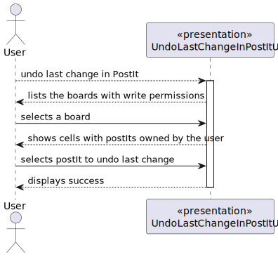
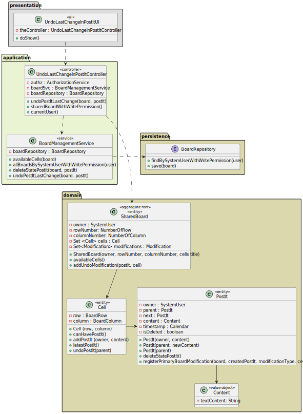

# US 3008 - As User, I want to Undo Last Change in Post-It

## 1. Context

*This is the first time this functionality is being developed. It is included in Sprint C of the project eCourse*

## 2. Requirements

**US 3008** As User, I want to Undo Last Change in Post-It

- US 3008 - Undo Last Change in Post-It<BR> <BR>
  Dependencies with:
    - 3004 - Share a Board
    - 3006 - Create a Post-It
    - 3007 - Change Post-It

### 2.1 Customer Specifications and Clarifications ###

**From the specifications Document:**

The user who created a post in a cell can change that post. It may change its contents or
move the post into a free cell. The owner of a post can delete it.  **It should be only available to users with Write Permission and each Post-It actions to its OWNER.**


**From the client clarifications:**

> **Question_1** (Wednesday, 31 de May de 2023 às 14:09) --> Nas especificações do sistema é dito o seguinte:
"Users with write permission may post content to a cell in the board. The content can be a text or an image."
Quando um User cria um post-it deve passar um link da imagem por exemplo:
"https://www.isep.ipp.pt/img/logo_20230106.png"
Ou devemos anexar uma imagem que está no nosso computador?


> **Answer_1** --> Para o cliente é um pouco indiferente o mecanismo que usam para fazer o "post" de imagens (assim como o(s) formato(s) suportado(s)).
Podem optar pela solução que for mais simples. Suponho que suportar o "upload" de imagens locais e suportar um formato comum, como png ou jpeg, seja suficiente.


> **Question_2** (Wednesday, 24 de May de 2023 às 15:11) --> As I read all the requirements within these User Stories, I had a few questions:
-Who can see the board's updates?
--All users associated to a board are able to see the updates;
--All users with Write permissions in a board are able tto see its updates;
--Only the owner of a board is able to see its updates.
-As I'm sharing the board, I have to do which of these?
--give permissions to the users to Write on it immediately
--only share it with Read permissions and afterwards have the possibility to give the user write permissions
--only share it with Read permissions and lock those permissions as Read
-After sharing the board with someone, should it be considered an update to be listed on User Story 3005?


> **Answer_2** --> "The user that creates the board is its owner. The owner can share the board with other users. Users may have read or write access to the board.". If a user shares the board with other users (either read or write) these users should be able to see the updates (otherwise what are we sharing?). Only users with write permissions are able to update the board.
When a user shares a board he/she must specify the users and, for each user, if the access is read or write. I think it makes sense to notify current users of a board when some update is done regarding access to the board.


### 2.3. Acceptance Criteria ###
- This functional part of the system has very specific technical requirements, particularly some concerns about synchronization problems.
  In fact, several clients will try to concurrently update boards.
  As such, the solution design and implementation must be based on threads, condition variables and mutexes. Specific requirements will be provided in SCOMP.
- Only users with Write Permissions can update post-its and it has to be the owners

### 2.4. Dependencies ###
- 3004 - Share a Board
- 3006 - Create a Post-It
- 3007 - Change Post-It


## 3. Analysis

### 3.1 Relevant Domain Model Excerpt


### 3.2 System Sequence Diagram (SSD)



## 4. Design

### 4.1. Realization (Sequence Diagram - SD)


### 4.2. Class Diagram (CD)



### 4.3. Applied Patterns

- ENTITY as root of AGGREGATE
- VALUE OBJECT caractherizes OBJECTS
- SERVICE
- FACTORY
- REPOSITORY
- SINGLE RESPONSABILITY


### 4.4. Tests

```
    @Test
    public void ensureAddUndoModificationIsCorrect(){
        SharedBoard board = boardBuilder.withOwner(user1).withColumnNumber(COLUMN).withRowNumber(ROW).withTitle(TITLE).build();
        PostIt createdPostIt = new PostIt(user1, new Content("conteudo"));
        Iterator<Cell> it = board.cells().iterator();
        Cell cell1 = it.next();
        BoardModification undo = new BoardModification(createdPostIt, ModificationType.UNDO, cell1);

        board.addUndoModification(createdPostIt, cell1);;

        assertEquals(board.modifications().iterator().next().description(), undo.description());
    }
```
```

    @Test
    public void ensureCellIsAvailableIfHasNonePostIts(){
        SharedBoard board = boardBuilder.withOwner(user1).withColumnNumber(COLUMN).withRowNumber(ROW).withTitle(TITLE).build();
        Iterator<Cell> it = board.cells().iterator();
        Cell cell1 = it.next();

        assertTrue(board.availableCells().contains(cell1));
    }
 ```
```

    @Test
    public void ensureCellIsNotAvailableIfHasPostIts(){
        SharedBoard board = boardBuilder.withOwner(user1).withColumnNumber(COLUMN).withRowNumber(ROW).withTitle(TITLE).build();
        Iterator<Cell> it = board.cells().iterator();
        Cell cell1 = it.next();
        cell1.addPostIt(user1, new Content("conteudo"));

        assertFalse(board.availableCells().contains(cell1));
    }
    
```
```

    @Test
    public void ensureCellIsAvailableIfHasDeletedPostIt(){
        SharedBoard board = boardBuilder.withOwner(user1).withColumnNumber(COLUMN).withRowNumber(ROW).withTitle(TITLE).build();
        Iterator<Cell> it = board.cells().iterator();
        Cell cell1 = it.next();
        PostIt postIt = new PostIt(user1, new Content("conteudo"));
        postIt.deletePostIt();
        cell1.postItList().add(postIt);

        assertTrue(board.availableCells().contains(cell1));
    }
```

## 5. Implementation

```
@UseCaseController
public class SetCourseTeachersController {

    private final AuthorizationService authz = AuthzRegistry.authorizationService();
    private final CourseManagementService courseSvc = AuthzRegistry.courseService();
    private final TeacherManagementService teacherSvc = AuthzRegistry.teacherService();
    private final CourseRepository courseRepository = PersistenceContext.repositories().courses();

    public Course setCourseTeachers(String selection, List<Teacher> allTeachers, Course course) {
        authz.ensureAuthenticatedUserHasAnyOf(EcourseRoles.POWER_USER, EcourseRoles.ADMIN);
        return courseSvc.setCourseTeachers(selection, allTeachers,course);
    }

    public Course setCourseTeacherInCharge(Teacher teacherInCharge, Course course) {
        authz.ensureAuthenticatedUserHasAnyOf(EcourseRoles.POWER_USER, EcourseRoles.ADMIN);
        course.setTeacherInCharge(teacherInCharge);
        return courseRepository.save(course);
    }


    public Iterable<Course> allCourses() {
        authz.ensureAuthenticatedUserHasAnyOf(EcourseRoles.POWER_USER, EcourseRoles.ADMIN);
        return courseSvc.allCourses();
    }

    public Iterable<Teacher> allTeachers() {
        authz.ensureAuthenticatedUserHasAnyOf(EcourseRoles.POWER_USER, EcourseRoles.ADMIN);
        return teacherSvc.allTeachers();
    }
}
```

## 6. Integration/Demonstration


## 7. Observations
*NA*
