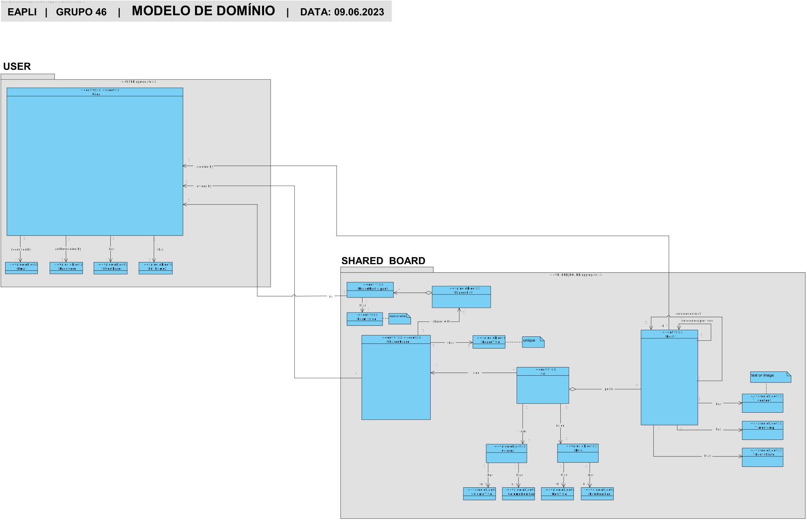
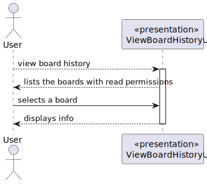
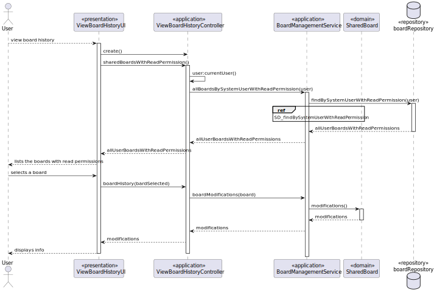
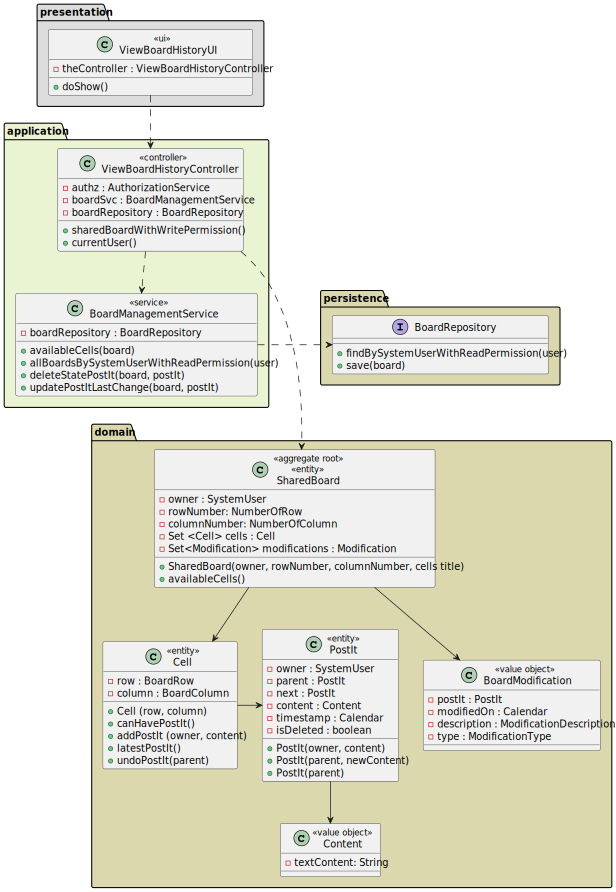

# US 3009 - As User, I want to view the history of updates on a board

## 1. Context

*This is the first time this functionality is being developed. It is included in Sprint C of the project eCourse*

## 2. Requirements

**US 3009** As User, I want to view the history of updates on a board
The system should maintain an history/log of all the updates in the board.

### 2.1 Customer Specifications and Clarifications ###

**From the specifications Document:**

A user views a history of updates in a board. The system should maintain an history/log of all the updates in the board.


**From the client clarifications:**

> **Question_1** (Thursday, 30 de March de 2023 às 10:31) --> In the requirements, it says that the system should maintain the history/log of all the updates on the board. There's someone specific that will be able to see those logs, or is it just something everyone that has access to the board can see?

> **Answer_1** --> I would say all the information that is needed for a possible "restore operation" in the future (so that it can be used again with "total" functionality).

> **Question_2** (Thursday, 30 de March de 2023 às 21:56 ) --> Dear client, Regarding the board history of FRB07, which information should be stored? For example: change date, change made, user?

> **Answer_2** --> The history in the boards is important for the following functional requirements:
FRB06 - Undo Post-it Change A user undo the last change in a post-it
FRB07 - View Board History A user views a history of updates in a board
If a user as read access to the board he/she can view the history.


### 2.3. Acceptance Criteria ###
- This functional part of the system has very specific technical requirements, particularly some concerns about synchronization problems.
  In fact, several clients will try to concurrently update boards.
  As such, the solution design and implementation must be based on threads, condition variables and mutexes. Specific requirements will be provided in SCOMP.
- Only users with Write Permissions can update post-its and it has to be the owners

### 2.4. Dependencies ###
- 3004 - Share a Board
- 3006 - Create a Post-It
- 3007 - Change Post-It
- 3009 - Undo Last Change in Post-It


## 3. Analysis

### 3.1 Relevant Domain Model Excerpt


### 3.2 System Sequence Diagram (SSD)



## 4. Design

### 4.1. Realization (Sequence Diagram - SD)


### 4.2. Class Diagram (CD)



### 4.3. Applied Patterns

- ENTITY as root of AGGREGATE
- VALUE OBJECT caractherizes OBJECTS
- SERVICE
- FACTORY
- REPOSITORY
- SINGLE RESPONSABILITY


### 4.4. Tests

```
  @Test
    public void ensureAddCreationModificationIsCorrect(){
        SharedBoard board = boardBuilder.withOwner(user1).withColumnNumber(COLUMN).withRowNumber(ROW).withTitle(TITLE).build();
        PostIt createdPostIt = new PostIt(user1, new Content("conteudo"));
        Iterator<Cell> it = board.cells().iterator();
        Cell cell1 = it.next();
        BoardModification creation = new BoardModification(createdPostIt, ModificationType.CREATION, cell1);

        board.addCreationModification(createdPostIt, cell1);

        assertEquals(board.modifications().iterator().next().description(), creation.description());
    }
```
```
    @Test
    public void ensureAddUpdateModificationIsCorrect(){
        SharedBoard board = boardBuilder.withOwner(user1).withColumnNumber(COLUMN).withRowNumber(ROW).withTitle(TITLE).build();
        PostIt createdPostIt = new PostIt(user1, new Content("conteudo"));
        Iterator<Cell> it = board.cells().iterator();
        Cell cell1 = it.next();
        BoardModification update = new BoardModification(createdPostIt, ModificationType.CONTENT_UPDATE, cell1, new Content("novo conteudo"));

        board.addContentModification(createdPostIt, cell1, new Content("novo conteudo"));;

        assertEquals(board.modifications().iterator().next().description(), update.description());
    }

```
```
    @Test
    public void ensureAddDeleteModificationIsCorrect(){
        SharedBoard board = boardBuilder.withOwner(user1).withColumnNumber(COLUMN).withRowNumber(ROW).withTitle(TITLE).build();
        PostIt createdPostIt = new PostIt(user1, new Content("conteudo"));
        Iterator<Cell> it = board.cells().iterator();
        Cell cell1 = it.next();
        BoardModification delete = new BoardModification(createdPostIt, ModificationType.DELETE, cell1);

        board.addDeleteModification(createdPostIt, cell1);;

        assertEquals(board.modifications().iterator().next().description(), delete.description());
    }

```

```
    @Test
    public void ensureCellIsAvailableIfHasNonePostIts(){
        SharedBoard board = boardBuilder.withOwner(user1).withColumnNumber(COLUMN).withRowNumber(ROW).withTitle(TITLE).build();
        Iterator<Cell> it = board.cells().iterator();
        Cell cell1 = it.next();

        assertTrue(board.availableCells().contains(cell1));
    }
```
```
    @Test
    public void ensureCellIsNotAvailableIfHasPostIts(){
        SharedBoard board = boardBuilder.withOwner(user1).withColumnNumber(COLUMN).withRowNumber(ROW).withTitle(TITLE).build();
        Iterator<Cell> it = board.cells().iterator();
        Cell cell1 = it.next();
        cell1.addPostIt(user1, new Content("conteudo"));

        assertFalse(board.availableCells().contains(cell1));
    }
```
```
    @Test
    public void ensureCellIsAvailableIfHasDeletedPostIt(){
        SharedBoard board = boardBuilder.withOwner(user1).withColumnNumber(COLUMN).withRowNumber(ROW).withTitle(TITLE).build();
        Iterator<Cell> it = board.cells().iterator();
        Cell cell1 = it.next();
        PostIt postIt = new PostIt(user1, new Content("conteudo"));
        postIt.deletePostIt();
        cell1.postItList().add(postIt);

        assertTrue(board.availableCells().contains(cell1));
    }
```

## 5. Implementation

```
@UseCaseController
public class ViewBoardHistoryController {
    private final UserRepository userRepo = PersistenceContext.repositories().users();
    private final AuthorizationService authz = AuthzRegistry.authorizationService();
    private final BoardManagementService boardSvc = AuthzRegistry.boardService();

    /**
     * Get the current user from the session.
     * @return An optional containing the current user if present, empty optional otherwise.
     */
    private Optional<SystemUser> currentUser() {
        return authz.session().flatMap(s -> userRepo.ofIdentity(s.authenticatedUser().identity()));
    }

    /**
     * Get all boards where the current user has read permissions.
     * @return An iterable containing all boards where the current user has read permissions.
     */
    public Iterable<SharedBoard> sharedBoardsWithReadPermission() {
        return boardSvc.allBoardsBySystemUserWithReadPermission(currentUser());
    }

    /**
     * Get all boards.
     * @return An iterable containing all boards.
     */
    public Iterable<SharedBoard> allBoards() {
        return boardSvc.allBoards();
    }

    /**
     * Get the history of updates in a board.
     * @param board The shared board to retrieve the history of updates from.
     * @return A set containing the board modifications representing the history of updates of the board.
     */
    public Set<BoardModification> boardHistory (SharedBoard board){
        return boardSvc.boardModifications(board);
    }
}
```

## 6. Integration/Demonstration


## 7. Observations
*NA*
