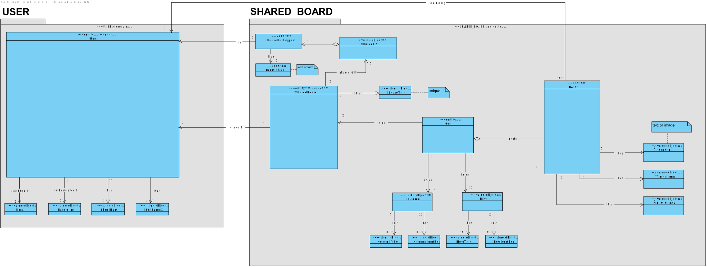
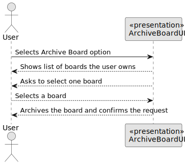
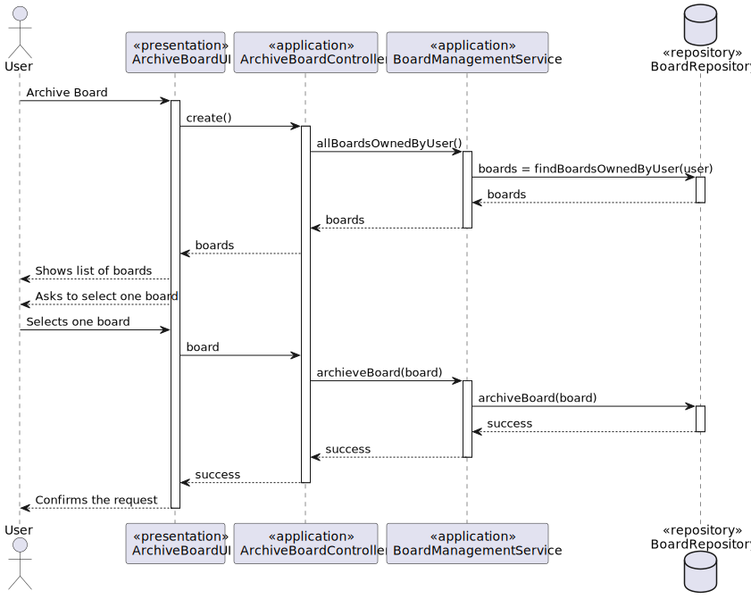
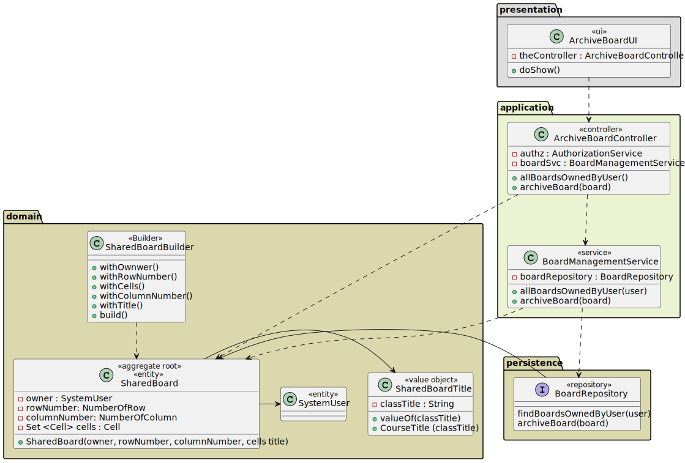
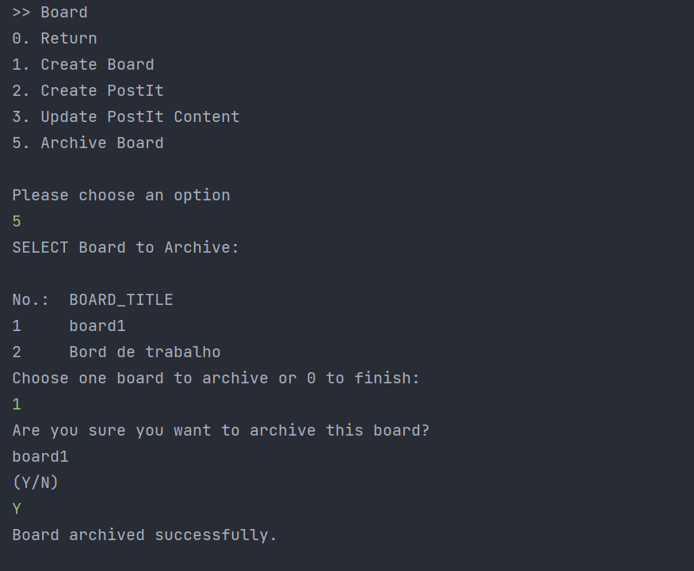

# US 3010 - As a user, I want to archive a board I own 

## 1. Context

*This is the first time this functionality is being developed. It is included in Sprint C of the project eCourse.*

## 2. Requirements

### 2.1 User Story Description

**US 3010** As a user, I want to archive a board I own.

To develop this user story, the following flow were considered:
- The user selects the board he/she wants to archive (sees a list of boards that he/her owns).
- Selects one board and the selected board is archived.

### 2.2 Customer Specifications and Clarifications ###

**From the specifications Document:**

>This User story is related to the Functional Requirement FRB08 - Archive Board. The owner of a board can archive the board. (Section 3.1.4).

>A shared board is a digital implementation of a post-it board. It has a unique title. 
It is divided into a certain number of columns and rows. Therefore, it has a certain number of cells. 
>The user that creates the board is its owner. The owner can share the board with other users...
> The owner of a board can archive the board when it will no longer be used.
(Section 5.2.3).


**From the client clarifications:**

> *Question_1* (Monday, 27 March 2023 at 23:23h) --> Can a user own more than one board?
>
> *Answer_1* --> Yes.
>
> *Question_2* (Thursday, 30 March 2023 at 21:56h) --> Regarding the board history of FRB07, which information should be stored? For example: change date, change made, user?  
>
> *Answer_2* --> I would say all the information that is needed for a possible "restore operation" in the future (so that it can be used again with "total" functionality).


### 2.3. Acceptance Criteria ###
NA

### 2.4. Dependencies ###

* **US3002** - As User, I want to create a board.

## 3. Analysis

### 3.1 Relevant Domain Model Excerpt



### 3.2 System Sequence Diagram (SSD)



## 4. Design

### 4.1. Realization (Sequence Diagram - SD)



### 4.2. Class Diagram (CD)



### 4.3. Applied Patterns

* ENTITY as root of AGGREGATE
* VALUE OBJECT caractherizes OBJECTS
* SERVICE
* REPOSITORY
* SINGLE RESPONSABILITY

### 4.4. Tests

**Test 1:** *Verifies that it is not possible to archive an instance of the SharedBord class with null Board.*

```
   @Test
    public void ensureBoardStatusIsArchievedAfterArchive() throws Exception {
        
        SystemUserBuilder userBuilder = new SystemUserBuilder(new NilPasswordPolicy(), new PlainTextEncoder());

        SystemUser user = userBuilder.with(EMAIL1, PASSWORD, FULL_NAME, SHORT_NAME, VAT_ID, DAY, MONTH,YEAR).build();
        SharedBoardTitle title = new SharedBoardTitle("Title");
        NumberOfColumns columns = new NumberOfColumns(3);
        NumberOfRows rows = new NumberOfRows(4);

        SharedBoard board = new SharedBoard(user, title, rows, columns);

        Calendar now = Calendar.getInstance();

        board.archive(now);

        final boolean expected = board.isActive();
        assertFalse(expected);
    }
````

## 5. Implementation

```
@UseCaseController
public class ArchiveBoardController {

    private final BoardManagementService boardSvc = AuthzRegistry.boardService();

    private final BoardRepository boardRepo = PersistenceContext.repositories().boards();

    private final AuthorizationService authz = AuthzRegistry.authorizationService();


    public Iterable<SharedBoard> allBoardsOwnedByUser() {
        authz.ensureAuthenticatedUserHasAnyOf(EcourseRoles.POWER_USER, EcourseRoles.ADMIN, EcourseRoles.STUDENT, EcourseRoles.TEACHER);
        return boardSvc.allBoardsOwnedByUser(authz.session().get().authenticatedUser());
    }


    public void archiveBoard(SharedBoard boardSelected) {
        boardSvc.archiveBoard(boardSelected);
    }
}
````


## 6. Integration/Demonstration

### Demonstration of the implemented functionality


## 7. Observations
It was also implmented a functionality that allows the user to restore a board he owns.