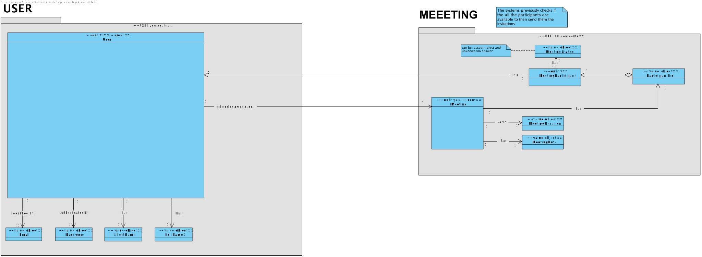
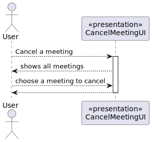
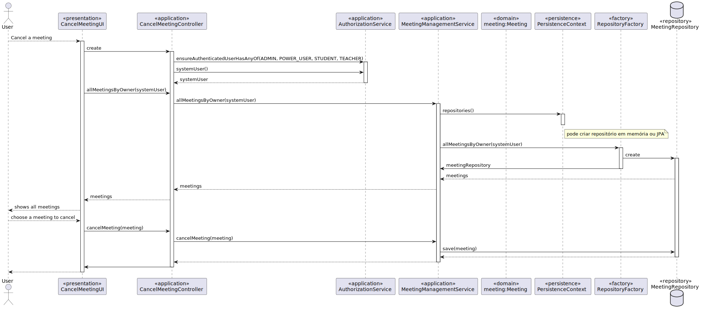
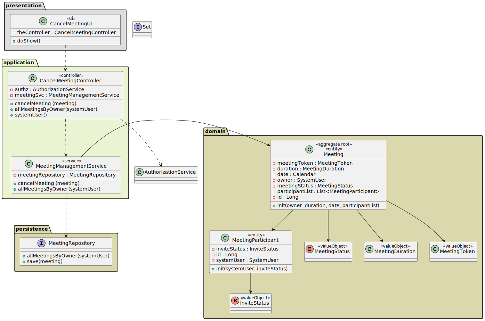
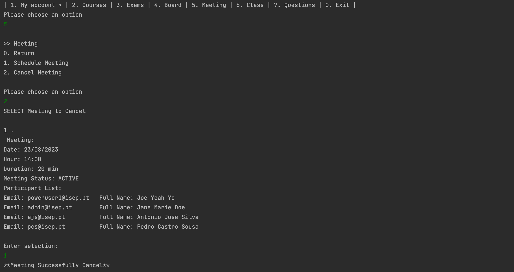

# US 4002 -  As User, I want to cancel a meeting

## 1. Context

*This is the first time this functionality is being developed. It is included in Sprint C of the project eCourse*

## 2. Requirements
**US 4002** As User, I want to cancel a meeting

- Cancel a meeting.

### 2.1 Customer Specifications and Clarifications ###

**From the specifications Document:**

This User story is related to the Functional Requirement FRM02- Cancel Meeting A user cancels a meeting that he owns


### 2.3. Acceptance Criteria ###


### 2.4. Dependencies ###
* [US1001] - As Manager, I want to be able to register, disable/enable, and list users of the system (Teachers and Students, as well as Managers).
Users will schedule a meeting.
* [US4001] - As User, I want to schedule a meeting.


## 3. Analysis

### 3.1 Relevant Domain Model Excerpt


### 3.2 System Sequence Diagram (SSD)



## 4. Design

### 4.1. Realization (Sequence Diagram - SD)


### 4.2. Class Diagram (CD)



### 4.3. Applied Patterns

- ENTITY as root of AGGREGATE
- VALUE OBJECT caractherizes OBJECTS
- BUILDER
- SERVICE
- FACTORY
- REPOSITORY


### 4.4. Tests

NA

## 5. Implementation

````

public class CancelMeetingController {
private final AuthorizationService authz = AuthzRegistry.authorizationService();

    private final MeetingManagementService meetingSvc = AuthzRegistry.meetingService();

    public SystemUser systemUser() {
        return authz.session().get().authenticatedUser();
    }

    public Iterable<Meeting> allMeetingsByOwner(SystemUser systemUser) {
        return meetingSvc.allMeetingsByOwner(systemUser);
    }

    public void cancelMeeting(Meeting meeting) {
        meetingSvc.cancelMeeting(meeting);
    }
}


````


## 6. Integration/Demonstration



## 7. Observations

NA