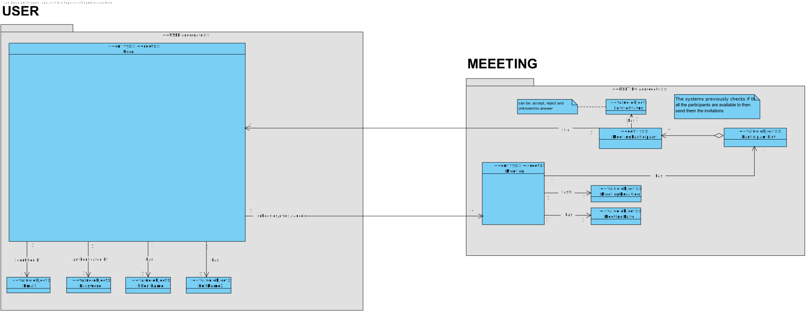
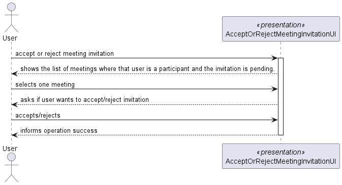
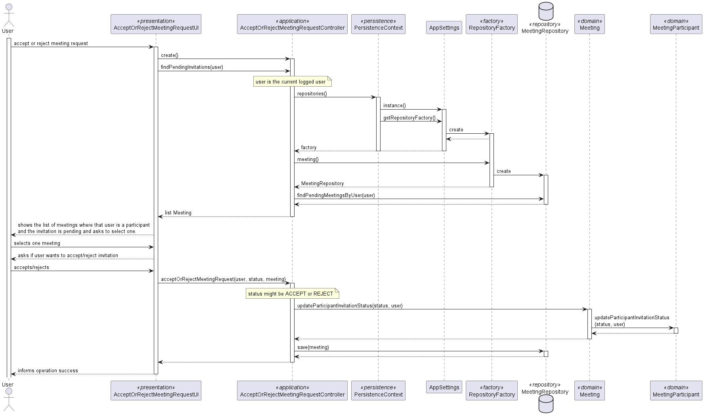
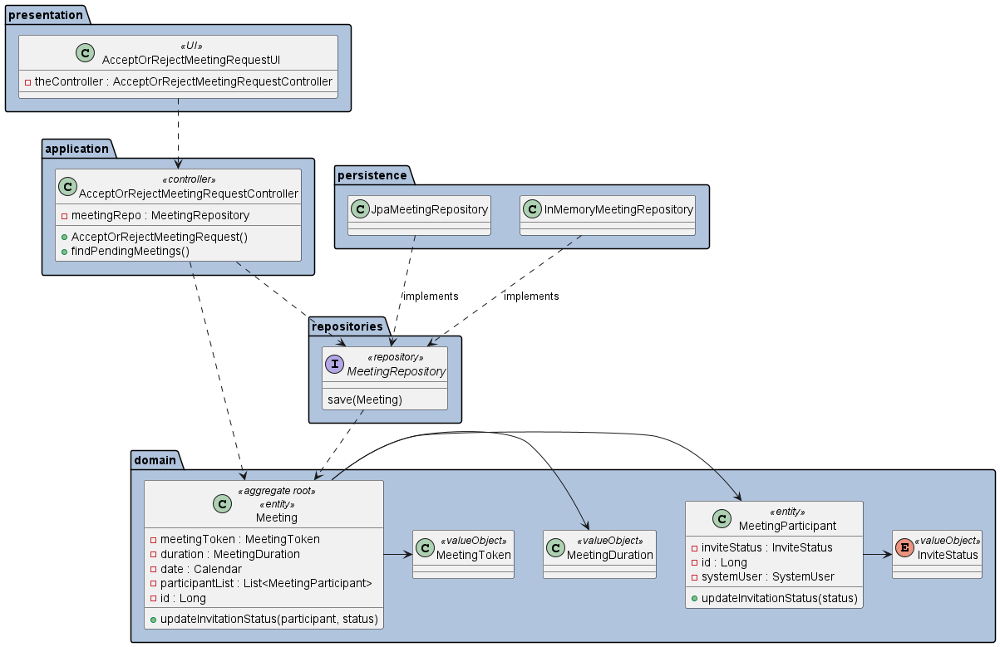

# US 4003 - As User, I want to accept or reject a meeting request

## 1. Context

*This is the first time this functionality is being developed. It is included in Sprint C of the project eCourse*

## 2. Requirements

### 2.1. User Story Description
**US 4003** As User, I want to accept or reject a meeting request

### 2.1 Customer Specifications and Clarifications ###

**From the specifications Document:**

This US is related to the Functional Requirement:

**FRM03 Accept/Reject Meeting-** A user accepts or rejects an invitation to a meeting

Additionally, according to the project description:
* *Classes and meetings are events that happen in some time and have a duration. They also have
  participants. However there is no concept of location related to classes and meetings. They do
  not take place in a specific location and "nothing" happens at the time of the event.*

*From the client clarifications:*
> ***Question_1*** (Tuesday, 30 de May de 2023 às 11:13) --> [US 4003 - As User, I want to accept or reject a meeting request] - Em relação a esta US deveríamos simplesmente considerar os "meeting request" que não foram aceites ou rejeitados?
Um "meeting request" que já foi aceite ou rejeitado poderá ser alterado, depois?
>
> *Answer_1* --> 1. Não sei se discutiu o assunto na aula OT presencial, mas a intenção nesta US é fazer exactamente o que está descrito: aceitar ou rejeitar um pedido de reunião. A decisão é tomada uma única vez pelo utilizador..

### 2.3. Acceptance Criteria ###

**A.C.1-** The decision to accept or reject a meeting request is made only once by system user.

### 2.4. Dependencies ###
* [US1001] - As Manager, I want to be able to register, disable/enable, and list users of the system (Teachers and Students, as well as Managers). 
Since all users can be a participant.

* [US4001] - As User, I want to schedule a meeting. When a meeting is scheduled the system must check if all participants are available and send invitations to participants.
So, the goal of US4003 is to accept or reject this invitation.

## 3. Analysis

### 3.1 Relevant Domain Model Excerpt

### 3.2 System Sequence Diagram (SSD)

## 4. Design

### 4.1. Realization (Sequence Diagram - SD)

### 4.2. Class Diagram (CD)

### 4.3. Applied Patterns

* ENTITY as root of AGGREGATE
* VALUE OBJECT caractherizes OBJECTS
* FACTORY
* REPOSITORY
* SINGLE RESPONSABILITY

### 4.4. Tests

**Test 1:** *Verifies that it is not possible to create an instance of Shared Board class without owner (system user).*

    @Test
    public void ensureSharedBoardHasOwner(){
        System.out.println("Shared Board owner can't be null");
        assertThrows(IllegalArgumentException.class, () -> boardBuilder.withOwner(null).withColumnNumber(COLUMN).withRowNumber(ROW).withTitle(TITLE).build());
    }

## 5. Implementation

*In this section the team should present, if necessary, some evidencies that the implementation is according to the design. It should also describe and explain other important artifacts necessary to fully understand the implementation like, for instance, configuration files.*

*It is also a best practice to include a listing (with a brief summary) of the major commits regarding this requirement.*

## 6. Integration/Demonstration

*In this section the team should describe the efforts realized in order to integrate this functionality with the other parts/components of the system*

*It is also important to explain any scripts or instructions required to execute an demonstrate this functionality*

## 7. Observations

*This section should be used to include any content that does not fit any of the previous sections.*

*The team should present here, for instance, a critical prespective on the developed work including the analysis of alternative solutioons or related works*

*The team should include in this section statements/references regarding third party works that were used in the development this work.*