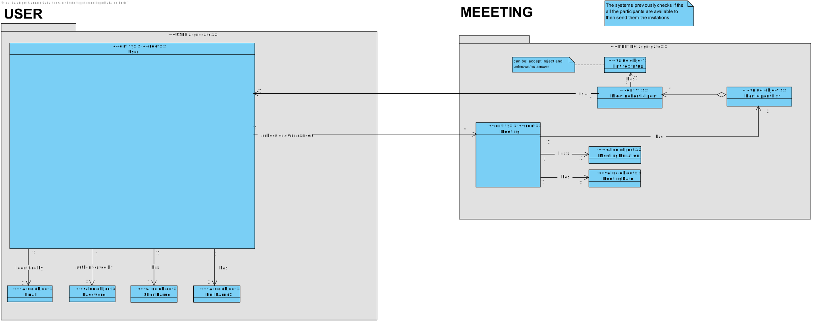
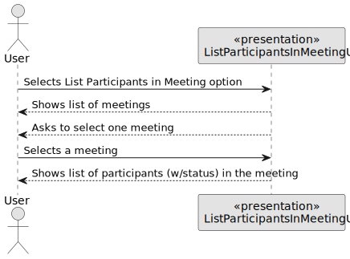
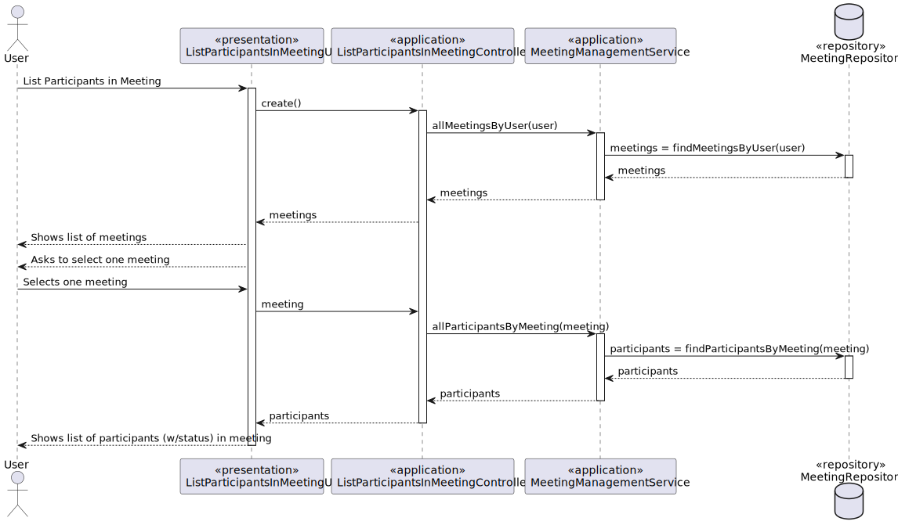
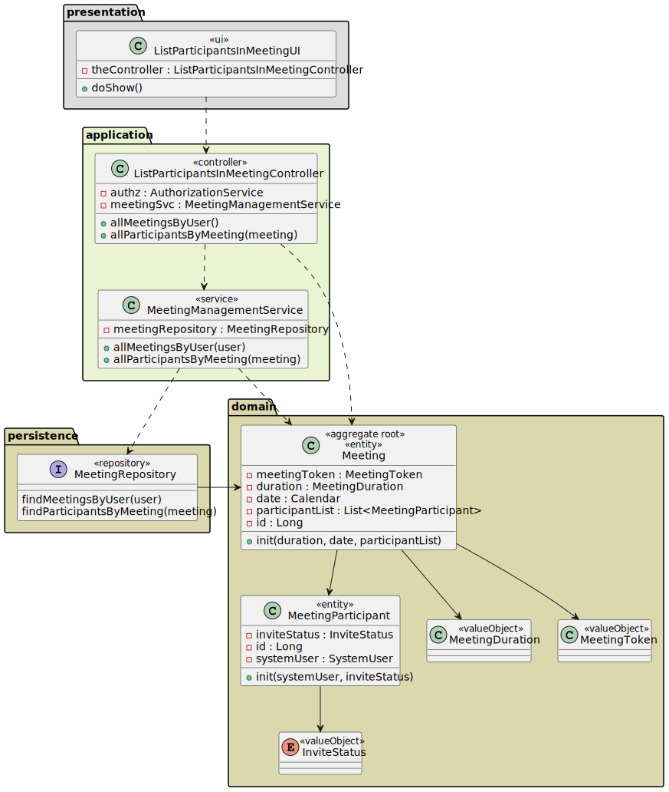
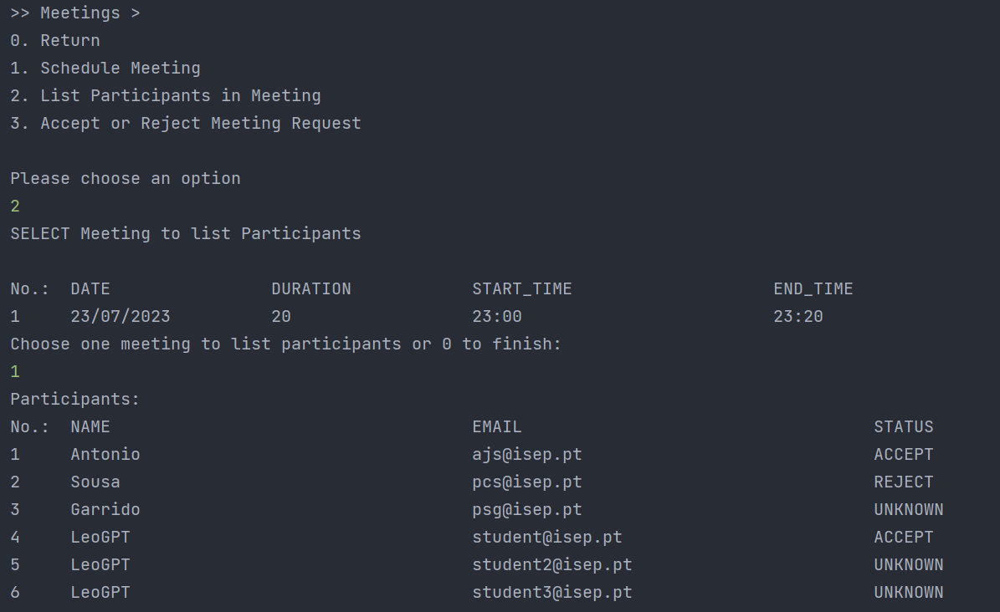

# US 4004 - As a user, I want to view a list of participants in my meeting and their status (accepted or rejected).

## 1. Context

*This is the first time this functionality is being developed. It is included in Sprint C of the project eCourse.*

## 2. Requirements

### 2.1 User Story Description

**US 4004** As a user, I want to view a list of participants in my meeting and their status (accepted or rejected).

To develop this user story, the following flow were considered:
- The system shows the list of meetings where the user is participant.
- The user selects the meeting he/she wants to see the list of participants.
- Selects one meeting to list the participants.
- The system shows the list of participants and their status (accepted or rejected).

### 2.2 Customer Specifications and Clarifications ###

**From the specifications Document:**

>This User story is related to the Functional Requirement FRM04 - List Participants. The system displays the lists of 
participants in a meeting and the response status (accept or reject meeting) (Section 3.1.5).

> Classes and meetings are events that happen in some time and have a duration. They also have
participants. However, there is no concept of location related to classes and meetings. They do
not take place in a specific location and "nothing" happens at the time of the event.
(Section 5.2.2).


**From the client clarifications:**

> *Question_1* (Thursday, 23 March 2023 at 09:49h) --> Can any user of the system invite any other user? For example, can a student invite another student who is in a different course, or can a manager can create a meeting with any group of teachers.
>
> *Answer_1* --> When in the document specification the term "User" is used it usually means "any user" of the system. Therefore, any user of the system can schedule a meeting and be a participant in a meeting.


> *Question_2* (Thursday, 23 March 2023 at 16:42h) --> FRM04 List Participants The system displays the lists of participants in a meeting and the response status (accept or reject meeting).
When mentioning "accept or reject meeting", I though to myself about an invite being sent to the user and 2 options for the response:
The sent invite has already as a response "Rejected", so that it can either be changed to "Accepted" or stays as it is, seeing that if the user doesn't accept it, he will be rejecting it.
The sent invite has a response being  "No answer" and, at a certain time near the begining of the meeting, the answer would change to "Rejected". The answer can be changed before it at any time to "Accepted" or "Rejected"
I think that the 1st option would go more towards what you are looking for (by reading FRM04, it would only show the users who "accept or reject the meeting") but I wanna be sure.
>
> *Answer_2* --> FRM01 relates to the fact that the system should check if participants are available before sending the invitations. For instance, checking if a user has no other class or meeting at the same time. The system should only invite participants with a free calendar at the time of the meeting.
In FRM03, the user accepts or rejects an invitation.
In FRM04, the status of someone that did not answer should be "no answer" or "unknown".
To be noticed that there is "nothing" to do by the system at the time of the meeting. Nothing needs to "happen". The same applies for classes.

> *Question_3* (Monday, 29 May 2023 at 16:44h) --> Relativamente a esta user story, o ficheiro excel providenciado refere o seguinte:
As User, I want to view a list of participants in my meeting and their status (accept or reject).
Aqui, pelo menos a meu ver, o termo "my meeting" parece sugerir que esta funcionaliade apenas se a aplica a meetings que o utilizador criou (i.e. se um User não for owner de uma meeting não puderá ver os seus participantes).
No entanto, no documento de especificação, o seguinte é dito:
The system displays the lists of participants in a meeting and the response status (accept or reject meeting).
O que não discrimina se esta funcionalidade deve estar disponível a todos os participantes ou apenas ao criador.
A meu ver, a alternativa que parece fazer mais sentido seria, de facto, qualquer utilizador poder ver a lista de participantes de uma meeting, desde que pertença à mesma; no entanto, faço-lhe esta pergunta para me certificar de que a feature que vai ser implementada realmente corresponde àquilo que o cliente pretende.
Aproveito ainda para lhe perguntar se a data da ocorrência da meeting possui alguma importância no que diz respeito a este caso de uso; isto é, o utilizador deve poder selecionar a meeting que pretende ver os participantes mesmo que esta já tenha ocorrido (e terminado), ou apenas aquelas que estão/irão decorrer é que possuem relevância?
>
> *Answer_3* --> Relativamente à primeira questão faz sentido a sua segunda interpretação, ou seja, o que está no documento de especificação está correto e reflete o que o cliente deseja. Ou seja, deve ser possível qualquer utilizador participante consultar os outros participantes em reuniões na qual ele também é participante.
Relativamente à segunda questão, do ponto de vista do cliente faz sentido também ver reuniões que ocorreram no passado.

### 2.3. Acceptance Criteria ###
From conversation with the client, the system should show a list of meetings where the user is participant.
It is not neccessary to be the creator of the meeting to see the list of participants and their status.

### 2.4. Dependencies ###

* **US4001** - As User, I want to schedule a meeting.
* **US4003** - As User, I want to accept or reject a meeting request.

## 3. Analysis

### 3.1 Relevant Domain Model Excerpt



### 3.2 System Sequence Diagram (SSD)



## 4. Design

### 4.1. Realization (Sequence Diagram - SD)



### 4.2. Class Diagram (CD)



### 4.3. Applied Patterns

* ENTITY as root of AGGREGATE
* VALUE OBJECT caractherizes OBJECTS
* SERVICE
* REPOSITORY
* SINGLE RESPONSABILITY

### 4.4. Tests

NA - No domain tests for this user story.

## 5. Implementation

```
public class ListParticipantsInMeetingController {

    private final AuthorizationService authz = AuthzRegistry.authorizationService();
    private final MeetingManagementService meetingSvc = AuthzRegistry.meetingService();

    public Iterable<Meeting> allMeetingsByUser() {
        authz.ensureAuthenticatedUserHasAnyOf(EcourseRoles.POWER_USER, EcourseRoles.ADMIN, EcourseRoles.STUDENT, EcourseRoles.TEACHER);
        return meetingSvc.allMeetingsByUser(authz.session().get().authenticatedUser());
    }

    public Iterable<MeetingParticipant> allParticipantsByMeeting(MeetingToken identity) {
        return meetingSvc.allParticipantsByMeeting(identity);
    }
}
````


## 6. Integration/Demonstration

### Demonstration of the implemented functionality


## 7. Observations
NA